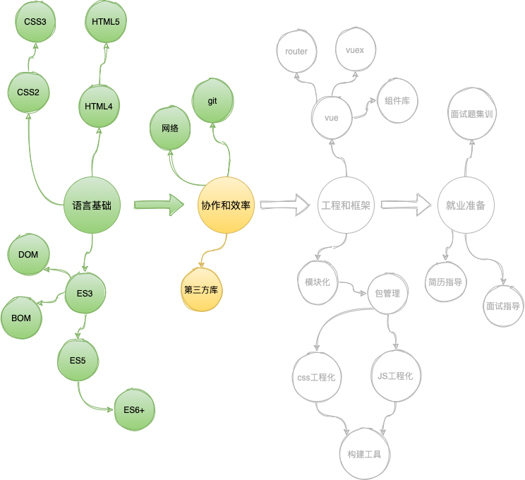
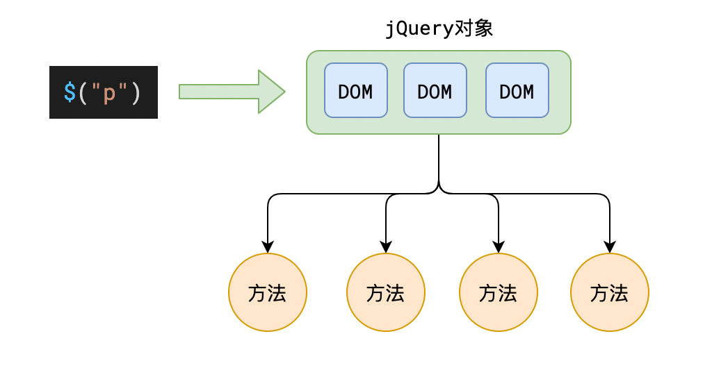
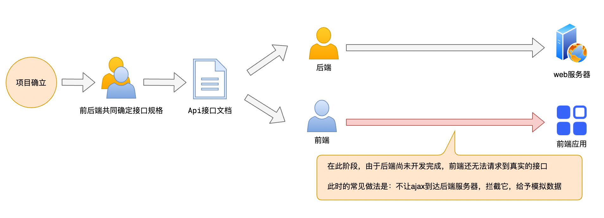
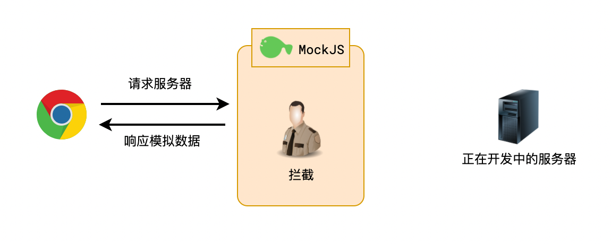

# 第三方库概览

|      名称      | 文档                                                         | 一句话介绍                                                   |
| :------------: | ------------------------------------------------------------ | ------------------------------------------------------------ |
|    `jQuery`    | 官网：https://jquery.com/<br />中文网：https://jquery.cuishifeng.cn/ | 让操作 `DOM` 变得更容易                                      |
|    `Lodash`    | 官网：https://lodash.com/docs<br />中文网：https://www.lodashjs.com/ | 你能想到的工具函数它都帮你写了                               |
| `Animate.css`  | 官网：https://animate.style/                                 | 常见的 `CSS` 动画效果都帮你写好了                            |
|    `Axios`     | 官网：https://axios-http.com/zh/                             | 让网络请求变得更简单                                         |
|   `Mock.js`    | 官网：http://mockjs.com/                                     | `Ajax` 拦截和模拟数据生成                                    |
|  `Moment.js`   | 官网：https://momentjs.com/<br />中文网：http://momentjs.cn/ | 让日期处理更容易                                             |
|  `ECharts.js`  | 官网：https://echarts.apache.org/zh                          | 搞定所有你能想到的图表📈                                      |
|   `Anime.js`   | 官网：https://animejs.com/                                   | 简单好用的 `JavaScript` 动画库                               |
|  `Editor.md`   | 官网：https://pandao.github.io/editor.md                     | `Markdown` 编辑器                                            |
| `Validate.js`  | 官网：http://validatejs.org/                                 | 简单好用的 `JS` 对象验证库                                   |
|   `date-fns`   | 官网：https://date-fns.org/                                  | 功能和 `Moment` 几乎相同<br />支持 `tree shaking`            |
|    `Zepto`     | 官网：https://zeptojs.com/                                   | 功能和 `jQuery` 几乎相同<br />对移动端支持更好<br />包体积更小 |
| `NProgress.js` | 官网：https://github.com/rstacruz/nprogress                  | 简单好用的进度条插件<br />`YouTube` 就使用的是它             |
|      `qs`      | 官网：https://github.com/ljharb/qs                           | 一个用于解析 `URL` 的小工具                                  |


对于第三方库，除了下载使用，还可以通过CDN在线使用

> [!tip]
>
> **科普知识：CDN**
>
> `CDN` 即内容分发网络（`Content Delivery Network`）。
>
> 简单来说，就是提供很多的服务器，用户访问时，自动就近选择服务器给用户提供资源：
>
> 

国内使用广泛的免费 `CDN` 站点：https://www.bootcdn.cn/


# JQuery

> 官网：https://jquery.com/
>
> 中文网：https://www.jquery123.com/ [^1]
>
> `CDN`：https://cdn.bootcdn.net/ajax/libs/jquery/3.7.1/jquery.min.js

针对 `DOM` 的操作无非以下几种：

- 获取它
- 创建它
- 监听它
- 改变它

`JQuery` 可以让上面整个过程更加轻松。

## jQuery 函数

`jQuery` 提供了一个函数，名称为 `jQuery`，也可以写作 `$`

该函数提供了强大的 `DOM` 控制能力

通过下面的示例，可以快速理解 `jQuery` 的核心功能：

```js
// 获取类样式为 container 的所有 DOM
const container = $(".container")

// 获取 container 后面的兄弟元素，元素类样式必须包含list
container.nextAll(".list");

// 删除元素
container.remove();

// 找到所有类样式为 list 元素的后代li元素，给它们加上类样式 item
$(".list li").addClass("item");

// 为所有 p 元素添加一些 style
$("p").css({ "color": "#ff0011", "background": "blue" });

// 注册 DOMContentLoaded 事件
$(function(){ 
	// ...
})

// 给所有 li 元素注册点击事件
$("li").click(function(ev){
  // ...
})

// 创建一个 a 元素，设置其内容为 link，然后将它作为子元素追加到类样式为 .list 的元素中
$("<a>").text("link").appendTo(".list");
```

下面依次介绍 `jQuery` 中的核心概念，以便查阅文档。


## jQuery 对象和 DOM 对象

通过 `jQuery` 得到的元素是一个 `jQuery` 对象，而不是传统的 `DOM` 对象。

`jQuery` 对象是一个 **伪数组**，它和 `DOM` 元素的关系如下：



`jQuery` 对象和 `DOM` 之间可以互相转换：

```js
// jQuery -> DOM
jQuery对象[索引]
jQuery对象.get(索引)

// DOM -> jQuery
$(DOM对象)
```


## 官网文档中的目录介绍

| 目录名                                                       | 内容                                                         |
| ------------------------------------------------------------ | ------------------------------------------------------------ |
| 选择器 [Selectors](https://api.jquery.com/category/selectors/) | 选择器是一个字符串，用于描述要选中哪些元素                   |
| 筛选 [Filtering](https://api.jquery.com/category/traversing/filtering/) | 在当前 `jQuery` 对象的基础上，进一步选中元素                 |
| 文档处理 [Manipulation](https://api.jquery.com/category/manipulation/) | 更改 `HTML` 文档结构，例如删除元素、清空元素内容、改变元素之间的关系 |
| 属性 [Properties](https://api.jquery.com/category/properties/) | 控制元素属性，例如修改类样式、读取和设置文本框的 `value`、读取和设置 `img` 的 `src` |
| [CSS](https://api.jquery.com/category/css/)                  | 控制元素 `style` 样式，例如改变字体颜色、设置背景、获取元素尺寸、获取和设置滚动位置 |
| 事件 [Events](https://api.jquery.com/category/events/)       | 监听元素的事件，例如监听文档加载完成、监听元素被点击         |
| [Ajax](https://api.jquery.com/category/ajax/)                | `jQuery` 封装了 `XHR`，使 `Ajax` 访问更加方便<br />这部分功能目前已被其他第三方库 **全面超越** |

# Lodash

> 官网：https://lodash.com/docs
>
> 中文网：https://www.lodashjs.com/
>
> CDN：https://cdn.bootcdn.net/ajax/libs/lodash.js/4.17.21/lodash.min.js

`Lodash` 是一个针对 `ES` 的古老工具库，它出现在 `ES5` 之前。

`Lodash` 提供了大量的 `API`，弥补了 `ES` 中对象、函数、数组 `API` 不足的问题。

你可以想到的大部分工具函数，都可以在 `Lodash` 中找到。

> 如果不编写框架或通用库，一般不会用到 `Lodash`。

# Animate.css

> 官网：https://animate.style/
>
> CDN：https://cdn.bootcdn.net/ajax/libs/animate.css/4.1.1/animate.min.css

`Animate.css` 库提供了大量的动画效果，开发者仅需使用它提供的类名即可

**注意：Animate.css 中的动画【对行盒无效】**

## 基本用法

类名格式为：

```
animate__animated animate__效果名
```

效果名分为以下几个大类，你可以从官网中找到对应的分类，每个分类下有多种效果名可供使用

| 分类               | 含义     |
| ------------------ | -------- |
| Attention seekers  | 强调     |
| Back entrances     | 进入     |
| Back exits         | 退出     |
| Bouncing entrances | 弹跳进入 |
| Bouncing exits     | 弹跳退出 |
| Fading entrances   | 淡入     |
| Fading exits       | 淡出     |
| Flippers           | 翻转     |
| Lightspeed         | 光速     |
| Rotating entrances | 旋转进入 |
| Rotating exits     | 旋转退出 |
| Specials           | 特殊效果 |
| Zooming entrances  | 缩放进入 |
| Zooming exits      | 缩放退出 |
| Sliding entrances  | 滑动进入 |
| Sliding exits      | 滑动退出 |


## 工具类

`Animate.css` 还提供了多个工具类，可以控制动画的 **延时**、**重复次数**、**速度**：

- 延时

  ```css
  /* 默认无延时 */
  animate__delay-1s  /* 延时 1 秒 */
  animate__delay-2s  /* 延时 2 秒 */
  animate__delay-3s  /* 延时 3 秒 */
  animate__delay-4s  /* 延时 4 秒 */
  animate__delay-5s  /* 延时 5 秒 */
  ```

- 重复次数

  ```css
  /* 默认重复 1 次 */
  animate__repeat-2	/* 重复 2 次 */
  animate__repeat-3	/* 重复 3 次 */
  animate__infinite	/* 重复无限次 */
  ```

- 速度

  ```css
  /* 默认 1 秒内完成动画 */
  animate__slow /* 2 秒内完成动画 */
  animate__slower	/* 3 秒内完成动画 */
  animate__fast	/* 800 毫秒内完成动画 */
  animate__faster	/* 500 毫秒内完成动画 */
  ```

示例：

```html
<!-- 
使用 animate.css
动画名：bounce
速度：快
重复：无限次
延迟：1 秒
-->
<h1
    class="
           animate__animated
           animate__bounce
           animate_fast
           animate__infinite
           animate__delay-1s
           "
    >
  Hello Animate
</h1>
```


# Axios

> 官网：https://axios-http.com/
>
> 中文官网：https://axios-http.com/zh/
>
> `CDN`：https://cdn.bootcdn.net/ajax/libs/axios/0.21.1/axios.min.js

`Axios` 是一个基于 `Promise` 的网络请求第三方 `JS` 库。在浏览器环境中，它封装了 `XHR`，提供更加便捷的 `API` 发送请求。

## 基本用法

```js
// 发送 get 请求到 https://study.duyiedu.com/api/herolist，输出响应体的内容
axios.get("https://study.duyiedu.com/api/herolist").then(resp => {
  console.log(resp.data); // resp.data 为响应体的数据，Axios 会自动解析 JSON 格式
})

// 发送 get 请求到 https://study.duyiedu.com/api/user/exists?loginId=abc，输出响应体的内容
axios.get("https://study.duyiedu.com/api/user/exists", {
  params: { // 这里可以配置查询参数，Axios 会自动将其进行 URL 编码
    loginId: "abc"
  },
}).then(resp => {
  console.log(resp.data); // resp.data 为响应体的数据，Axios 会自动解析 JSON 格式
})

// 发送 POST 请求到 https://study.duyiedu.com/api/user/reg
// Axios 会将第二个参数转换为 JSON 格式的请求体
axios.post("https://study.duyiedu.com/api/user/reg", {
  loginId: 'abc',
  loginPwd: '123123',
  nickname: '棒棒鸡'
}).then(resp => {
  console.log(resp.data); // resp.data 为响应体的数据，Axios 会自动解析 JSON 格式
})
```

`Axios` 的基本用法为：

```js
axios.get(URL 地址, [请求配置]);
axios.post(URL 地址, [请求体对象], [请求配置]);

// 或直接使用 Axios 方法，在请求配置中填写请求方法
axios(请求配置);
```

## 实例

`Axios` 允许开发者先创建一个实例，后续通过使用实例进行请求。

这样做的好处是可以预先进行某些配置，例如：

```js
// 创建实例
const instance = axios.create({
  baseURL: 'https://study.duyiedu.com/'
});

// 发送 GET 请求到 https://study.duyiedu.com/api/herolist，输出响应体的内容
instance.get("/api/herolist").then(resp => {
  console.log(resp.data); // resp.data 为响应体的数据，Axios 会自动解析 JSON 格式
})
```

## 拦截器

有时，我们可能需要对所有的请求或响应做一些统一的处理 ——

比如，在请求时，如果发现本地有 `token`，需要附带到请求头；

又比如，在拿到响应后，我们仅需要取响应体中的 `data` 属性；

再比如，如果发生错误，我们需要做一个弹窗显示……

**这些统一的行为就非常适合使用拦截器**：

```js
// 添加请求拦截器
axios.interceptors.request.use(function (config) {
  // config 为当前的请求配置
  // 在发送请求之前做些什么
  // 这里，我们添加一个请求头
  const token = localStorage.getItem('token');
  if(token){
    config.headers.authorization = token;
  }
  return config; // 返回处理后的配置
});

// 添加响应拦截器
axios.interceptors.response.use(function (resp) {
  // 2xx 范围内的状态码都会触发该函数。
  // 对响应数据做点什么
  return resp.data.data; // 仅得到响应体中的 data 属性
}, function (error) {
  // 超出 2xx 范围的状态码都会触发该函数。
  // 对响应错误做点什么
  alert(error.message); // 弹出错误消息
});
```

设置好拦截器后，后续的请求和响应都会触发对应的函数。

拦截器可以针对 `Axios` 实例进行设置。

# MockJS

> 官网：http://mockjs.com/
>
> `CDN`：https://cdn.bootcdn.net/ajax/libs/Mock.js/1.0.0/mock-min.js

`MockJS` 有两个作用：

1. 产生模拟数据
2. 拦截 `Ajax`

下面两张图说明 `MockJS` 的作用：





## 仅模拟数据

```js
Mock.mock(数据模板)
```

数据模板有其特有的书写规范，具体写法见官网。

## 拦截 + 模拟数据

```js
Mock.mock(要拦截的url, 要拦截的请求方法, 数据模板)
```

更多用法见官网。

**注意，MockJS 拦截数据的原理是重写了 XHR，因此它仅能拦截 XHR 的数据请求，而无法拦截使用 `fetch ` 发出的请求**

具体的，`MockJS` 可以拦截：

- 原生 `XmlHttpRequest`
- `jQuery` 中的 `$.ajax`
- `axios`

`MockJS` 可以模拟网络延时，用法为：

```js
Mock.setup({
  timeout: 400 // 网络延时400毫秒
})

Mock.setup({
  timeout: '200-600' // 网络延时200-600毫秒
})
```


# Moment

> 官网：https://momentjs.com/
>
> 中文网：http://momentjs.cn/
>
> `CDN`：https://cdn.bootcdn.net/ajax/libs/moment.js/2.29.1/moment.min.js
>
> 各种语言包：https://www.bootcdn.cn/moment.js/

`Moment` 提供了强大的 **日期处理能力**。

## 时间基础知识

### 单位

| 单位               | 名称 | 换算                   |
| ------------------ | ---- | ---------------------- |
| hour               | 小时 | 1 hour = 1/24 day      |
| minute             | 分钟 | 1 minute = 1/60 hour   |
| second             | 秒   | 1 second = 1/60 minute |
| millisecond （ms） | 毫秒 | 1 ms = 1/1000 second   |
| microsecond （μs） | 微秒 | 1 μs = 1/1000 ms       |
| nanosecond （ns）  | 纳秒 | 1 ns = 1/1000 μs       |

### GMT 和 UTC

世界划分为 24 个时区，北京在东 8 区，格林威治在 0 时区。


**GMT**：**Greenwish Mean Time** 格林威治世界时。太阳时，精确到毫秒。

**UTC**：**Universal Time Coodinated** 世界协调时。以原子时间为计时标准，精确到纳秒。

> 国际标准中，已全面使用 `UTC` 时间，而不再使用 `GMT` 时间

`GMT` 和 `UTC` 时间在文本表示格式上是一致的，均为 `星期缩写, 日期 月份 年份 时间 GMT`，例如：

```markdown
Thu, 27 Aug 2020 08:01:44 GMT
```

另外，`ISO 8601` 标准规定，建议使用以下方式表示时间：

```markdown
YYYY-MM-DDTHH:mm:ss.msZ
例如：
2020-08-27T08:01:44.000Z
```

**GMT、UTC、ISO 8601 都表示的是零时区的时间**

### Unix 时间戳

> `Unix` 时间戳（`Unix Timestamp`）是 `Unix` 系统最早提出的概念

它将 `UTC` 时间 1970 年 1 月 1 日凌晨作为起始时间，到指定时间经过的秒数（毫秒数）

### 程序中的时间处理

**程序对时间的计算、存储务必使用 UTC 时间，或者时间戳**

**在和用户交互时，将 UTC 时间或时间戳转换为更加友好的文本**


思考下面的问题：

1. 用户的生日是本地时间还是 `UTC` 时间？
2. 如果要比较两个日期的大小，是比较本地时间还是比较 `UTC` 时间？
3. 如果要显示文章的发布日期，是显示本地时间还是显示 `UTC` 时间？
4. `北京时间2020-8-28 10:00:00` 和 `格林威治2020-8-28 02:00:00`，两个时间哪个大，哪个小？
5. `北京的时间戳为0` 和 `格林威治的时间戳为0`，它们的时间一样吗？
6. 一个中国用户注册时填写的生日是 `1970-1-1`，它出生的 `UTC` 时间是多少？时间戳是多少？

## Moment 核心用法


`Moment` 的使用分为两个部分：

1. 获得 `Moment` 对象
2. 针对 `Moment` 对象做各种操作

# ECharts

> 官网：https://echarts.apache.org/zh
>
> `CDN`：https://cdn.bootcdn.net/ajax/libs/echarts/5.1.1/echarts.min.js

具体使用方法见课程讲解。


---

[^1]: 之前给的 https://www.jquery123.com/ 已过期，先更新为其他中文链接。


