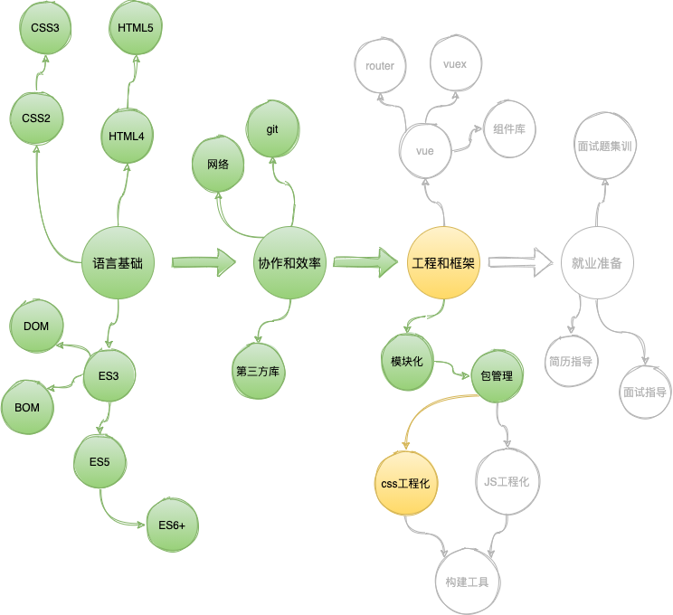
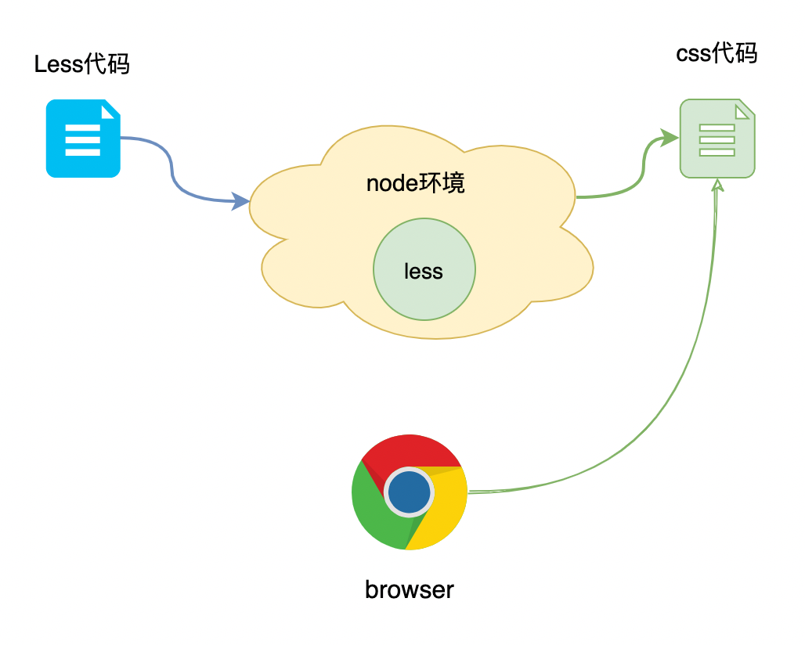
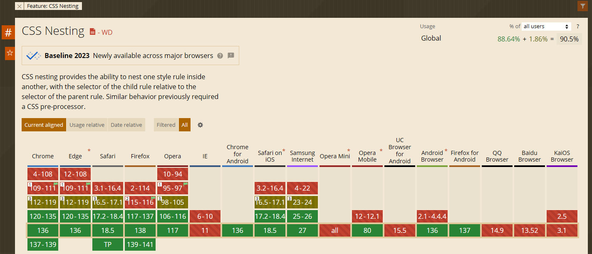

# L04：CSS 预编译器 Less 简介

---



## 1 什么是 Less？

**Less** 是一种更加简洁的样式代码，它非常像 `CSS`，但又不太一样，它让编写样式变得更容易。

下面是 `CSS` 代码和 `Less` 代码的对比，它们都表达了一样的含义：


**Less 代码虽好，但它无法被浏览器识别**，因此需要一个工具将其转换为血统纯正的 `CSS` 代码。

由于 **NodeJS 环境具有读写文件的能力**，于是在 `NodeJS` 环境中可以轻松地完成文件的转换。

`npm` 上有一个包叫做 `less`，它运行在 `NodeJS` 环境中，通过它可以完成对 `Less` 代码的转换：



**可以看出，node 环境在前端工程化中充当了一个辅助的角色，它并不直接运行前端代码，而是让我们编写前端代码更加舒适便利，在后续课程中，你还会不断地体会到这一点。**

**转换代码的操作过程，称之为编译（compile），转换代码的工具，称之为编译器（compiler）**。


## 2 体验 Less

1. 新建 `index.less` 文件，编写如下 `Less` 代码：

   ```less
   @green: #008c8c;
   .list {
     display: flex;
     flex-wrap: wrap;
     color: @green;
     li {
       margin: 1em;
       &:hover {
         background: @green;
         color: #fff;
       }
     }
   }
   ```

2. 使用 `npm` 下载 `less`；

   `less` 包提供了一个 `cli` 工具 `lessc`，可以有两种方案使用它：

   - **方案一：全局安装 Less**：该方案可以在任何终端目录使用 `lessc` 命令，但不利于版本控制；
   - **方案二：本地安装 Less**：该方案会把 `less` 安装到工程目录的 `node_modules` 中，从而无法全局使用 `lessc` 命令；但可以在当前工程目录中使用 `npx lessc` 运行该命令。
   
   > [!tip]
   >
   > `npx` 是 `npm` 提供的一个小工具，它可以运行当前项目中安装到 `node_modules` 的 `cli` 命令；
   >
   > 如果配置 `package.json` 脚本，无须使用 `npx`；
   >
   > 最佳实践：**尽量使用本地安装，而非全局安装**。
   
3. 使用 `lessc` 命令，对编写的 `Less` 文件进行编译：

   ```shell
   # 将 index.less 编译成为 index.css
   lessc index.less index.css
   ```

4. 新建一个页面，引用编译结果 `index.css`

> [!note]
>
> 目前，编写 `Less` 代码会遇到一点小麻烦，就是每次编写后，都需要运行命令进行编译
>
> 这个麻烦只是暂时的，将来很快就可以解决。


## 3 Less 核心语法

>`Less` 官网：https://lesscss.org/
>
>`Less` 民间中文网：https://less.bootcss.com/

`Less` 提供了非常多的功能，帮助我们更加轻松地编写 `CSS` 代码。

其中，我们最常用的功能有下面三个：

- [变量](https://less.bootcss.com/#%E5%8F%98%E9%87%8Fvariables)
- [嵌套](https://less.bootcss.com/#%E5%B5%8C%E5%A5%97nesting)
- [混合](https://less.bootcss.com/#%E6%B7%B7%E5%90%88mixins)

另外，你需要关注 `Less` 的特殊 [注释](https://less.bootcss.com/#%E6%B3%A8%E9%87%8Acomments)


## 4 练习题

### 4.1 练习题1

编写一个 `Less` 混合，实现绝对定位居中。


### 4.2 练习题2

将过去你所做的某个 `demo`，将其 `CSS` 代码改造为 `Less`。


> [!tip]
>
> 根据最新的查询结果（2025-5-22），`CSS` 的原生嵌套语法已于 2023 年完成基线支持（详见 [Can I Use](https://caniuse.com/css-nesting) 官网）：
>
> 

