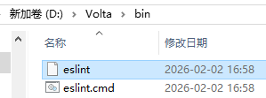
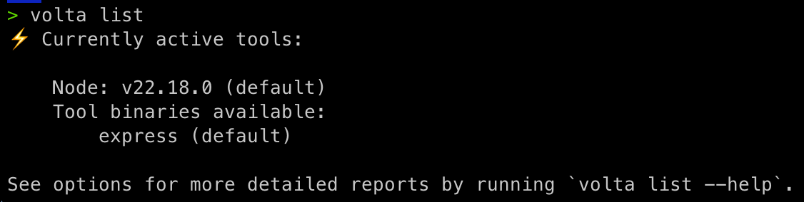

# 使用 Volta 管理工具链版本

---

更新时间：`2025-08-03 15:56:33`


## 1 nvm 存在的问题

在前端生态中，`Node.js` 是一个非常重要的生态环境，每一位前端开发者必然会涉及到在自己的电脑上安装 `Node.js`

而且，我们经常还有这样的需求，那就是需要在自己的电脑上安装不同版本的 `Node.js`

早期的时候，一般使用 `nvm` 来解决。`nvm` 全称 `node version manger`，是管理 `node` 版本的一个工具，通过这个工具，可以在一台计算机上安装多个版本的 `node`，并且随时进行无缝的切换。

```bash
# 安装某个 node 版本
nvm install 版本号

# 切换 node 版本
nvm use 版本号
```

但是该工具也存在一些问题，比如：版本切换引发的 **工具丢失**

```bash
nvm install 16.17.1
nvm use 16.17.1
npm install -g express-generator

# 现在切换 Node 版本
nvm install 22
nvm use 22

# 然后你执行
express

# 报错：command not found
```

因为每个 `Node.js` 版本都有自己 **隔离的** 全局 `node_modules` 目录。

除此之外，还有诸如：

1. 每次需要手动 `nvm use`，容易忘

2. `nvm` 是 `Shell` 脚本实现，`nvm use` 切换慢

3. `nvm` 在并非 `Windows` 原生应用，需要 `nvm-windows` 替代版

   ......


面对 `nvm` 所暴露出的种种问题，我们真正需要的是一个更现代、更可靠的 **工具链** 管理器（如 `ESLint`、`Vite`、`Express` 等等）：

- 能自动识别项目所需 `Node` 版本，而不是每次都手动 `nvm use`；
- 能全局安装 `CLI` 工具后在任意版本 `Node` 下都能用；
- 能在 `Windows` / `MacOS` / `Linux` 中无缝一致；
- 能不拖慢 `Shell` 启动、不依赖一堆 `Shell` 脚本配置。

这时候，[Volta](https://volta.sh/) 就应运而生。**Volta 是一个用 Rust 编写的现代 Node.js 工具链管理器，设计初衷就是为了解决 nvm 的所有痛点。**

> [!tip]
>
> 得益于 `Rust` 的极致响应速度，当前的前端工具链用 `Rust` 语言全部重写已成必然趋势，包括尤雨溪开发的 `ox` —— `NPM` 脚本的命令行运行工具，以及打包工具 `Rolldown`，都是基于 `Rust` 开发的。


## 2 安装 Volta

在继续介绍之前，我们先安装 `Volta`。


### 2.1 MacOS / Linux 安装方式

直接使用官方安装脚本：

```bash
curl https://get.volta.sh | bash
```

执行完后，`Volta` 会自动：

- 下载 `Rust` 编译的二进制工具；
- 更新你的 `.zshrc` 或 `.bashrc` 配置；
- 将 `$HOME/.volta/bin` 添加到 `PATH` 环境变量中；

验证是否成功安装：

```bash
volta --version
```


### 2.2 Windows 安装方式


> [!important]
>
> **踩坑记录**
>
> 安装 `Volta` 前必须先卸载 `nvm`，否则 `node -v` 及 `npm -v` 命令都将卡死！！！
>
> 想要自定义 `Volta` 工具链的安装路径，必须在安装 `Volta` 前设置好如下环境变量：
>
> ```powershell
> [Environment]::SetEnvironmentVariable("VOLTA_HOME", "D:\Volta", "Machine")
> [Environment]::SetEnvironmentVariable("VOLTA_CACHE_DIR", "%VOLTA_HOME%\cache", "Machine")
> [Environment]::SetEnvironmentVariable("VOLTA_INSTALL_DIR", "%VOLTA_HOME%\toolchain", "Machine")
> [Environment]::SetEnvironmentVariable("VOLTA_NODE_MIRROR", "https://npmmirror.com/mirrors/node", "Machine")
> [Environment]::SetEnvironmentVariable("VOLTA_NPM_MIRROR", "https://npmmirror.com/mirrors/npm", "Machine")
> ```
>
> 然后运行下列命令安装 `Volta`（`Volta` 自身只能安装到 `C:\` 盘下）：
>
> ```powershell
> winget install Volta.Volta
> ```


**方式一（推荐）：**

```bash
winget install Volta.Volta
```

**方式二：**

- 访问官网：[https://volta.sh](https://volta.sh)
- 下载 `.exe` 安装器，点击安装即可

安装完成后，`Volta` 会自动设置环境变量，不需要你改 `PowerShell` 配置。


### 2.3 配置环境变量

在国内网络环境下， 下载 `Node.js` 可能需要配置镜像。

:one: `MacOS` / `Linux` 用户

打开你的终端配置文件：

```bash
nano ~/.zshrc   # 如果你用的是 zsh
# 或
nano ~/.bashrc  # bash 用户
```

添加这一行：

```bash
export VOLTA_NODE_MIRROR=https://npmmirror.com/mirrors/node
```

然后刷新：

```bash
source ~/.zshrc
# 或
source ~/.bashrc
```

注意：查看隐藏文件，键入：<kbd>Command</kbd> + <kbd>Shift</kbd> + <kbd>.</kbd>


:two: `Windows` 用户（`PowerShell`）

在 `PowerShell` 中设置（仅当前会话）：

```powershell
$env:VOLTA_NODE_MIRROR="https://npmmirror.com/mirrors/node"
```

或者 **设置为永久环境变量**（推荐）：

```powershell
# 定义【用户级】环境变量
[Environment]::SetEnvironmentVariable("VOLTA_NODE_MIRROR", "https://npmmirror.com/mirrors/node", "User")
# 定义【系统级】环境变量
[Environment]::SetEnvironmentVariable("VOLTA_NODE_MIRROR", "https://npmmirror.com/mirrors/node", "Machine")
```

然后 **重新打开 Windows Terminal 终端** 生效配置。

> [!tip]
>
> **小技巧：从命令行打开【高级系统属性】窗口**
>
> 也可以通过窗口界面手动添加：
>
> ```powershell
> # 命令行打开【高级系统设置】
> # PowerShell:
> control "sysdm.cpl,,3"
> # CMD:
> control sysdm.cpl,,3
> ```
>
> 上述命令将打开【系统属性】窗口的【高级】标签页：
>
> 


### 2.4 Volta 初体验

安装一个 `Node.js` 版本：

```bash
volta install node@18.17.1
```

这将会：

- 下载并缓存该版本
- 自动设为【系统默认】版本
- 创建 `shim` 绑定（`node`、`npm` 等命令指向 `Volta` 的 `shim`）


再如，安装一个 `CLI` 工具 `ESLint` 的最新版：

```bash
volta install eslint
```

这相当于：

- 把 `ESLint` 安装到 `Volta` 的沙箱中（而非全局的 `npm`）；
- 创建 `shim`，可在 **任何目录** 使用；
- 同时记录下 `ESLint` 安装时的 `node` 引擎版本（可固定）。


查看当前状态：

```bash
volta list
```

关于 `Volta` 提供的命令说明，可以在官网的 [Reference 参考部分](https://docs.volta.sh/reference/) 进行查阅。


## 3 Volta 特性介绍


> [!tip]
>
> **关于 Volta 的名称**
>
> `DeepSeek`：
>
> `Volta` 是以 **亚历山德罗·伏特**（***Alessandro Volta***）命名，他是：
>
> - 意大利物理学家、化学家
> - 电池的发明者（1800 年发明了伏打电堆）
> - 电压单位"伏特"（`Volt`）就是以他的姓氏命名
>
> 选择这个名字有双重含义：
>
> - **能源/动力隐喻**：就像电池为设备提供稳定电力，`Volta` 为开发环境提供稳定的工具链
> - **快速切换**："`volta`"在意大利语中意为"转变"或"回合"，体现工具快速切换版本的能力
> - **电路连接**：隐喻连接不同工具和版本的"电路"
>
> `Volta` 的主要创建者兼开发者 **Ben Newman** 在采访中提到：
>
> > "我们想要一个简短、易记的名字，能够体现'能量'和'转变'的概念。伏特作为电学先驱，他的名字完美契合我们想传达的理念——为 `JavaScript` 工具链提供动力并快速切换。"


现在我们已经安装好了 `Volta`，接下来来了解一下 `Volta` 相较于 `nvm` 是如何解决前面说的痛点的、具备哪些实用的特性。


### 3.1 了解 Shim

要真正理解 `Volta` 的核心机制，我们必须先了解一个关键词：**shim（垫片）**。

什么是 `shim`？

**shim** 本意是「**垫片、适配器**」，在开发工具中，它是一种 **中间层的可执行程序（二进制）**，用于拦截命令调用、做一些逻辑处理后再转发。对于用户在 `Volta` 中安装的每个 `CLI` 工具（如 `ESLint`、`Vite` 等），`Volta` 都会创建一个二进制 `shim` 文件来 **替你执行它**。

> [!tip]
>
> `DeepSeek`：
>
> `Shim` 的实质，是 `Volta` 在用户的 `PATH` 中创建的 **代理程序**，当你运行 `node`、`npm`、`yarn` 等命令时：
>
> - 实际执行的是 `Volta` 创建的 `shim` 程序
> - `shim` 会动态决定使用哪个版本的 `Node`/`npm`
> - 然后调用对应版本的真正二进制文件

例如：

```bash
volta install eslint
```

`Volta` 做了三件事：

1. 把 `ESLint` 下载下来（存在 `%VOLTA_HOME%/tools/image/packages/eslint/`）
2. 在 `%VOLTA_HOME%/bin/` 目录下生成一个名为 `eslint` 的 `shim` 二进制文件
3. 这个 `shim` 不是真正的 `ESLint`，而是一个 **中转适配器**

实测 `ESLint` 的二进制 `shim` 文件位置截图：



每当运行 `ESLint` 时，它会：

1. 查找用户当前项目是否有绑定的 `node` 版本；
2. 使用合适的 `Node.js` 环境运行真实的 `ESLint`。


**Shim 的优势**

传统方式（即 `nvm` + `npm` 模式）下：

- `Express` 被安装到对应版本的全局 `node_modules`，**路径依赖于当前 node 版本**；
- 切换 `node` 版本后，工具路径可能变更或消失。

而 `Volta` 的 `shim` 是放在统一的地方，**始终存在**：

```bash
# %VOLTA_HOME% 默认路径：~/.volta
%VOLTA_HOME%/bin/express
%VOLTA_HOME%/bin/vite
%VOLTA_HOME%/bin/tsc
```

不论当前的 `Node.js` 版本是 `14.x`、`16.x`、`18.x`、`20.x`，**这些 shim 都不会改变位置，也不会失效**。

因此总结一下 `shim` 的优势：

1. 工具与 `Node.js` 解耦：工具不会因为切换 `Node.js` 而 **丢失**；
2. 执行路径稳定：所有命令都统一走 `Volta` 的 `shim`，无需修改 `PATH` 记录；
3. 自动路由能力强：`Volta` 能根据项目 `pin` 自动切换版本；
4. 执行速度块：`shim` 是 `Rust` 编译的二进制文件，可直接运行，不依赖 `Shell` 脚本。


### 3.2 Volta 的优势

#### 1. 工具永不丢失

在 `Volta` 中，`CLI` 工具（如 `ESLint`、`Vite`、`ExpressGenerator`）被安装为【**全局 shim**】，**与 Node.js 版本解耦**。你可以随意切换 `Node.js` 版本，工具始终可用：

```bash
volta install express-generator
volta install node@16.17.1
volta install node@22.8.0

# 不论当前 Node 是哪个版本
express new my-app  # 永远可用
```


#### 2. 自动识别项目版本，无需手动切换

只需在项目中绑定所需 `Node.js` 版本即可：

```bash
volta pin node@18.17.1
```

之后再次进入该项目目录，`Volta` 会 **自动切换** 到对应 `Node` 版本，无需额外操作。真正实现「走哪算哪」。


#### 3. 安装快速，执行飞快

`Volta` 用 `Rust` 编写，所有执行命令都是本地二进制 `shim`，**不依赖 Shell 脚本**。不像 `nvm` 每次都要慢慢加载配置，`Volta` 是 **即点即用**。


#### 4. 原生跨平台支持

`Volta` 完整支持 `MacOS`、`Linux`、`Windows`，**不再需要用 `nvm-windows` 这种社区工具替代品**。团队中无论是 `Mac` 党还是 `Windows` 党，都能统一使用 `Volta` 环境。


#### 5. CLI 工具管理统一

不再使用 `npm install -g`，你只需：

```shell
volta install vite
```

`Volta` 会自动下载并安装到它自己的隔离环境中，并提供稳定路径 `%VOLTA_HOME%/bin/vite`，**全局但不污染系统**。


## 4 理解 pin 的作用

`pin` 是 `Volta` 的另一个核心特性。

在前端开发中，我们总会遇到这样一种「迷之现象」：

- 项目在本地跑得好好的，同事一 `pull` 下来就报错；

- `CI` 一构建就炸了；

- 部署到服务器又是另一套 `Node.js`

  ……

这大概率是因为事先没有 **锚定** 项目依赖的工具链版本。而 `Volta` 中的 `pin` 机制，本质上就是把某个工具的版本 **绑定** 到当前项目，确保所有人在这个项目目录下都使用相同的版本。

这个绑定信息会写入 `package.json` 的 `volta` 字段中，例如：

```json
{
  "volta": {
    "node": "20.11.0",
    "npm": "10.2.4",
    "yarn": "1.22.19"
  }
}
```

`Volta` 会自动读取这个配置，在进入项目目录时 **自动切换版本**，无需手动切换、也不需要编辑 `.nvmrc` 文件、更不需要人肉通知队友【记得换版本】。


**使用方式**

```bash
volta pin node@20.11.0
volta pin npm@10.2.4
volta pin yarn@1.22.19
```

这样在进入该项目的时候，`Volta` 就会自动切换到对应的版本。如果不存在该版本，`Volta` 则会自动下载安装。


### 辨析 `volta install` 和 `npm install` 之间的区别

`volta install` 安装的是【工具链】层级的工具，而不是项目层级的依赖。

| 类别             | 用途                                                         | 示例命令                                         |
| ---------------- | ------------------------------------------------------------ | ------------------------------------------------ |
| **工具链层级**   | 和项目 **开发环境** 有关的工具，比如 `node`、`npm`、`ESLint`、`Vite`、`tsc`、`pnpm`、`yarn` | `volta install node@20`<br/>`volta install vite` |
| **项目依赖层级** | 跟代码直接运行有关的包，比如 `express`、`lodash`、`axios`、`vue` | `npm install express`<br/>`pnpm install vue`     |


## 5 npm 是否需要 Volta 来管理

接下来讨论一个问题：`npm` 是否需要 `Volta` 来管理？

当我们输入 `volta list`，当前显示出来的结果如下：



可以看到：运行结果中有 `Node.js` 的版本，以及工具链工具的版本；但是并没有 `npm` 的版本。

这说明 `Volta` 并没有将它列为【可独立管理】的 `shim` 工具。

但是输入 `npm -v` 还是能够查看 `npm` 的版本：


因为安装 `Node.js` 时会自动安装一个 **对应版本的 npm**，只不过这个 `npm` 的版本不由 `Volta` 来管理。当前使用哪个版本的 `Node.js`，`npm` 也会自动的切换成对应的版本。


问题来了：是否需要 `Volta` 来管理 `npm` 的版本呢？

绝大多数情况下：项目 **只对 Node.js 版本** 有明确要求，而对 **npm / yarn / pnpm 的版本** —— 通常是 **没有强依赖** 的。因为它们只是 **包的下载工具**，主要用于通过 `xxx install` 命令安装 **项目依赖**，而 **不影响代码运行或者语法解释**。


那有没有例外呢？

有。比如某些项目会在如下场景强制限定 `npm` 的版本：

| 场景                                  | 原因                                                  |
| ------------------------------------- | ----------------------------------------------------- |
| 使用新的 `overrides` 字段（`npm 8+`） | 低版本 `npm` 不支持                                   |
| 使用 `npm workspaces`                 | 需要 `npm 7+` 才能识别                                |
| 构建脚本中使用 `npm exec`（较新语法） | 老 `npm` 不支持                                       |
| 在 `CI` 中复刻一致性环境              | 某些团队会强制要求 `pin npm@<version>` 以确保行为一致 |

因此在这类情况下，可以选择针对该项目执行 `pin npm` 命令，例如：

```bash
volta pin npm@10.9.3
```

该配置会写入 `package.json`：

```json
{
  "volta": {
    "node": "22.18.0",
    "npm": "10.9.3"
  }
}
```

> [!tip]
>
> **总结**
>
> 一般项目只需 `pin node@<version>`，**npm 使用 Node 自带的版本就足够了**；除非遇到特定语法特性、构建流程或 `CI` 问题，才会考虑 `pin npm@<version>`。


## 6 写在最后

**为什么我愿意推荐 Volta**

前端苦工具链之混乱久矣，工具链问题向来是前端开发中投入【隐形成本】最高的领域之一 —— 用 `nvm` 切版本、用 `npx` 临时运行命令、`npm` 全局安装、换用 `yarn` 安装依赖……总之没完没了：明明不是项目代码的问题，却总在运行阶段频频踩坑。

而 `Volta` 带来的，是一种新的范式：

- 安装工具一键完成，无需额外配置；
- 版本切换自动感知，走哪用哪；
- 工具链脱离 `Node.js` 环境漂移，永远可用；
- 项目绑定无需 `.nvmrc`，直接写进 `package.json`；
- 告别平台依赖，同时支持 `Windows` / `Linux` / `MacOS` 原生安装；

它不仅提升了开发体验，更极大地降低了团队协作的环境不一致风险。

如果你希望在项目中做到真正的「开箱即用」、在 `CI/CD` 中实现环境无差异部署，或者你只是单纯想告别 `Shell` 脚本的版本切换之痛，那 `Volta` 真的值得你试一试。


---

-EOF-