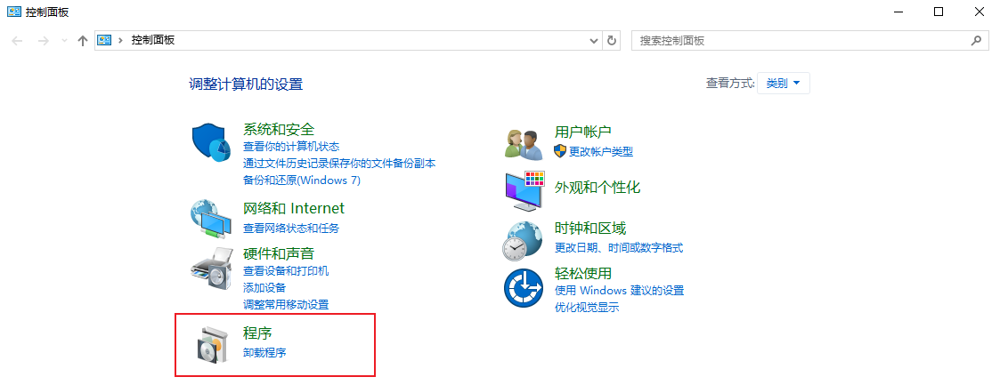
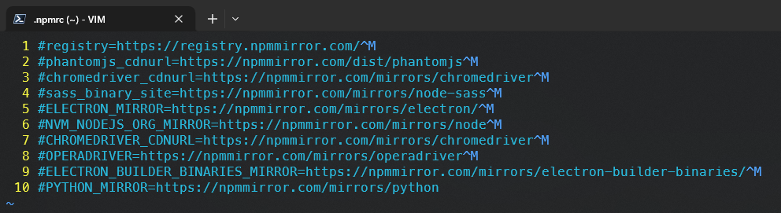
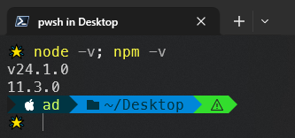

# Windows 系统下安装 nvm

`nvm` 全称为 `node version manger`，顾名思义就是管理 `node` 版本的一个工具，通过这个工具，我们可以在一台计算机上安装多个版本的 `node`，并且随时进行无缝切换。


## 1.  卸载原本的 node.js

如果之前有安装过 `Node.js`，那么首先我们需要卸载掉之前的安装。

命令行或【`Win + R`】运行窗口下输入 `control` 命令，可快速打开控制面板首页：




## 2. 下载安装 nvm

链接：https://pan.baidu.com/s/1uoxlk8CVNHV2KTCwIGbQMQ?pwd=yi5m [^1]

提取码：`yi5m`

> ### **实测 `nvm` 在 `Windows` 上的安装**
>
> 根据 `nvm` 的 `GitHub` [仓库文档](https://github.com/nvm-sh/nvm) 定位其 `Windows` 版 [仓库](https://github.com/coreybutler/nvm-windows)。
>
> 下载并安装最新版 `v1.2.2` 后，成功安装 `Node.js` 的最新版（`v24.1.0`）和 `LTS` 版（`v22.16.0`）。
>
> 安装最新版 `Node.js` 后发现查看 `npm` 版本出现一系列警告：
>
> ```powershell
> > npm -v
> npm warn Unknown user config "phantomjs_cdnurl". This will stop working in the next major version of npm.
> npm warn Unknown user config "chromedriver_cdnurl". This will stop working in the next major version of npm.
> npm warn Unknown user config "sass_binary_site". This will stop working in the next major version of npm.
> npm warn Unknown user config "ELECTRON_MIRROR". This will stop working in the next major version of npm.
> npm warn Unknown user config "NVM_NODEJS_ORG_MIRROR". This will stop working in the next major version of npm.
> npm warn Unknown user config "CHROMEDRIVER_CDNURL". This will stop working in the next major version of npm.
> npm warn Unknown user config "OPERADRIVER". This will stop working in the next major version of npm.
> npm warn Unknown user config "ELECTRON_BUILDER_BINARIES_MIRROR". This will stop working in the next major version of npm.
> npm warn Unknown user config "PYTHON_MIRROR". This will stop working in the next major version of npm.
> 11.3.0
> ```
>
> 原因：`~/.npmrc` 默认的配置文件自动设置了上述选项，将其全部注释即可：
>
> 
>
> 配置验证（已生效）：
>
> 


## 3. 修改 nvm 源

如果直接用 `nvm` 命令下载 `node` 的话，因为源在国外，所以会导致下载失败，所以我们最好修改 `nvm` 的源

打开 `nvm` 的下载路径，如果你是一路 `Next` 操作的，那么一般就在：`C:\Users\你现在用的用户名\AppData\Roaming\nvm`

打开 `setting.txt` 文件，在末尾写入：

```markdown
node_mirror: https://npm.taobao.org/mirrors/node/
npm_mirror: https://npm.taobao.org/mirrors/npm/
```


## 4. nvm 常用命令

```shell
# 查看当前安装和使用的 node 版本
nvm list

# 安装某个 node 版本
nvm install 版本号

# 切换 node 版本
nvm use 版本号

# 设置默认版本
nvm alias v12.22.12
```


## 5. 配置 npm 源

安装 `Node.js` 之后，一般对应的 `npm` 也会被安装好，但是默认 `npm` 的源是指向 `npm` 官网的，这就导致我们在下载包的时候会很慢。

我们需要修改 `npm` 的源：

```js
npm config set registry=https://registry.npm.taobao.org
npm config get registry
```


---

[^1]: 由于使用了 `GitHub` 上最新的 `Windows` 版安装工具，网盘这个版本作废。


