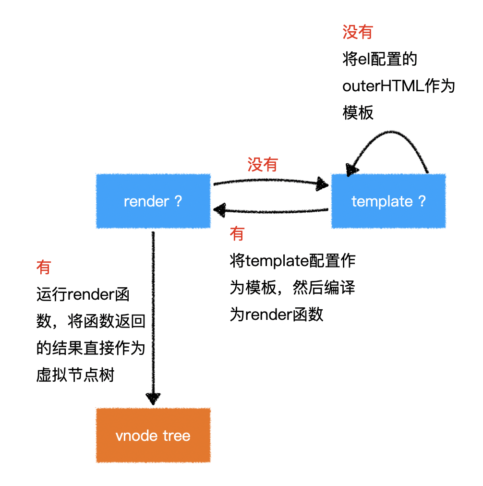

# L03：Vue 核心概念

---

## 1 注入


`Vue` 会将以下配置注入到 `Vue` 实例：

- `data`：和界面相关的数据
- `computed`：通过已有数据计算得来的数据，将来详细讲解
- `methods`：方法

> 模板中可以使用 `Vue` 实例中的成员


## 2 虚拟 DOM 树

直接操作真实的 `DOM` 会引发严重的效率问题，`Vue` 使用虚拟 `DOM`（`Vnode`）的方式来描述要渲染的内容

`vnode` 是一个 **普通的** `JS` 对象，用于描述界面上应该有什么，比如：

```js
var vnode = {
  tag: "h1",
  children: [
    { tag: undefined, text: "第一个 Vue 应用：Hello World"}
  ]
}
```

上面的对象描述了：

```markdown
有一个标签名为 h1 的节点，它有一个子节点，该子节点是一个文本，内容为「第一个 Vue 应用：Hello World」
```

**Vue 模板并不是真实的 DOM，它会被编译为虚拟 DOM**

```html
<div id="app">
  <h1>第一个 Vue 应用：{{title}}</h1>
  <p>作者：{{author}}</p>
</div>
```

上面的模板会被编译为类似下面结构的虚拟 `DOM`：

```js
{
  tag: "div",
  children: [
    { tag: "h1", children: [ { text: "第一个vue应用：Hello World" } ] },
    { tag: "p", children: [ { text: "作者：袁" } ] }
  ]
}
```

虚拟 `DOM` 树会最终生成为真实的 `DOM` 树：


当数据变化后，将引发重新渲染，`Vue` 会比较新旧两棵 `vnode tree`，找出差异，然后仅把差异部分应用到真实 `DOM tree` 中：


**可见，在 Vue 中，要得到最终的界面，必须要生成一个 vnode tree**

`Vue` 通过以下逻辑生成 `vnode tree`：




**注意：虚拟节点树必须是 *单根的***。

> [!tip]
>
> 经实测，`render()` 函数存在时，`template` 和页面模板都不生效；仅有 `template` 模板时，页面模板不生效。


## 3 挂载

将生成的真实 `DOM` 树，放置到某个元素位置，称之为 **挂载**：

挂载的方式：

1. 通过 `el:"CSS选择器"` 进行配置；
2. 通过 `vue实例.$mount("CSS选择器")` 进行配置。


## 4 完整流程


本节思维导图：


> 20260104补充
>
> - `v-for` 指令的 `key` 绑定最好来自数据项的 `id` 值，`for` 循环的索引值次之；
> - `v-model` 等效于 `v-bind` 和 `v-on` 的组合，例如：`<input v-model="something">` 等效于 `<input v-bind:"something" v-on:input="something=$event.target.value">` [^1]


[^1]: 摘自 `Vue.js in Action` 第 65 页 4.1 小节。

