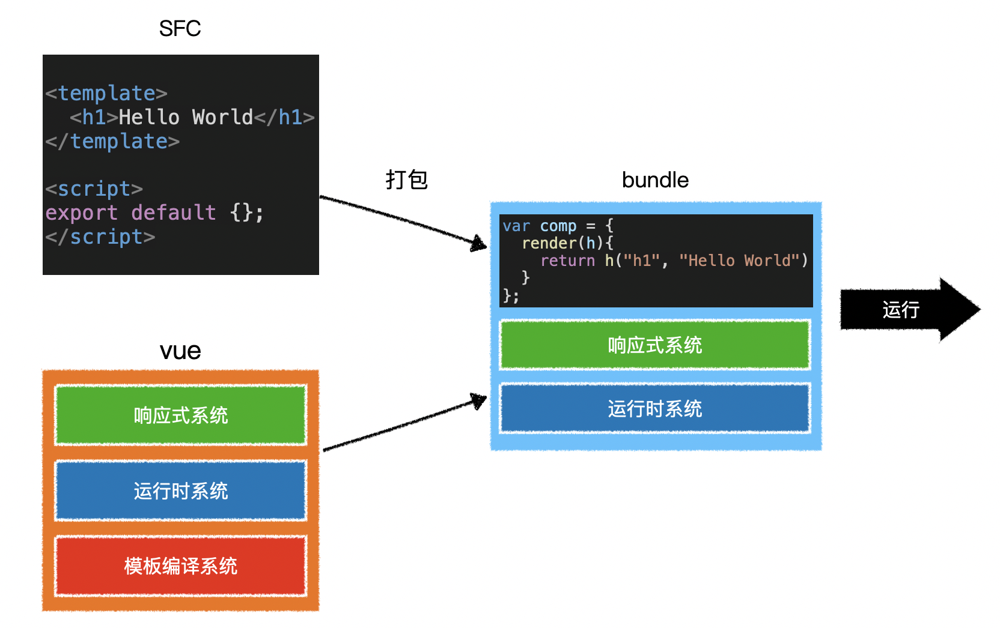
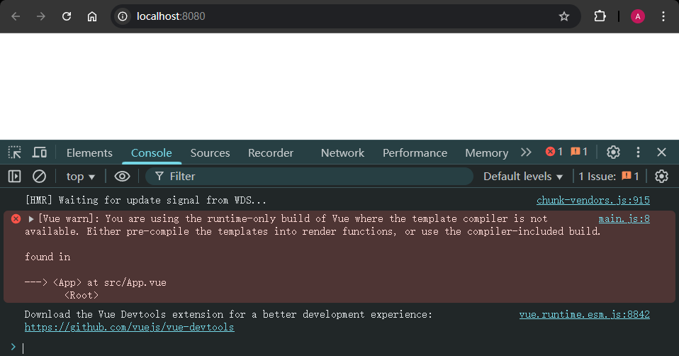
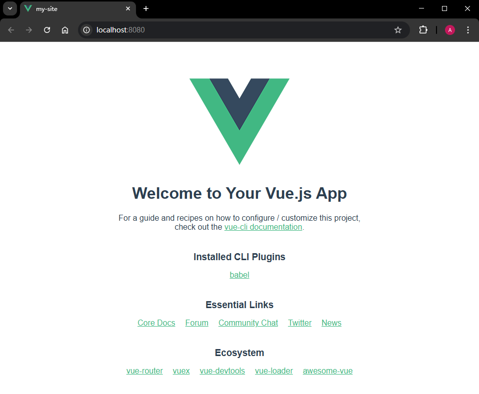

# L05：工程搭建

---


> `vue-cli` 官方文档：https://cli.vuejs.org/zh/


## 1 vue-cli

`vue-cli` 是一个脚手架工具，用于搭建 `Vue` 工程。

它内部使用了 `Webpack`，并预置了诸多插件（`plugin`）和加载器（`loader`），以达到开箱即用的效果。

除了基本的插件和加载器外，`vue-cli` 还预置了：

- `babel`
- `webpack-dev-server`
- `eslint`
- `postcss`
- `less-loader`


## 2 SFC

单文件组件，`Single File Component`，即一个文件就包含了一个组件所需的全部代码：

```html
<template>
	<!-- 组件模板代码 -->
</template>

<script>
export default {
  // 组件配置
}
</script>

<style>
	/* 组件样式 */
</style>
```


## 3 预编译

当 `vue-cli` 进行 **打包** 时，会直接把组件中的模板转换为 `render` 函数，这个过程叫做模板的 **预编译**

这样做的好处在于：

1. 运行时就不再需要编译模板了，提高了运行效率；
2. 打包结果中不再需要 `Vue` 的编译代码，减少了打包体积；



因此，受 `vue-cli` 打包的影响，`SFC` 中如果用 `template` 选项替代 `template` 标签，项目运行是有问题的 [^1]：

```vue
<script>
import Avatar from './components/Avatar';

export default {
  name: 'App',
  components: {
    Avatar
  },
  data() {
    return {
      url: 'http://mdrs.yuanjin.tech/FgMwAPYq17So9nwVH44ltDHo7u3c',
      size: 150
    }
  },
  template: `
    <div id="app">
      <h1>App 组件</h1>
      <Avatar :size="size" :url="url" />
    </div>
  `
}
</script>
```

重新加载项目，控制台出现警告：仅存在运行时的 `Vue` 没有模板编译器：




## 4 实测备忘

`Windows` 版 `nvm` 最新版目前无法安装 `Node.js v16` 及以前的版本，只能降级到 `v1.1.12`。根据 `GitHub` 仓库创建人的回复，该问题本来早已修复，只是由于新版本无法通过 `ARM` 架构的自动构建流程而延误 [^2]。

根据演示视频，项目搭建所需的 `vue-cli` 版本（`@vue/cli@4.5.8`）只能在 `Node.js` 的 `v14.21.3` 中才能正常运行。

配置完脚手架参数后，由于淘宝镜像的证书已过期：

```markdown
error request to https://registry.npm.taobao.org/@vue%2fcli-plugin-babel failed, reason: certificate has expired
```

因此启动项目还必须先禁用 `SSL` 校验：

```shell
npm config set strict-ssl false
```

带成功安装并启动项目，再恢复 `SSL` 设置：

```shell
npm config set strict-ssl true
```

具体搭建命令：

```shell
> nvm install 14
> nvm use v14.21.3
> npm i -g @vue/cli@4.5.8
> npm config set strict-ssl false
> vue create my-site
# 依次选中：
# - Manually select features
# (*) Babel
# (*) CSS Pre-processors
# 2.x
# Less
# In dedicated config files
# Save this as a preset for future projects? (y/N) n
> npm config set strict-ssl true
> cd my-site
> npm run serve
# 然后根据提示打开 http://localhost:8080/ 即可
```

最终效果：



---

[^1]: 本节示例代码，详见 `15_Vue_intro\proj1_my_site`
[^2]: 详见 `nvm-windows` 的 1240 号议案：https://github.com/coreybutler/nvm-windows/issues/1240