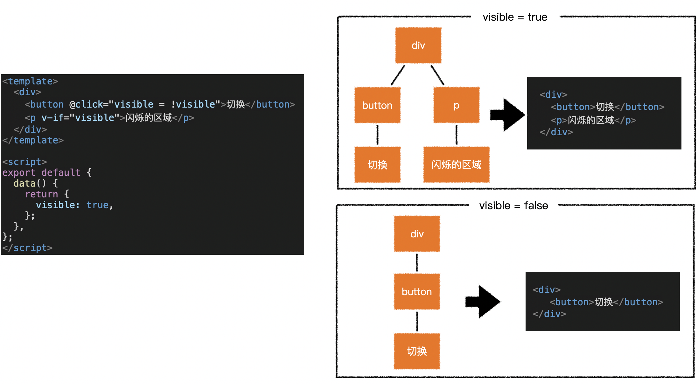
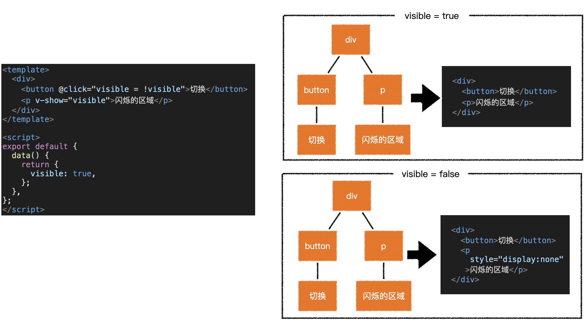
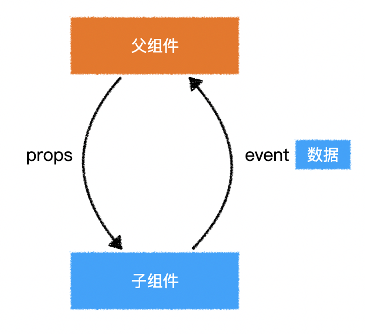
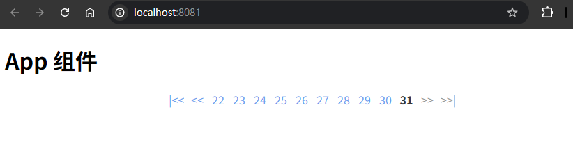

# L07：组件事件

---

本节任务：实现分页组件 `Pager.vue`。

## 1 pager 组件需求

### 1.1 属性

| 属性名          | 含义       | 类型     | 必填 | 默认值 |
| --------------- | ---------- | -------- | ---- | ------ |
| `current`       | 当前页码   | `Number` | 否   | `1`    |
| `total`         | 总数据量   | `Number` | 否   | `0`    |
| `limit`         | 页容量     | `Number` | 否   | `10`   |
| `visibleNumber` | 可见页码数 | `Number` | 否   | `10`   |

### 1.2 事件

| 事件名       | 含义     | 事件参数 | 参数类型 |
| ------------ | -------- | -------- | -------- |
| `pageChange` | 页码变化 | 新的页码 | `Number` |

## 2 知识点

### 2.1 全局样式

### 2.2 v-if 和 v-show

-------

> [!tip]
>
> **面试题：v-if 和 v-show 有什么区别？**
>
> `v-if` 能够控制是否生成 `Vnode`，也就间接控制了是否生成对应的 `DOM`。当 `v-if` 为 `true` 时，会生成对应的 `Vnode`，并生成对应的 `DOM` 元素；当其为 `false` 时，不会生成对应的 `Vnode`，自然不会生成任何的 `DOM` 元素。
>
> `v-show` 始终会生成 `Vnode`，也就间接导致了始终生成 `DOM`。它只是控制 `DOM` 的 `display` 属性：
>
> - 当 `v-show` 为 `true` 时，不做任何处理；
> - 当其为 `false` 时，生成的 `DOM` 的 `display` 属性值为 `none`。
>
> 使用 `v-if` 可以有效地减少树的 **节点和渲染量**，但也会导致树的 **不稳定**；而使用 `v-show` 可以保持树的稳定，但不能减少树的节点和渲染量。
>
> 因此，在实际开发中，显示状态变化频繁的情况下应该使用 `v-show`，**以保持树的稳定**；显示状态变化较少时应该使用 `v-if`，**以减少树的节点和渲染量**。

### 2.3 组件事件

抛出事件：子组件在某个时刻触发了某一事件，但自身无法处理，于是 **通过事件的方式** 通知父组件处理。

事件参数：子组件抛出事件时，传递给父组件的数据。

注册事件：在父组件上声明。当子组件发生某件事的时候，父组件自身将做出一些处理。

## 3 案例实测

主要变更：

1. 修正分页组件可显示页码的上下边界计算逻辑；
2. `Flexbox` 布局新增弹性元素宽度，让组件总宽度固定下来；
3. 细节控制：利用 `user-select: none;` 禁用页码数字选中。

实测效果：

