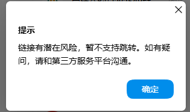
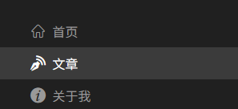
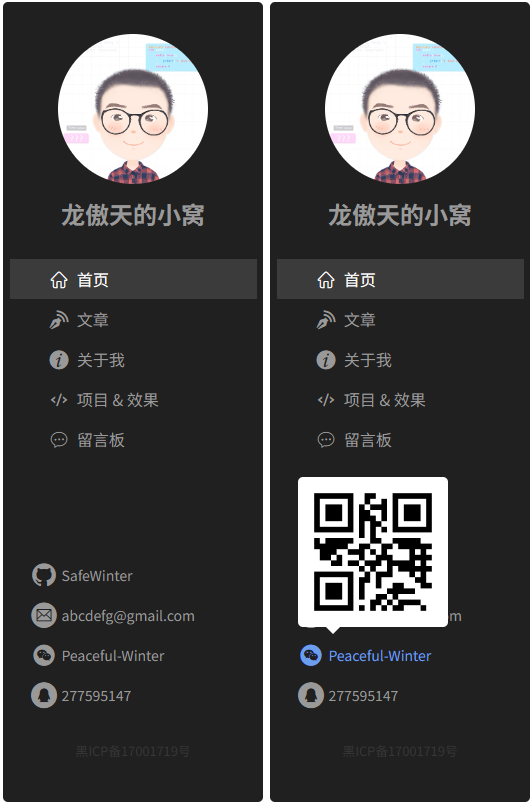

# L09：组件练习

---

> 本节通过实现五个不同的 `Vue` 组件来熟悉相关语法和操作：
>
> - `Empty`：自定义的无内容占位组件；
> - `ImageLoader`：自带清晰度过渡的图片加载组件；
> - `Contact`：侧边栏联系方式组件（已改造为由多个 `ContactItem` 组合构成），同时支持超链接跳转和二维码显示；
> - `Menu`：侧边栏菜单组件；
> - `SiteAside`：侧边栏自身组件。

---

## 1 Empty

实测过程复盘：

1. 练习 `mixin.less` 的用法，抽取居中定位的样式设置；
2. 组件的样式应该尽量在组件内实现，而不是主要通过透传 `attribute` 属性实现；
3. 透传 `attribute` 仅用于控制二级子组件的样式，例如 `Empty` 中引入的 `Icon` 组件，可通过属性透传控制图标大小等；


## 2 ImageLoader

实测过程复盘：

1. 缩略图和高清图的先后渲染：时间上先渲染缩略图（较小），隐藏原始图片；然后过渡 `opacity` 让高清图逐渐显示出来；
2. 缩略图只能在高清图加载完毕后删除，否则页面会闪过一段空白；
3. 渐显和渐隐的实现方式完全不同：
   1. 渐显：`opacity` 由 `0` 过渡到 `1`；
   2. 渐隐：缩略图初始模糊（`filter: blur(1vw);`）；待高清图片加载完毕，再用 `v-if` 删除缩略图；
4. 再次强化 `mixin.less` 的用法。


## 3 Contact

该组件为复合组件，可以理解为多个 `ContactItem` 的组合。由于超链接和二维码都是选填的，因此存在四种可能：

|                  |         **存在超链接**         |    **不存在超链接**    |
| :--------------: | :----------------------------: | :--------------------: |
|  **存在二维码**  | 又可跳转 `URL`，又可渲染二维码 |      仅渲染二维码      |
| **不存在二维码** |   可跳转 `URL`，但没有二维码   | 既不跳转，也没有二维码 |

`ContactItem` 组件模板设计如下：

```vue
<figure class="contact-item-container">
  <figcaption class="label">
    <a v-if="hasLink" :href="link" target="_blank">
      <Icon class="icon" :type="icon" /><span>{{ label }}</span>
    </a><a v-else>
      <Icon :type="icon" /><span>{{ label }}</span>
    </a>
  </figcaption>
  <div class="pop" v-if="hasQrCode">
    
  </div>
</figure>
```

要点梳理：

1. 练习 `HTML` 语义化标签；

2. 利用 `props` 传入的值定义计算属性，提高渲染效率；

3. 注意有无超链接的实现，需配合 `v-if` / `v-else`；

4. 练习 `transform-origin` 的用法；

5. 鼠标悬停才能显示二维码（如果存在），这里还有一种 `CSS` 实现方式：

   ```less
   .label {
     &:has(a:hover) + .pop {
       transform: scaleY(1);
     }
   }
   ```

> [!important]
>
> **待解决问题：对象数组作 props 时的字段描述情况。**
>
> 由于 `Vue` 中没有原生支持 `props` 定义对象数组的特性，根据 `Claude Sonnet 4` 的回复，可利用校验函数绕道而行。

另外，视频中的 `QQ` 跳转方式已经失效，即便提前登录 `QQ` 也不会正常跳转：



## 4 Menu

菜单组件相对简单，需要依赖 `Icon` 组件。本节重点在于 `selected` 类的切换，需要借助 `location.pathname`；对于特殊路径，判定规则也有所不同（全等？模糊匹配？）：

```js
methods: {
  isSelected({link, matchPrefix = false}) {
    const curPath = location.pathname;
    return matchPrefix
      ? curPath.startsWith('/blog')
      : curPath === link;      
  },
},
```

另外，为了让选中的菜单项背景贯通整个容器，而不是文字宽度，需要在 `a` 元素外再包裹一层 `li`，即对 `li` 设置背景，`a` 设置左右外边距：




## 5 SiteAside

该组件为前面组件的汇总组件，直接依赖 `Avatar`、`Menu`、`Contact` 组件。重点训练集成各子组件后的样式微调（包括博客名称、备案号等增补内容）。

实测效果：


