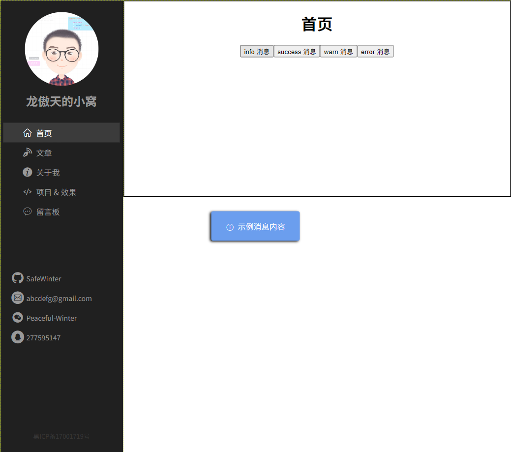

# L12：弹出消息通用组件

---

本节实现一个通用的弹出消息模块。通过声明到 `Vue.prototype` 的属性上，可以很方便地在任意容器实现统一的消息提示效果。

实现该功能需要补充以下四个知识点。


## 1 使用 CSS module

在 `SFC` 中使用导入的 `CSS` 样式类，需要将样式文件命名为 `xxx.module.ooo`。其中：

- `xxx` 为文件名
- `ooo` 为样式文件后缀名，可以是`css`、`less`


## 2 得到组件渲染的 DOM 元素

```js
  /**
    获取某个组件渲染的Dom根元素
  */
function getComponentRootDom(comp, props){
  const vm = new Vue({
    render: h => h(comp, {props})
  })
  vm.$mount();
  return vm.$el;
}
```


## 3 扩展 Vue 实例


## 4 ref 引用

```html
<template>
  <div>
    <p ref="para">some paragraph</p>
    <ChildComp ref="comp" />
    <button @click="handleClick">查看所有引用</button>
  </div>
</template>

<script>
  import ChildComp from "./ChildComp"
  export default {
    components:{
      ChildComp
    },
    methods:{
      handleClick(){
        // 获取持有的所有引用
        console.log(this.$refs);
        /*
        {
        	para: p元素（原生DOM）,
        	comp: ChildComp的组件实例
        }
        */
      }
    }
  }
</script>
```

`ref` 获取的是 DOM 元素或子组件实例的引用，且不具备响应式特点（详见 [#ref](https://cn.vuejs.org/api/built-in-special-attributes.html#ref)）；另外，`ref` 的值除了字符串外，还可以是一个函数（函数式模板引用），具体详见官方文档 [模板引用](https://cn.vuejs.org/guide/essentials/template-refs.html#template-refs)。


> [!warning]
>
> **注意**
>
> 通过 `ref` 可以直接操作 `DOM` 元素，甚至可能直接改动子组件，这些都不符合 `Vue` 的设计理念。
>
> **切记：除非迫不得已，否则不要使用 `ref`**。


## 5 实测备忘

实测时略作调整：

1. 页面强制渲染（重排）没有使用 `div.clientHeight`，而是使用 `setTimeout(fn, 0)` 解决异步调用问题（`L9`、`L23`）：

```js
// @/utils/getMessage.js
let isStatic = false;
if(getComputedStyle(container).position === 'static') {
  isStatic = true;
  container.classList.add(styles.relative);
}
container.appendChild(div);

setTimeout(() => {
  console.log('消息框渲染完毕');
  div.classList.add(styles.normal);
  setTimeout(() => {
    div.classList.replace(styles.normal, styles.hidden);
    div.addEventListener('transitionend', () => {
      div.remove();
      if (isStatic) {
        container.classList.remove(styles.relative);
        isStatic = false;
      }
      callback();
    }, { once: true });
  }, duration);
}, 0);
/* @/utils/showMessage.module.less:
&.normal {
  opacity: 1;
  transform: translate(-50%, -50%) translateY(0);
}
&.hidden {
  opacity: 0;
  transform: translate(-50%, -50%) translateY(-25px);
}
*/
```

2. 将形如 `dom.style.attr` 的样式设置逻辑全部变为样式类的切换（`L5`、`L13`、`L17`），尽可能符合 `Web` 最佳实践。
3. 手动变更消息框包含块的 `position` 样式值时，待消息隐藏后应恢复容器的默认样式，避免前后状态不一致。
4. 由于实测时正文区用的 `HTML` 元素为 `main` 元素，自定义消息弹框的父容器元素应该明确指定为该 `main` 元素，而不是视频中的 `body` 元素，否则页面渲染出错：


原因：App 组件的最外层容器为 `.app-container`，而不是 `document.body`。因此默认容器要么设为 `document.querySelector(.app-container)`，要么设为正文区的容器元素 `document.querySelector(.main)`。

默认容器为 `.app-container` 时：



默认容器为 `.app-container` 时：


> [!tip]
>
> **防误触设置**
>
> 在展示弹窗消息过程中，如果不希望再次触发其他弹窗消息，可以引入一个状态参数实现每次只展示一个弹窗消息（`L4`、`L9`、`L18`）：
>
> ```js
> export default {
>   data() {
>     return {
>       running: false
>     }
>   },
>   methods: {
>     showInfo(type) {
>       if (this.running) return;
>       this.running = true;
>       const that = this;
>       this.$getMessage({
>         content: '示例消息内容',
>         type,
>         container: this.$refs.home,
>         callback() {
>           console.log('消息已显示');
>           that.running = false;
>         }
>       });
>     }
>   }
> }
> ```
>
> 尤其需要注意的是 `this` 的指向问题（`L11`）。
