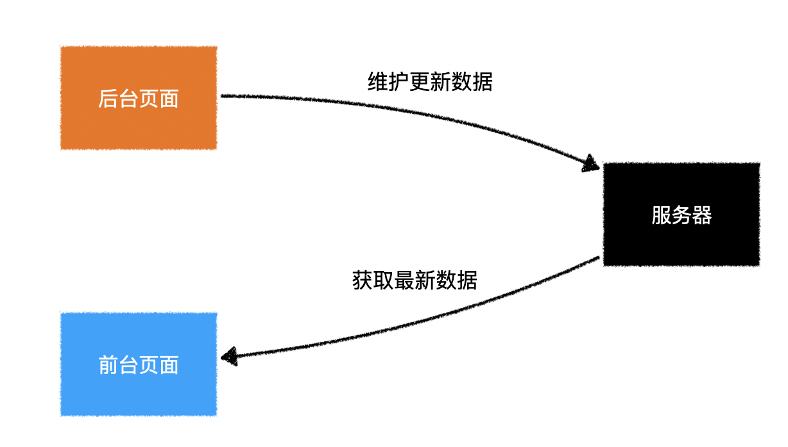
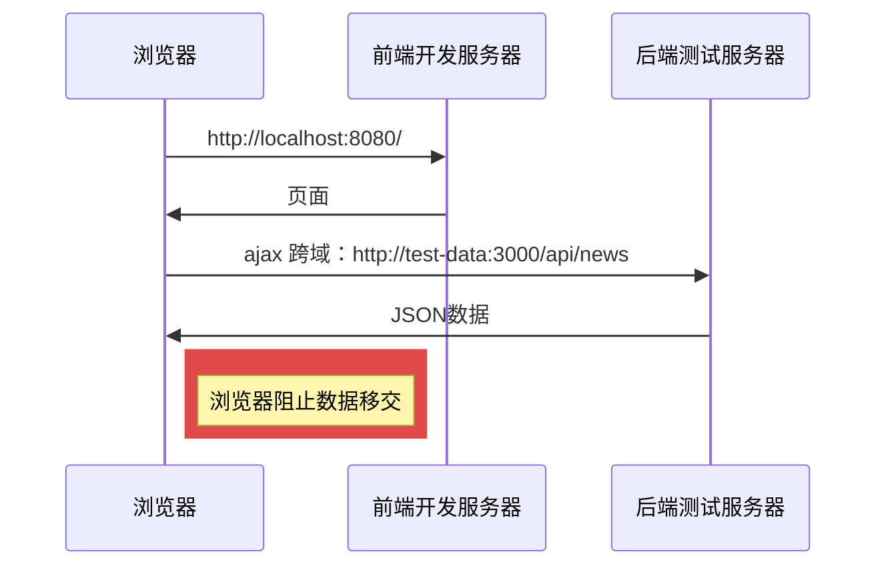
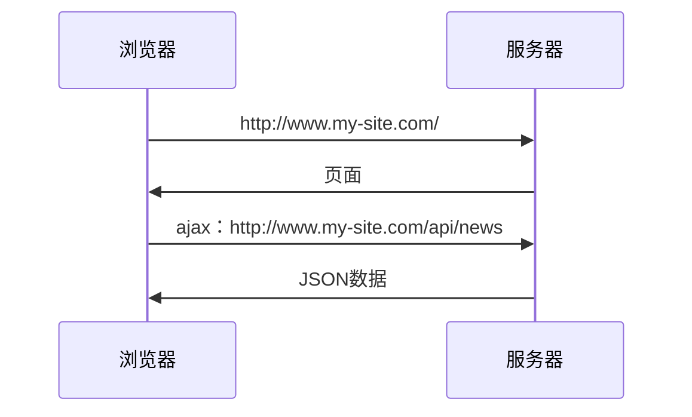
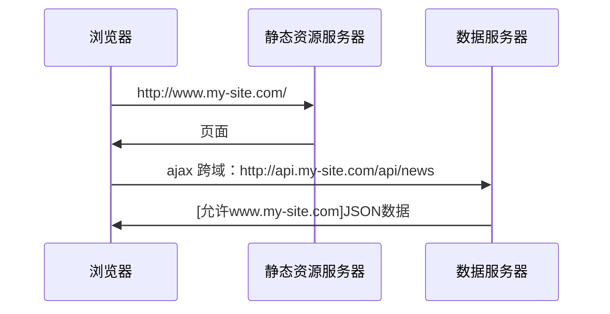
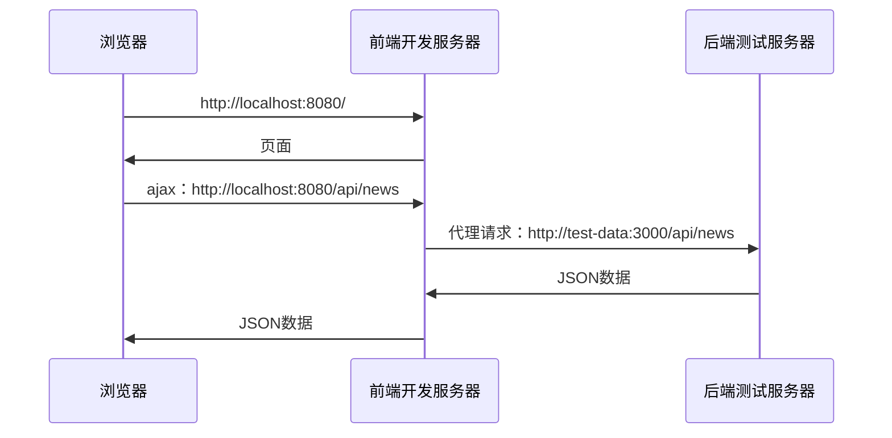
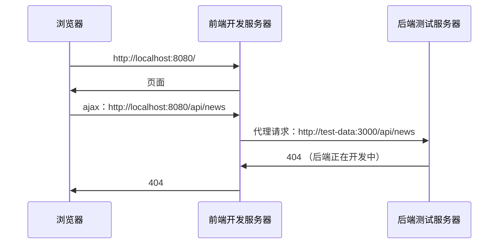
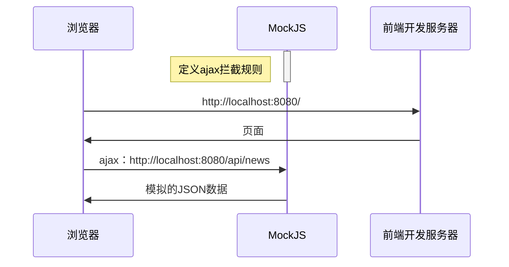
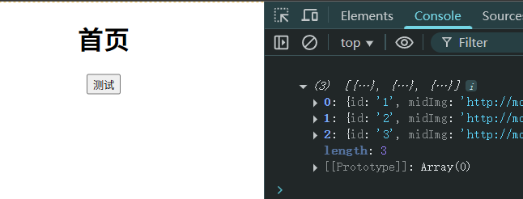

# L13：获取远程数据

> 本节课内容和 `Vue` 没有任何关系！
>
> `Vue cli`：https://cli.vuejs.org/zh/
>
> `Axios`：https://github.com/axios/axios
>
> `Mockjs`：http://mockjs.com/

---


## 1 远程获取数据的意义



## 2 开发环境有跨域问题



## 3 生产环境没有跨域问题





## 4 解决开发环境的跨域问题



## 5 为什么要 Mock 数据






## 6 实战备忘录

设置开发服务器代理：

```js
// vue.config.js
module.exports = {
  devServer: {
    proxy: {
      '/api': {
        target: 'https://demo/url/target',
      },
    },
  },
}
```

通过 `Axios` 实例设置请求/响应拦截器：

```js
const apiClient = axios.create({
  timeout: 5000
});

apiClient.interceptors.response.use(function (resp) {
  const { code, msg, data } = resp.data;
  if (code !== 0) {
    getMessage({
      type: 'error',
      content: msg,
      duration: 500,
      callback: () => {
        console.error(`Error: ${msg}（code:${code}）`);
      }
    });
    return null;
  }
  return data; // Return the data directly if the code is 0
});

export default apiClient;
```

再通过 `Axios` 实例发送实际请求：

```js
import request from './request';

// 获取banner
export async function getBanner() {
  return await request.get('/api/banner');
}
```

如果后端接口没写好，则可通过 `Mockjs` 设置模拟接口：

```js
import Mock from 'mockjs';

Mock.mock('/api/banner', 'get', {
  code: 0,
  msg: '获取数据成功',
  data: [{
      id: "1",
      midImg: "http://mdrs.yuanjin.tech/img/20201031141507.jpg",
      bigImg: "http://mdrs.yuanjin.tech/img/20201031141350.jpg",
      title: "凛冬将至",
      description: "人唯有恐惧的时候方能勇敢",
    },
    {
      id: "2",
      midImg: "http://mdrs.yuanjin.tech/img/20201031205550.jpg",
      bigImg: "http://mdrs.yuanjin.tech/img/20201031205551.jpg",
      title: "血火同源",
      description: "如果我回头，一切都完了",
    },
    {
      id: "3",
      midImg: "http://mdrs.yuanjin.tech/img/20201031204401.jpg",
      bigImg: "http://mdrs.yuanjin.tech/img/20201031204403.jpg",
      title: "听我怒吼",
      description: "兰尼斯特有债必偿",
    },
  ]
});
```

最后在入口文件 `main.js` 中启用或屏蔽 `mock` 模拟接口：

```js
import '@/mock';
```

实测结果：


