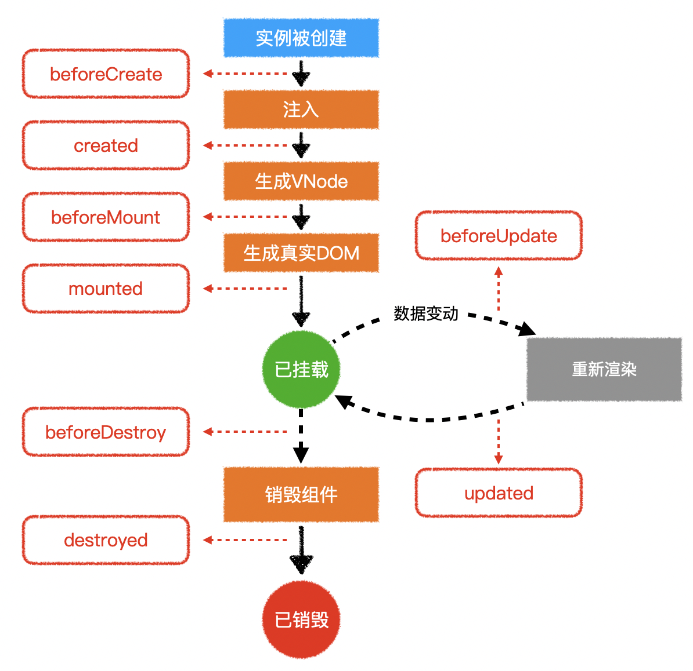
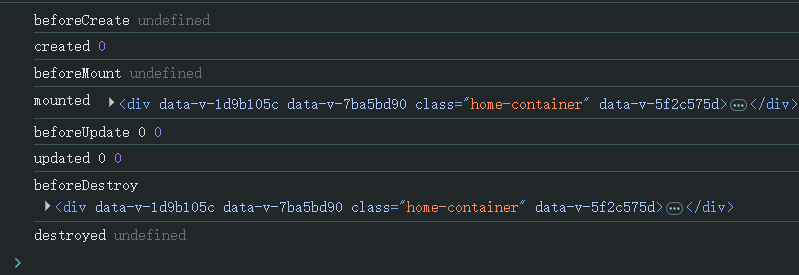

# L14：组件生命周期

---

## 1 基本原理




实测效果：




## 2 常见应用

> 不要死记硬背，要根据具体情况灵活处理

### 2.1 加载远程数据

```js
export default {
  data(){
    return {
      news: []
    }
  },
  async created(){
    this.news = await getNews();
  }
}
```

### 2.2 直接操作 DOM

```js
export default {
  data(){
    return {
      containerWidth:0,
    	containerHeight:0
    }
  },
  mounted(){
    this.containerWidth = this.$refs.container.clientWidth;
    this.containerHeight = this.$refs.container.containerHeight;
  }
}
```

### 2.3 启动和清除计时器

```js
export default {
  data(){
    return {
      timer: null
    }
  },
  created(){
    this.timer = setInterval(()=>{
     ... 
    }, 1000)
  },
  destroyed(){
    clearInterval(this.timer);               
  }
}
```

> [!important]
>
> 只要页面存在变动，就会触发 `updated()` 钩子，因此需要 `destroyed()` 钩子完成一些必要的清理工作。
