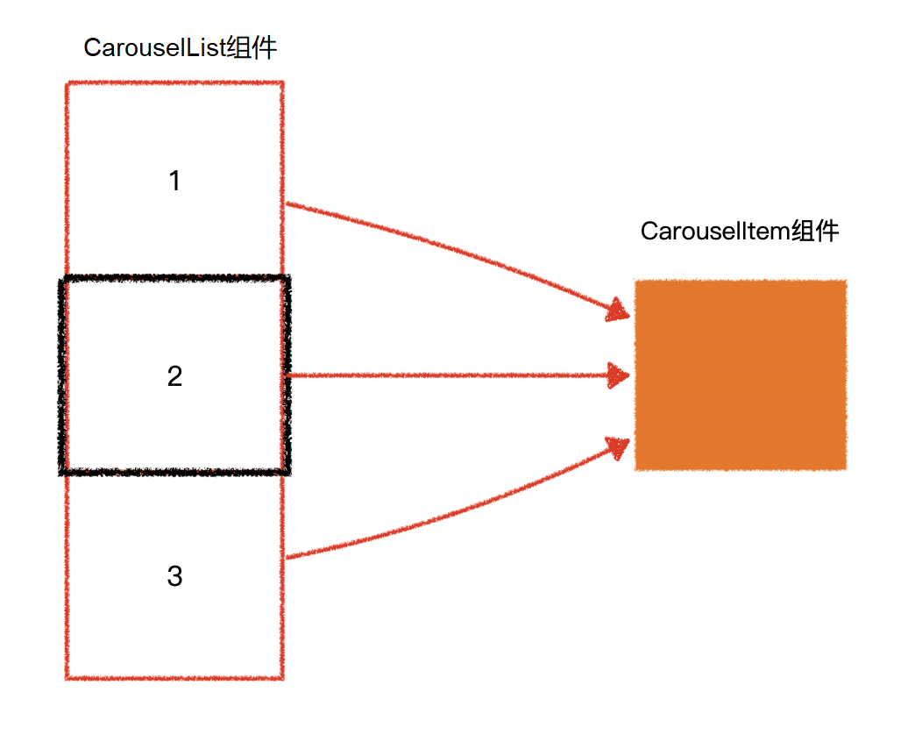

# L15：实现项目首页

---

本节利用 `Vue` 组件的基本原理，搭建 `my-site` 示例项目的首页基本结构。

具体分工如下：

- `Home` 组件：负责请求首页数据，并引入轮播图组件 `CarouselList` 进行具体渲染（本节实现）。
- ` CarouselList` 组件：分为 **容器** 和具体的 **轮播图元素项** 两部分，其中——
  - 前者为多个元素项提供渲染的容器，并支持上下鼠标翻页、滚轮翻页、单击翻页等功能（包括动画进行时禁用二次操作等特性）（本节实现）；
  - 后者为单独的组件（`CarouselItem`）（后两节 `L16`、`L17` 实现）；
- `CarouselItem` 组件：包括图片和文字两部分内容，其中——
  - 图片由 `ImageLoader` 组件渲染（第 `L16` 节实现）；
  - 文字则需实现从左向右展开的动画效果（第 `L16` 节实现）；
  - 并且在鼠标移动时，背景图片可以反向移动（让页面视图有镜头移动的感觉）（第 `L17` 节实现）。

`CarouselList` 与 `CarouselItem` 组件的核心功能设计：

`CarouselList` 组件负责：

- 整体布局
- 监听鼠标滚轮事件，切换轮播图
- 提供上下按钮，切换轮播图
- 提供指示器，切换轮播图

`CarouselItem` 组件：负责单张轮播图的全部事务——

- 导入 `ImageLoader` 组件；
- 文字动画特效；
- 鼠标移动时图片反向移动特效；
- 移出容器后自动复位居中效果。

本节实测后的项目首页效果图：

