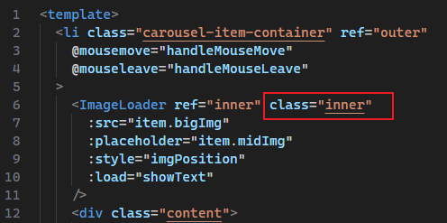

# L17：实现项目首页（接上节）

> **本节重点**
>
> 实现单张轮播图背景随鼠标 **反向移动**，并在鼠标 **进出正文区时** 提供平滑过渡效果（过渡时长 `0.3s`）。
>
> 实测过程中，修复了课件源码页面卡顿的问题（未能及时关闭过渡）。

---


## 1 核心逻辑

问题的关键，在于根据当前鼠标坐标（`mouseX`、`mouseY`）、图片的内、外容器宽高，计算出内层容器的实际偏移量（`left` + `top`，或者 `transform`）。

数量关系：

```markdown
left = f(mouseX)
     = K_x · mouseX
     = (left_max / mouseX_max) · mouseX
top = f(mouseY)
     = K_y · mouseY
     = (top_max / mouseY_max) · mouseY
```

这里的 `mouseX`、`mouseY` 分别为鼠标相对于外层容器的位置坐标，可通过 `mousemove` 事件的 `event.clientX` 和 `event.clientY` 和外容器的 `left`、`top` 值分别相减得到：

```js
const {left, top} = this.$refs.outer.getBoundingClientRect();
this.mouseX = ev.clientX - left;
this.mouseY = ev.clientY - top;
```

又因为 `K_x` 和 `K_y` 只与内外容器的宽高相关，因此可将其设为计算属性 `ratio`：

```js
ratio() {
  if(!this.outerSize || !this.innerSize) {
    return {x: 1, y: 1};
  }
  return {
    x: (this.outerSize.width - this.innerSize.width) / this.outerSize.width,
    y: (this.outerSize.height - this.innerSize.height) / this.outerSize.height,
  };
},
```

从而得到内层容器的实时偏移量为：

```js
imgPosition() {
  const x = this.mouseX * this.ratio.x;
  const y = this.mouseY * this.ratio.y;
  return {
    transform: `translate(${x}px, ${y}px)`,
  }
},
```


## 2 页面卡顿问题复盘

实现图片的反向移动后，为了消除鼠标进出外容器时的动画突变，还引入了 `mouseleave` 事件逻辑：离开外容器后，对内层容器设置过渡特效。

但由此引入一个 Bug：离开容器时添加了过渡，但进入容器时怎么处理呢？

- 继续保留过渡设置，则图片的反向移动会实时触发大量过渡动画，**导致页面卡顿**；
- 如果进入后立即取消过渡，但实测发现鼠标移入容器时还是存在动画突变。

由此可见，进入容器后何时取消过渡特效 **缺乏一个明确的边界条件**。

为此，特地引入 **容器内填充区域** 的概念，人为划定一个尺寸为固定大小（如 `5px`）的内边距区域。鼠标在该区域移动时有过渡特效；再往里移动则取消过渡，计算方式如下（设为一个计算属性 `nearBorder`）：

```js
nearBorder() {
  const gap = this.padding;
  const [x, y] = [this.mouseX, this.mouseY];
  const [width, height] = [this.outerSize.width, this.outerSize.height];
  const nearLeft = x <= gap;
  const nearTop = y <= gap;
  const nearRight = x >= width - gap;
  const nearBottom = y >= height - gap;
  return [nearBottom, nearTop, nearLeft, nearRight].some(t => t);
},
```

然后在鼠标移动时动态切换内层容器的样式类：

```js
const innerEl = this.$refs.inner.$el;
innerEl.classList.toggle('valid', this.nearBorder);
innerEl.classList.toggle('invalid', !this.nearBorder);
/* 样式类定义：
.inner {
    &.valid { transition: transform 0.3s; }
    &.invalid { transition: none; }
} */
```

注意：变更样式时尽量通过 **切换 CSS 样式类** 实现效果，万不得已再绑定 `style` 属性。


## 3 @layer 规则的试用与复盘

实测过程中为了便于理解，`CarouselList` 和 `CarouselItem` 组件都作了样式调整，为了提高 `CSS` 代码的复用性，尝试使用全新的 `@layer` 规则剥离调试环境下的 `CSS` 代码，在 `style` 标签下使用 `@base` 和 `@test` 两个图层进行区分，但是效果很差：

```css
@layer base, test;
@layer base {
    /* original styles */
};
@layer test {
    /* styles for testing */
};
```


## 4 透传属性的再次理解

第 `L9_组件练习.md` 中曾学过 **透传属性（Fallthrough Attributes）** 的相关内容（详见 [官方文档](https://cn.vuejs.org/guide/components/attrs)）。

实测时由于 `ImageLoader` 没有添加额外的 `div` 容器，因此内层容器角色实际上是由 `ImageLoader` 组件的根元素 `<div class="image-loader-container">` 扮演的。要实现内层容器尺寸放大 `10%`，需要在 `ImageLoader` 的父组件 `CarouselItem` 上通过透传属性将样式类 `.inner` 叠加到其根元素上：



因此 `.inner` 的样式必须在父组件内声明：

```css
/* CarouselItem.vue */
& > .inner {
  width: 110%;
  height: 110%;

  // z-index: -1; //test

  &.valid { transition: transform 0.3s; }
  &.invalid { transition: none; }
}
```

这样就能在不修改子组件内部样式的情况下改变内部容器的宽高，并且在调试模式下让 `z-index` 设置生效（用于暴露外层容器边框，以观察容器的相对位置）。


## 5 关于 refs 引用的一个细节

`ref` 加到子组件上，获取子组件的根元素要用 `this.$refs.foo.$el`；加到 `HTML` 元素上，则使用 `this.$refs.foo` 即可（`L7`、`L8`）：

```js
/*<template>
  <li ref="outer" class="carousel-item-container">
    <ImageLoader ref="inner" class="inner" />
  </li>
</template>*/
computed: {
  computeContainerSize() {
    this.outerSize = {
      width: this.$refs.outer.clientWidth,
      height: this.$refs.outer.clientHeight,
    };
    this.innerSize = {
      width: this.$refs.inner.$el.clientWidth,
      height: this.$refs.inner.$el.clientHeight,
    };
  },
}
```

