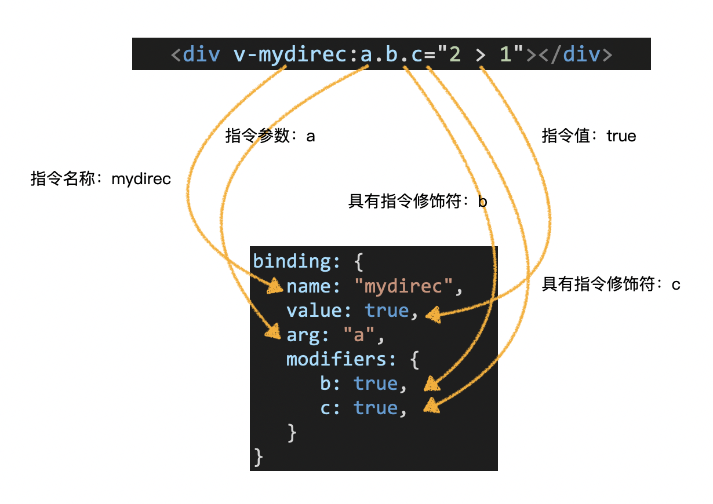
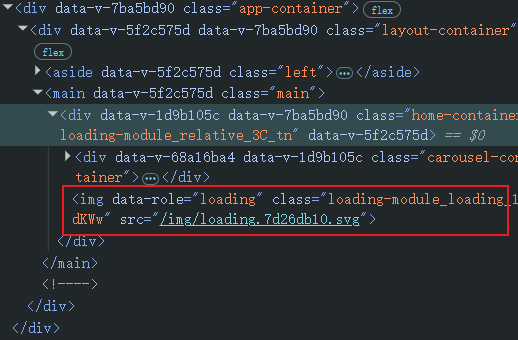

# L18：Vue 自定义指令

---

本节通过自定义指令统一设置 **正在加载** 的等待效果，实现代码的高度复用。


## 1 指令的定义

### 1.1 全局定义

```js
// 指令名称为：mydirec1
Vue.directive('mydirec1', {
  // 指令配置
})

// 指令名称为：mydirec2
Vue.directive('mydirec2', {
  // 指令配置
})
```

之后，所有的组件均可使用 `mydirec1` 和 `mydirec2` 指令：

```vue
<!-- 某组件模板 -->
<template>
  <div>
    <MyComp v-mydirec1="js表达式" />
    <div v-mydirec2="js表达式">
      ...
    </div>
    
  </div>
</template>
```

### 1.2 局部定义

局部定义是指在某个组件中定义指令，和局部注册组件类似。

定义的指令仅在该组件中有效：

```vue
<!-- 某组件模板 -->
<template>
  <div>
    <MyComp v-mydirec1="js表达式" />
    <div v-mydirec2="js表达式">
      ...
    </div>
    
  </div>
</template>

<script>
export default {
  // 定义指令
  directives: {
    // 指令名称：mydirec1
    mydirec1: {
      // 指令配置
    },
    // 指令名称：mydirec2
    mydirec2: {
      // 指令配置
    }
  }
}
</script>
```

和局部注册组件一样，为了让指令更加通用，通常我们会把指令的配置提取到其他模块：

```vue
<template>
  <!-- 某个组件代码 -->
  <div>
    <MyComp v-mydirec1="js表达式" />
    <div v-mydirec2="js表达式">
      ...
    </div>
    
  </div>
</template>

<script>
  // 导入当前组件需要用到的指令配置对象
  import mydirec1 from "@/directives/mydirec1";
  import mydirec2 from "@/directives/mydirec2";
  export default {
    // 定义指令
    directives: {
      mydirec1,
      mydirec2
    }
  }
</script>
```


## 2 指令配置对象

没有配置的指令，就像没有配置的组件一样，毫无意义。

`Vue` 支持在指令中配置一些 **钩子函数**，在适当的时机，`Vue` 会调用这些钩子函数并传入适当的参数，以实现相应的功能。

常用的钩子函数有：

```js
// 指令配置对象
{
  bind(el, binding){
    // 只调用一次，指令第一次绑定到元素时调用。在这里可以进行一次性的初始化设置。
  },
  inserted(){
    // 被绑定元素插入父节点时调用。
  },
  update(){
    // 所在组件的 VNode 更新时调用
  }
}
```

>  [!tip]
>
>  更多指令钩子函数，详见 [v2.x 版文档](https://v2.cn.vuejs.org/v2/guide/custom-directive.html#%E9%92%A9%E5%AD%90%E5%87%BD%E6%95%B0)，最新版文档详见 [v3.x 版本](https://cn.vuejs.org/guide/reusability/custom-directives#directive-hooks)。

每个钩子函数在调用时，`Vue` 都会向其传递一些参数，其中最重要的是前两个参数：

```js
// 指令配置对象
{
  bind(el, binding){
    // el 是被绑定元素对应的真实 DOM 元素
    // binding 是一个对象，描述了指令中提供的信息
  }
}
```

### 2.1 bingding 对象



> [!tip]
>
> 查看更多 `bingding` 对象的属性，详见 [官方文档](https://cn.vuejs.org/v2/guide/custom-directive.html#%E9%92%A9%E5%AD%90%E5%87%BD%E6%95%B0%E5%8F%82%E6%95%B0)。


## 3 配置简化

比较多的时候，在配置自定义指令时，我们都会配置两个钩子函数：

```js
const binding = {
  bind(el, bingding){
    
  },
  update(el, bingding){
    
  }
};
```

这样，在元素绑定和更新时，都能运行到钩子函数。

如果这两个钩子函数实现的功能相同，可以直接把指令配置简化为一个单独的函数：

```js
function(el, bingding){
  // 该函数会被同时设置到 bind 和 update 中
}
```


> 利用上述知识，可满足大部分自定义指令的需求
>
> 更多的自定义指令用法见官方文档：
>
> - `v2.x` 版：https://v2.cn.vuejs.org/v2/guide/custom-directive.html
> - `v3.x` 版：https://cn.vuejs.org/guide/reusability/custom-directives


首页实测情况：

