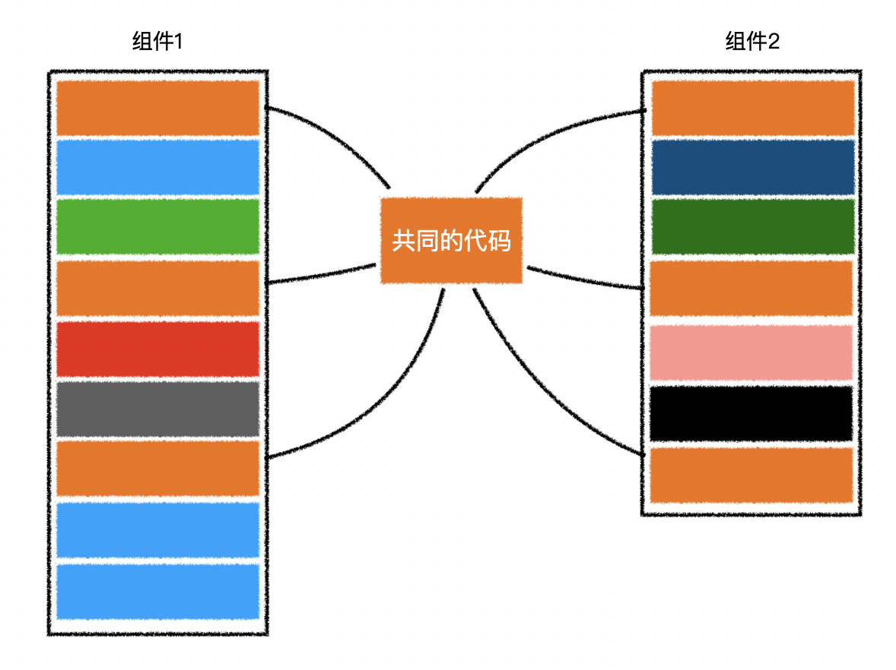
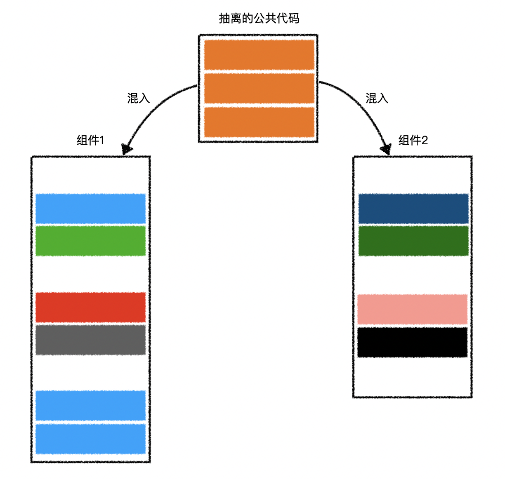

# L19：Vue 组件的 mixin（混入）

---

> **DIY 比较**
>
> `Vue` 组件中的 `mixin` 混入的概念类似 `Java 8` 中的默认接口实现。具体使用时可重写对应的配置项。

有的时候，许多组件有着类似的功能，这些功能代码分散在组件不同的配置中：



于是，我们可以把这些配置代码抽离出来，利用 **混入（mixin）** 融合到组件中：



具体的做法非常简单：

```js
// 抽离的公共代码
const common = {
  data(){
    return {
      a: 1,
      b: 2
    }
  },
  created(){
    console.log("common created");
  },
  computed:{
    sum(){
      return this.a + this.b;
    }
  }
}

/**
 * 使用 comp1，将会得到：
 * common created
 * comp1 created 1 2 3
 */
const comp1 = {
  mixins: [common] // 之所以是数组，是因为可以混入多个配置代码
  created(){
    console.log("comp1 created", this.a, this.b, this.sum);
  }
}
```

混入并不复杂，更多细节参见 [Vue 2.x 官网](https://v2.cn.vuejs.org/v2/guide/mixins.html#ad)。

> [!tip]
>
> **DIY 补充：mixin 的覆盖策略**
>
> 根据 `Vue 2.x` 提供的历史文档，混入机制遵循以下覆盖策略：
>
> 1. 数据对象在内部会进行递归合并，并在发生冲突时以 **组件数据优先**；
>
> 2. 值为对象的选项，例如 `methods`、`components` 和 `directives`，将被合并为同一个对象；若两个对象键名冲突时，取 **组件对象** 的键值对；
>
> 3. 同名 **钩子函数** 将合并为一个 **数组**，因此都将被调用；另外，混入对象的钩子将在组件自身钩子 **之前** 调用。
>
> 4. `Vue.extend()` 也使用同样的策略进行合并，该方法用法如下：
>
>    ```js
>    // 定义一个混入对象
>    var myMixin = {
>      created: function () {
>        this.hello()
>      },
>      methods: {
>        hello: function () {
>          console.log('hello from mixin!')
>        }
>      }
>    }
>       
>    // 定义一个使用混入对象的组件
>    var Component = Vue.extend({
>      mixins: [myMixin]
>    })
>       
>    var component = new Component() // => "hello from mixin!"
>    ```


## 项目实战备忘

实测过程中，将获取首页标语的远程数据获取逻辑重构到 `mixin` 中时，需要在组件的实例方法中定义具体的获取逻辑。结果实测时忘了写返回值，直接就在方法体中对数据源 `this.banners` 赋值了，从而导致标语渲染失败。正确写法如下（`L12`）：

```js
// @/mixins/fetchBanners.js
async created() {
  this.loading = true;
  this.banners = await this.getRemoteData();
  this.loading = false;
},

// @/views/Home/index.vue
methods: {
  async getRemoteData() {
    // implement the instance mothod in fetchBanner mixin
    return await getBanner();
  }
}
```

