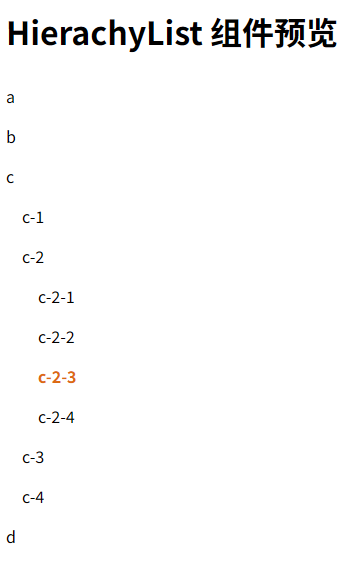

# L20：Vue 组件的递归处理

---

本节实现右侧边栏的菜单组件。该组件为递归渲染，写法上与常规组件略有不同。


## 1 递归组件的模板设计

核心逻辑：

```vue
<template>
  <ul class="hierachy-list-container">
    <li v-for="item in data" :key="item.id">
      <span :class="{active: item.id === currId}" @click="clickLabel(item)">{{ item.label }}</span>
      <HierarchyList v-if="item.children.length > 0" 
        :data="item.children" 
        :currId="currId"
        @selected="clickLabel"
      />
    </li>
  </ul>
</template>
```

其中第 `L5` 行为递归调用组件自身。由于不能注册自身为子组件，需要显式声明 `name` 的值，即该组件的名称：

```js
export default {
  name: 'HierarchyList',
  // ...
}
```


## 2 递归组件的状态更新问题

由于数据源是从父组件通过 `props` 传入，因此状态更新必须在父组件内完成，因此必须用 `this.$emit(eventName, data)` 通知父组件。

嵌套的递归组件在当前组件模板中同样充当子组件的角色，因此可以直接响应内层组件传回的 `eventName` 事件；鉴于组件没有更新数据的权限（不符合 `Vue` 最佳实践），因此需要继续通知更上一级组件，实例方法可沿用当前发送数据的方法（即 `this.clickLabel(item)`）：

```js
// 子组件内
methods: {
  clickLabel(item) {
    this.$emit('selected', item);
  }
},
```


## 3 关于当前选中项的样式切换

按惯例，选中不同的菜单项，应该高亮显示出来。由于菜单组件的树形结构，如果直接遍历菜单树来更新选中状态，实现难度较大。这里换用另一种方式：将当前选中菜单项的 `id` 作为一个响应式变量（即 `currId`），并传入菜单组件中；这样一来，递归渲染整个组件时，只需让每个节点的 `id` 同 `currId` 进行比较即可：

```vue
<!-- 子组件内 -->
<span :class="{active: item.id === currId}" @click="clickLabel(item)">{{ item.label }}</span>
```

而父组件收到菜单组件传回的事件名（即 `selected`）和对应数据时，只需更新 `currId` 即可完成菜单树状态的自动更新：

```js
// 父组件内
methods: {
  handleSelected(item) {
    console.log('Selected item:', item);
    this.currId = item.id;
  }
}
```

实测效果：

