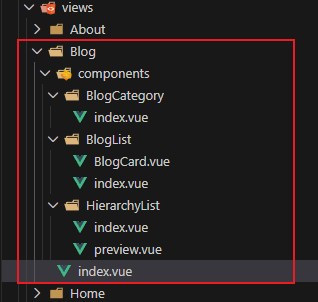

# L22：博客文章列表页开发（二）——功能实现


> [!tip]
>
> 本节为博客列表页的核心，需要深入理解 **路由信息** 在桥接【文章列表】与【文章类型列表】时发挥的重要作用。同时对于课上布置的小任务，一定要在本地亲自过一遍（会有很多改进空间）。


## 1 文章列表页逻辑

### 1 路由跳转逻辑


### 2 组件逻辑


#### 2.1 BlogList


#### 2.2 BlogCategory


## 2 知识

### 1 动态路由

我们希望下面的地址都能够匹配到 `Blog` 组件

- `/blog`，显示全部文章
- `/blog/cate/1`，显示分类 `id` 为 `1` 的文章
- `/blog/cate/3`，显示分类 `id`为 `3` 的文章
- ...

第一种情况很简单，只需要将一个固定的地址匹配到 `Blog` 组件即可

```js
{
  path: "/blog",
  name: "Blog",
  component: Blog
}
```

但后面的情况则不同：匹配到 `Blog` 组件的地址中，有一部分是动态变化的，则需要使用一种特殊的表达方式：

```js
{
  path: "/blog/cate/:categoryId",
  name: "CategoryBlog",
  component: Blog
}
```

在地址中使用 `:xxx` 来表达这一部分的内容是变化的，在 `vue-router` 中，将变化的这一部分称之为 `params`，可以在 `vue` 组件中通过 `this.$route.params` 来获取

```js
// 访问 /article/cate/3
this.$route.params // { categoryId: "3" }
// 访问 /article/cate/1
this.$route.params // { categoryId: "1" }
```

#### 1.1 动态路由的导航

```vue
<router-link to="/article/cate/3">to article of category 3</router-link>

<router-link :to="{
   name: 'CategoryBlog',
   params: {
       categoryId: 3           
   }                    
}">to article of category 3</router-link>
```


### 2 编程式导航

除了使用 `<RouterLink>` 超链接导航外，`vue-router` 还允许在代码中跳转页面：

```js
this.$router.push("跳转地址"); // 普通跳转
this.$router.push({ // 命名路由跳转
  name:"Blog"
})

this.$router.go(-1); // 回退。类似于 history.go
```


### 3 watch

利用 `watch` 配置，可以直接 **观察** 某个数据的变化，变化时可以做一些处理：

```js
export default {
  // ... 其他配置
  watch: {
    // 观察 this.$route 的变化，变化后，会调用该函数
    $route(newVal, oldVal){
      // newVal：this.$route 新的值，等同于 this.$route
      // oldVal：this.$route 旧的值
    },
    // 完整写法
    $route: {
      handler(newVal, oldVal){},
      deep: false, // 是否监听该数据内部属性的变化，默认 false
      immediate: false // 是否立即执行一次 handler，默认 false
    }
    // 观察 this.$route.params 的变化，变化后，会调用该函数
    ["$route.params"](newVal, oldVal){
      // newVal：this.$route.params 新的值，等同 this.$route.params
      // oldVal：this.$route.params 旧的值
    },
  	// 完整写法
    ["$route.params"]: {
      handler(newVal, oldVal){},
      deep: false, // 是否监听该数据内部属性的变化，默认 false
      immediate: false // 是否立即执行一次 handler，默认 false
    }
  }
}
```

**注意**：`this.$route` 已在框架层面确保了每次获得的路由信息对象是一个新对象，不是同一个堆内存的引用。


## 3 实战备忘

### 1 静态模板及样式的手动实现

为节省时间，课上没有从零编写博客正文区的静态页 `HTML` 和 `CSS`，实测时应手动绘制，参考效果在 `L22` 课 `00:25:22` 位置。


### 2 关于 watch 的使用与 mixin 的改造

为了实现路由发生变化时同步刷新数据源，应利用 `watch` 钩子观察 `this.$route` 的取值，并补充刷新逻辑：

```js
watch: {
  async '$route'() {
    this.$refs.blogList.scrollTop = 0;
    // from fetchRemoteData mixin
    this.loading = true;
    this.data = await this.getRemoteData();
    this.loading = false;
  }
},
```

由于 `L5-L6` 完全照搬 `mixin` 模块、且该逻辑写在 `created` 中无法直接调用，这里考虑重构 `mixin` 以复用代码：

```js
// src/mixin/fetchRemoteData.js
async created() {
  await this.refreshData();
},
methods: {
  async refreshData() {
    this.loading = true;
    this.data = await this.getRemoteData();
    this.loading = false;
  }
}

// BlogList/index.vue
watch: {
  async '$route'() {
    this.$refs.blogList.scrollTop = 0;
    await this.refreshData();
  }
},
```


### 3 关于 Mockjs 随机时间戳的格式转换问题

`Mock.js` 随机时间戳（`@date("T")`）的默认格式为字符串，实战项目要求数字格式。视频中（`00:25:50`）未能实现转换。

经实测，有如下三种可行的转换方案：

1. 创建转换函数 `formatDate` 后，在模板中手动转格式：`{{formatDate(+item.createDate)}}`（较原始，不推荐）；

2. 按照随机整数的语法生成（需要自定义两个端点，不太推荐）：

   ```python
   const startDate = new Date('2022-01-01').getTime();
   const endDate = new Date('2025-12-31').getTime();
   return Mock.mock({
     [`createDate|${startDate}-${endDate}`]: 0
   });
   ```

3. 使用函数形式手动转换（原生写法，推荐）：

   ```python
   return Mock.mock({
     createDate(){
       return parseInt(Mock.Random.date('T'))
     },
   });
   ```

4. 如果项目要求格式化后的字符串，可以直接写成：`createDate: "@datetime('yyyy-MM-dd HH:mm:ss')"`


### 4 关于可读性的思考

本次实操的重点，在于路由信息的动态变更：存在分类 `ID` 转到 `CategorizedArticle` 路由，否则转到 `Article` 路由。

最初的简洁写法：

```js
const categorized = cid !== -1;
const params = categorized ? { categoryId: cid } : {};
const name = categorized ? 'CategorizedArticle' : 'Article';
this.$router.push({ name, params, query });
```

缺点：可读性与后期可维护性差。

推荐写法：

```js
if(cid !== -1) {
  this.$router.push({ 
    name: 'CategorizedArticle', 
    params: { categoryId: cid }, 
    query 
  });
} else {
  this.$router.push({ 
    name: 'Article', 
    query 
  });
}
```


### 5 让 Mockjs 生成概率不等的随机值

在生成随机封面图片 `thumb` 时，需要得到正常图片 `URL` 或 `null` 值，默认情况下二者概率相等，均为 `50%`：

```js
'thumb|1': [
    Mock.Random.image('300x250', '#2f424ee1', '#FFF', 'Demo Image'), 
    null
],
```

通过人为补充数组元素，实现不均匀概率分布（`2/3`）：

```python
'thumb|1': [
    Mock.Random.image('300x250', '#2f424ee1', '#FFF', 'Demo Image'), 
    Mock.Random.image('300x250', '#2f424ee1', '#FFF', 'Demo Image'), 
    null
],
```


### 6 组件结构优化

从 `Blog` 组件拆分出单独的组件文件夹 `components`，其中又以文件夹的形式对复杂组件进行分组管理（如 `HierarchyList`、`BlogCategory`、`BlogList`）：



这里的 `BlogCard` 是实测是新增的，用于渲染博客列表中的单个列表项，使用了语义化的 `figure`、`figcaption` 等 `HTML5` 元素。

在预留分页标签底部的空白区域时，可以在 `footer` 元素上应用 `CSS` 的逻辑属性 `margin-block` 快速调整：

```css
.blog-list-container {
  /* -- snip -- */
  & > .pager {
    margin-block: 2em 4em;
  }
}
```


### 7 组件传参默认值的设置

如果默认值是复杂的数组或对象，最好写成函数形式：

```js
const defaults = {
  id: "<id>",
  title: "标题",
  description: "示例描述示例描述示例描述示例描述示例描述示例描述示例描述示例描述示例描述示例描述示例描述示例描述示例描述示",
  category: {
    id: 3,
    name: "分类3",
  },
  scanNumber: 10,
  commentNumber: 30,
};

export default {
  name: "BlogCard",
  props: {
    data: {
      type: Object,
      default: () => ({...defaults}),
    },
  },
}
```


### 8 关于添加 BlogList 预览效果

实测失败。按照组件注册配置项的思路，尝试添加 `BlogList` 的预览页：

```json
{
    "scripts": {
        "preview:BlogListPreview": "vue serve ./src/views/Blog/components/BlogList/preview.vue"
    }
}
```

新增组件 `preview.vue` 如下：

```vue
<template>
  <div class="blog-list-preview" v-loading="loading">
    <BlogList />
  </div>
</template>

<script>
import Vue from "vue";
import { getMessage } from "@/utils";
import "@/mock";
import { fetchRemoteData } from "@/mixins";
import vLoading from "@/directives/loading";
import BlogList from ".";
import router from "@/router";
import { getBlogs } from "@/api/blog";

Vue.prototype.$getMessage = getMessage;

export default {
  name: "BlogListPreview",
  mixins: [fetchRemoteData([])],
  components: {
    BlogList,
  },
  directives: {
    loading: vLoading
  },
  router,
  methods: {
    async getRemoteData() {
      return await getBlogs(1, 10, -1);
    },
  },
  data() {
    return {
      loading: false
    }
  }
};
</script>

<style lang="less" scoped>
.blog-list-preview {
  width: 80%;
  height: 85vh;
  margin: 3em auto;
}
</style>
```

实测效果：


由于没有设置路由标签 `<router-link />` 和 `<router-view />`，且牵涉太多全局配置，该预览页仅能渲染列表，无法实现基于路由的页面跳转与数据更新；

并且，由于自定义指令 `v-loading` 是局部注册的，启动预览前，还必须在 `BlogList.index.vue` 组件上重新注册 `v-loading`，非常不方便，因此该方案 **作废**：

```js
import vLoading from "@/directives/loading";

export default {
  name: 'BlogList',
  directives: {
    loading: vLoading
  },
}
```

