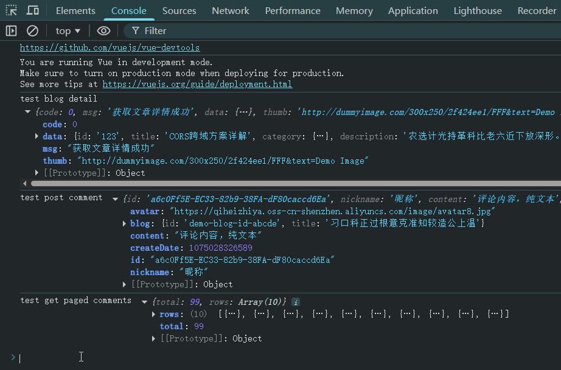
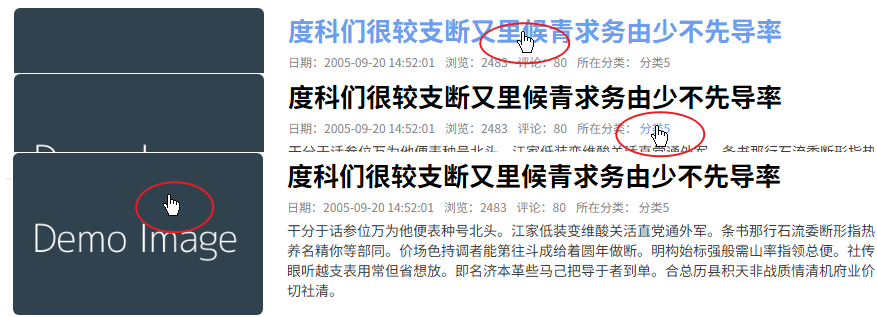
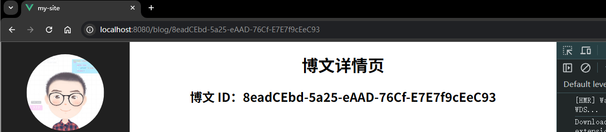

# L23：博客文章详情页开发（一）——准备工作


本节主要围绕博文详情页开发远程数据接口，并结合接口文档编制模拟数据。

最后对上节课的博文列表页进行改造，使其从标题和封面图片可以进入博文详情页（骨架）。


## 1 远程数据接口开发

参考第 21 课精校版接口文档，本节需要创建三个详情页数据接口：

- 单篇博文查询接口：`GET /api/blog/:id`
- 提交评论接口：`POST /api/comment`
- 分页评论列表接口：`GET /api/comment?page=1&limit=10?blogid=123`

上述接口全部通过带拦截器逻辑的 `Axios` 实例请求实现，详见 `@/api/blog`。


## 2 模拟数据的生成

对照三个新增接口需生成三套模拟数据，详见 `@/mock`。

实测时发现视频并未完全按照接口文档要求的结构生成数据，响应内容也和请求参数毫无关联，实测时一并进行增补完善。

遇到的最大阻碍，是调试遇到的 Bug：调用单篇博文接口始终返回博文分页列表信息。

原因：博文分页列表接口的正则表达式少写一个结尾限定符号 `$`：

```js
// original:
Mock.mock(/^\/api\/blog(\?.+)?/, 'get', function (options) {});

// correction:
Mock.mock(/^\/api\/blog(\?.+)?$/, 'get', function (options) {});
```

调试耗时：1h+（疲惫）

再次回顾数字型时间戳（毫秒）的生成方法：

```js
{
    createDate: () => parseInt(Mock.Random.date('T')),
}
```

模拟接口验证：

```js
// main.js
// -- snip --
import * as blogApi from './api/blog';
blogApi.getBlog('123')
  .then(data => console.log('test blog detail', data));

blogApi.postComment({
    nickname: "昵称",
    content: "评论内容，纯文本",
    blogId: 'demo-blog-id-abcde' // 评论的博客id
  })
  .then(data => console.log('test post comment', data));

blogApi.getComments('demoblogId')
  .then(data => console.log('test get paged comments', data));
```

实测结果：




## 3 创建博文详情页组件

首先在 `@/views/Blog/components/` 路径下创建详情页组件骨架 `BlogDetail.vue`：

```vue
<template>
  <div class="blog-detail-container">
    <h1>博文详情页</h1>
    <h2>博文 ID：{{ id }}</h2>
  </div>
</template>

<script>
export default {
  name: 'BlogDetail',
  computed: {
    id() {
      return this.$route.params.id;
    }
  },
}
</script>

<style lang="less" scoped></style>
```

由于博文详情页需要单独的路由对象，因此需要更新路由规则模块 `@/router/routes`：

```js
export default [
  // -- snip --
  {name: 'Article', path: '/blog', component: Blog},
  {name: 'CategorizedArticle', path: '/blog/cate/:categoryId', component: Blog},
  {name: 'ArticleDetail', path: '/blog/:id', component: BlogDetail},
  // -- snip --
];
```

然后在博文分页列表的正文组件（`BlogCard`）内，设计超链接指向详情页。做法：将标题和封面图片换成超链接，并将标准的 `<a>` 标签改为 `VueRouter` 专属内置组件 `<router-link></router-link>`：

```vue
<router-link 
  class="link" 
  :to="{
    name: 'ArticleDetail',
    params: {
      id: data.id
    }
  }">
  
</router-link>
```

注意：超链接上的样式需通过样式类手动设置。

最后再将每个列表项中的【所在分类】信息添加类似的路由跳转逻辑：

```html
<div class="category">
  所在分类：
  <router-link class="link" 
    :to="{
      name: 'CategorizedArticle',
      params: { categoryId: data.category.id }
    }">
    {{ data.category.name }}
  </router-link>
</div>
```

由于无需保留超链接的选中状态，故无需设置 `<router-link>` 的 `active` 样式。

实测效果：





