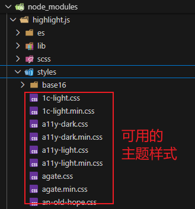

# L24：博客文章详情页开发（二）——页面渲染


本节主要完成博客文章内容及目录区的渲染、目录的点击交互效果（正文自动定位到目录项暂不涉及）。


## 1 文章数据逻辑


## 2 组件逻辑


> [!note]
>
> **注意**：从【文章对象】向子组件传参的设计，而非在各自的组件单独请求数据源，可以有效减少页面整体的请求次数。


### 2.1 BlogDetail

该组件没有任何难度，根据传入的文章详情对象的不同内容渲染到模板指定位置即可。

由于文章内容为 **原始 HTML**，因此模板必须用 `v-html` 指令来解析。

另外，文章内容的样式需要自行设置，可以参考本节课件 `markdown.css`（记得在父容器上添加样式类 `.markdown-body`）。该文件通过工程化方式生成，具体细节未作解释。

对于博客中【代码块】的样式，可以套用第三方库 [highlight.js](https://highlightjs.org/) 中提供的样式（例如 `GitHub` 风格）：

```bash
# 先安装依赖
npm i highlight.js
# 再导入模块内置样式
import "highlight.js/styles/github.css";
```

> [!note]
>
> 实测时发现最新的 `GitHub` 主题样式效果并不好，可能是默认适配的 `GitHub` 夜间模式，而练手项目为白天模式。最后选用的是谷歌的 `googlecode` 主题。更多 `highlight` 内置样式风格，可以在 `node_modules` 手动查找并切换：
>
> 


### 2.2 BlogToc

从路由信息获取文章 `ID`，进而请求博文内容对象，从中获取文章目录对象 `toc`，传入指定区域即可。

实测时，由于本地的递归组件使用数组元素的 `id` 和 `label` 属性渲染的，因此和传入的数据源不一致，需要以递归的方式手动重命名（`L11`）：

```js
// src/utils/renameToc.js
const validateArray = arr => Array.isArray(arr) && arr.length > 0;

export default function renameToc(arr, validArr = validateArray) {
  return arr.map(({
      name: label,
      anchor: id,
      children
    }) => ({
      id,
      label,
      children: validArr(children) ? [...renameToc(children)] : []
    }));
}
```

更一般的写法是：

```js
function renameFn(arr) {
  const tree = [];
  for (const item of arr) {
    const elem = {};
    for (const key in item) {
      const value = item[key];
      if (key === "name") elem.label = value;
      if (key === "anchor") elem.id = value;
      if (key === "children" && Array.isArray(value) && value.length > 0) {
        elem.children = [...renameFn(value)];
      }
    }
    tree.push(elem);
  }
  // console.log('final tree:', tree)
  return tree;
}
```

另外，时间戳的格式化还可以通过创建自定义的 `filter` 实现：

```vue
<template>
  <dd>{{ data.createDate | formatDate }}</dd>
</template>
<script>
import { formatDate } from "@/utils";
export default {
  name: "BlogBody",
  filters: {
    formatDate,
  },
}
</script>
```


### 2.3 BlogComment

（留待下节）


