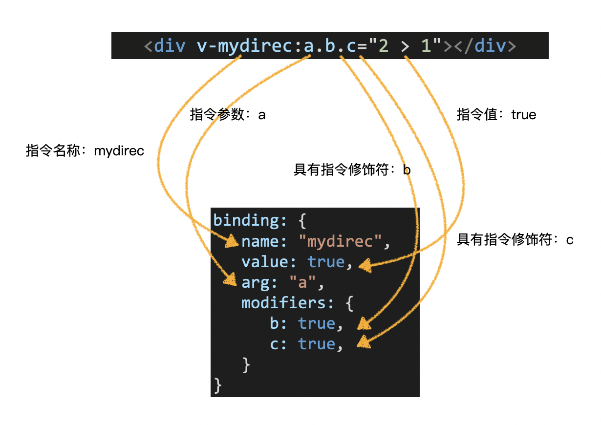
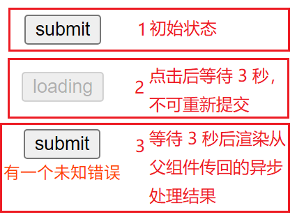
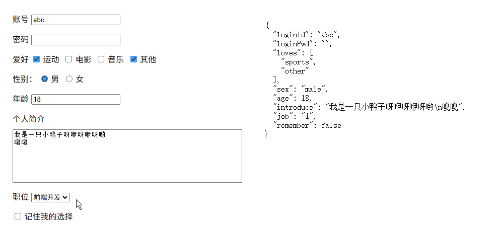

# L25：博客详情页知识点补讲：$listeners 与 v-model


本节通过两个典型案例，主要介绍了父子组件通信的另一种方式（`this.$listeners`），以及 `v-model` 双向绑定指令（语法糖）在表单中的相关用法。


## 1 事件修饰符

**针对 `DOM` 节点的原生事件**，`Vue` 支持多种修饰符以简化代码。

此前在实现自定义指令 `v-loading` 时在 `binding` 参数中见过修饰符，这里相当于扩展完善。



更多用法详见官方文档：[事件修饰符、按键修饰符、系统修饰符](https://cn.vuejs.org/guide/essentials/event-handling#event-modifiers)。


## 2 案例1：子组件需要根据父组件的异步结果更新状态

> **示例场景 1**
>
> 提交按钮在点击后需要获取父组件的异步处理结果后（例如 3 秒后返回字段校验结果），再作进一步处理（渲染报错信息、变更按钮状态等），其间不可以重复提交请求。
>
> 效果图：
>
> 

实现方案有三种：

- `$emit` 传回调函数（详见课件 `demo1/solution1/`）；
- `props` 传父组件的事件函数（详见课件 `demo1/solution2/`）；
- `$listeners` 调用父组件的事件函数（详见课件 `demo1/solution3/`）；

核心逻辑：

- 方案1：子组件传回调函数给父组件：

```js
// 子组件
childHander() {
  this.count++;
  this.error = "";
  this.isLoading = true;
  this.$emit("click", this.count, (err) => { // 该函数传给父组件，让父组件决定什么时候执行
    this.isLoading = false;
    this.error = err;
  });
},
// 父组件
parentHander(count, callback) {
  console.log("父组件", count);
  setTimeout(() => {
    // 处理完成
    callback("请填写账号");  // 关键点
  }, 3000);
},
```

- 方案2：父组件通过 `props` 给子组件传事件处理函数：

```js
// 父组件
//<template>
//  <LoadingButton :click="parentClick" />
//</template>
async parentClick(count) {
  console.log("父组件", count);
  return new Promise((resolve) => {
    setTimeout(() => {
      resolve("有一个未知错误");
    }, 3000);
  });
},
// 子组件
props: {
  click: Function,
},
async childClick() {
  this.count++;
  this.error = "";
  this.isLoading = true;
  if (this.click) {
    const err = await this.click(this.count); // 关键点
    this.isLoading = false;
    this.error = err;
  }
},
```

- 方案3：在子组件中直接使用 `this.$listeners` 调用父组件的事件处理逻辑：

```js
// 父组件
//<template>
//  <LoadingButton @click="parentClick" />
//</template>
async parentClick(count) {
  console.log("父组件", count);
  return new Promise((resolve) => {
    setTimeout(() => {
      resolve("有一个未知错误");
    }, 3000);
  });
},
// 子组件
async handleClick() {
  this.count++;
  this.error = "";
  this.isLoading = true;
  // 判断父组件是否传递了事件处理函数 click
  if (this.$listeners.click) {
    const err = await this.$listeners.click(this.count); // 关键点
    this.isLoading = false;
    this.error = err;
  }
},
```


### $listeners 要点

`$listeners` 是 `Vue` 的一个实例属性，它用于获取父组件传过来的所有事件函数：

```html
<!-- 父组件 -->
<Child @event1="handleEvent1" @event2="handleEvent2" />
```

而子组件可以通过 `$listeners` 直接执行父组件上的事件处理逻辑（简化后的结果）：

```js
this.$listeners // { event1: handleEvent1, event2: handleEvent2 }
```

> **`$emit` 和 `$listeners` 通信的异同**
>
> 相同点：二者均可实现子组件向父组件传递消息
>
> 不同点：
>
> - `$emit` 更加符合 **单向数据流**，子组件仅发出通知，由父组件监听做出改变；而 `$listeners` 则是在子组件中直接使用了父组件的方法。
> - 调试工具 `Vue Devtools` 可以监听到子组件 `$emit` 发出的事件，但无法监听 `$listeners` 中的方法调用。（想想为什么 [^1]）
> - 由于 `$listeners` 中可以获得传递过来的方法，因此调用方法可以得到其返回值。但 `$emit` 仅仅是向父组件发出通知，无法知晓父组件处理的结果


## 3 案例2：表单元素与响应式变量的绑定

>**示例场景 2**
>
>让表单元素与组件中的响应式数据绑定。
>
>效果图：
>
>

具体代码详见课件 `demo2/App.vue`。

`v-model` 对不同的表单元素绑定不同的事件：

- 文本框、密码框、数字框、文本域：绑定 `input` 事件（加 `.lazy` 后变为 `change` 事件）；
- 单选框、多选框、下拉菜单：绑定 `change` 事件；
- 单一的复选框：绑定布尔类型值。


### v-model 双向绑定

`v-model` 指令实质是一个 **语法糖**，它是 `value` 属性和 `input` 事件的 **结合体**：

```html
<input v-model="data" />
<!-- 等同于 -->
<input :value="data" @input="data=$event.target.value" />
```

详见：[表单输入绑定](https://cn.vuejs.org/guide/essentials/forms "按住 Ctrl 并单击可跳转到 Vue 官方文档")。

> [!tip]
>
> 根据最新的 `Vue3` 文档，`v-model` 还能用于自定义组件，并且可以携带一个自定义参数，以及无数个（理论上）修饰符，让双向绑定的功能更趋定制化。
>
> 详见官方文档：[组件 v-model](https://cn.vuejs.org/guide/components/v-model.html)。


---

[^1]: 因为 `Vue Devtools` 是通过 **Vue 的事件系统** 来监听 `$emit` 的；而 `$listeners` 中的方法调用则是 **普通 JavaScript 函数调用**，不经过 `Vue` 事件系统。

