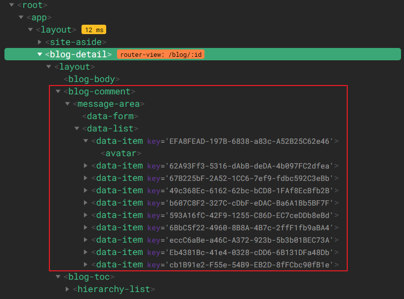
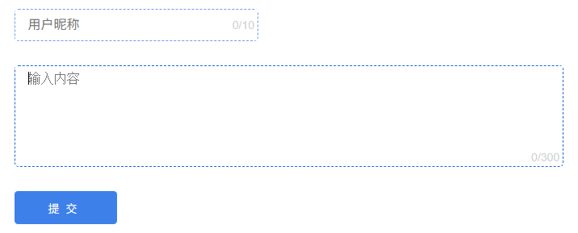
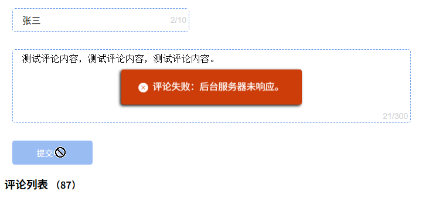
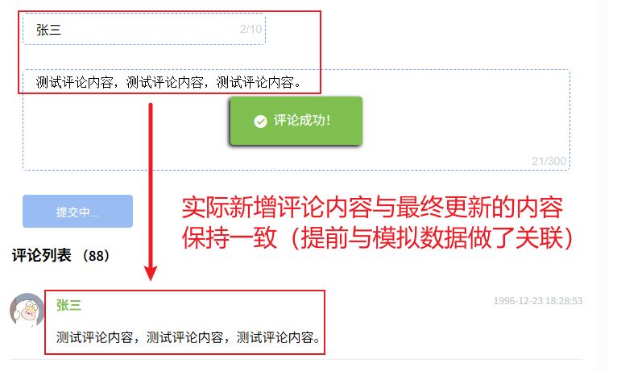

# L26：博客文章详情页开发（三）——评论区组件开发


本节主要完成详情页评论区的渲染、以及表单与评论列表的简单交互。


## 1 组件设计

鉴于文章评论区的版式设计与留言板页面高度相似，故单独提取为一个公共组件，命名为 `MessageArea`。基本效果如下：


列表区和文章列表的结构非常类似，故实测时也拆为 `DataList` 组件和 `DataItem` 组件（比视频课分得更细）。`DataList` 组件与 `DataForm` 组件平级。

最终博文详情页的组件结构设计如下（具体写法详见 `Git` 标签 `L26_blogDetail`）：




## 2 实战备忘

1. 本节耗时最多的是 `DataForm` 静态页面的绘制，比讲师给出的 `CSS` 代码量多了很多，应加强相关练习：



2. 最大的亮点在于考虑了提交评论失败的情况，并实现了对应的表单清理逻辑：

```js
handleSubmit() {
  // validation logics (snip)
  
  // submit new comment
  const params = {
    nickname: this.nickname,
    content: this.content
  };
  this.inOperation = true;
  this.$emit('submit', params, ({content, code}) => 
    (code === 0) 
      ? this.showSuccess(content)
      : this.showError(content)
  );
},
// 提交成功的消息弹框
showSuccess(content) {
  this.$getMessage({
    content,
    type: 'success',
    duration: 1000,
    container: this.$refs.form,
    callback: () => {
      this.nickname = '';
      this.content = '';
      this.inOperation = false;
    }
  });
},
// 提交失败的消息弹框
showError(content) {
  this.$getMessage({
    content,
    type: 'error',
    duration: 1000,
    container: this.$refs.form,
    callback: () => {
      this.inOperation = false;
    }
  });
},
```

3. 实现静态页时也充分考虑了语义化标签（`figure`、`section` 等），提高页面的可访问性。

4. 虽然 `Vue3` 已经全面废弃了 `this.$listeners` 的写法，但在本项目中，可将其用于组件层次较多时的数据传递，中间不用写冗余的 `handler` 方法（`L4`）：

```vue
<!-- 中间组件 MessageArea 中 -->
<template>
  <div class="message-area-container">
    <data-form v-on="$listeners"/>
    <h3 class="header">
      {{ title }}
      <span class="sub">{{ subTitle }}</span>
    </h3>
    <data-list :data="list"/>
  </div>
</template>
```

5. 表单提交后的状态，需要根据父组件请求后台 `API` 的结果来决定，根据上节课介绍的知识，这里采用的是子组件发送 **回调函数** 的方案；`$listeners` 的用法仅限于在中间组件中直接传参（可以节省很多相同的中间代码）。

6. 本节的表单验证逻辑非常原始，写起来很冗余，有待优化：

   ```js
   // validation logics
   this.err.content = '';
   this.err.nickname = '';
   if(this.nickname.trim().length === 0) {
     this.err.nickname = '昵称不能为空！';
     this.nickname = '';
   }
   if(this.content.trim().length === 0) {
     this.err.content = '昵称不能为空！';
     this.content = '';
   }
   if([this.content, this.nickname].some(d => d === '')) {
     return;
   }
   ```

7. 提交表单时，使用了事件绑定指令 `v-on` 的 `prevent` 修饰符，写作：`@submit.prevent="handleSubmit"`。实现了表单默认的提交流程，换成通过 `this.$emit` 提交表单。

8. 由于提前处理了页面请求与模拟数据之间的内在关联，实测时也可以直接看到真实的评论提交结果：

实测失败的页面渲染效果：



评论成功后的效果：




