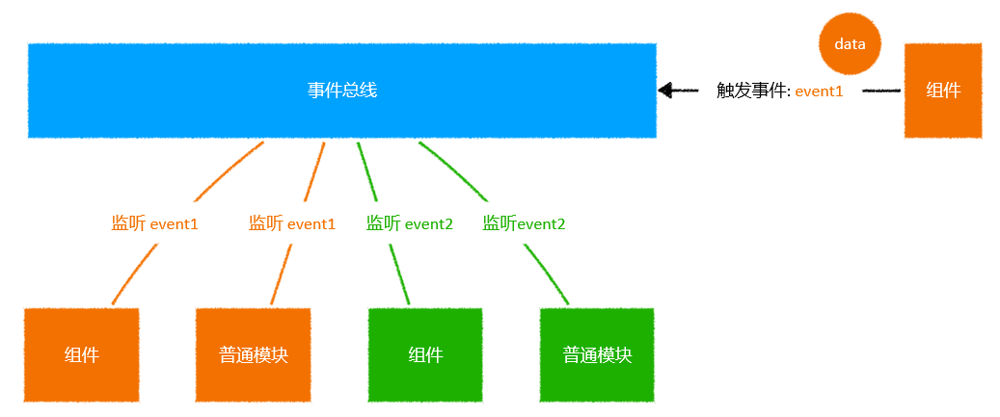

# L27：事件总线


核心原理：打破父子组件通信的树形遍历模式，实现更直接的事件订阅发布机制。

本节课件已转为 `PPT` 格式，原格式为 `.key`。



手动实现方案：

```js
// @/eventBus.js
const bus = {};

export default {
  $on(eventName, handler) {
    if(!bus[eventName]) {
      bus[eventName] = new Set();
    }
    bus[eventName].add(handler);
  },
  $off(eventName, handler) {
    if(bus[eventName] && bus[eventName].has(handler)) {
      bus[eventName].delete(handler);
    }
  },
  $emit(eventName, ...args) {
    if(!bus[eventName] || !(bus[eventName] instanceof Set)) {
      return;
    }
    for(const handler of bus[eventName]) {
      handler(...args);
    }
  }
};
```

由于利用了 `bus` 闭包，因此在不同的组件中导入该模块，使用的都是同一个 `bus` 总线：

```js
// in BlogToc.vue
import eventBus from '@/eventBus';
mounted() {
  eventBus.$on('myScroll', this.checkActive);
},
destroyed() {
  eventBus.$off('myScroll', this.checkActive);
},

// in BlogDetail/index.vue
import eventBus from '@/eventBus';
handleScroll() {
  console.log('滚动条变化了');
  eventBus.$emit('myScroll', this.$refs.blogBody1);
},
mounted() {
  this.scrollDebounced = debounce(this.handleScroll, 50);
  this.$refs.blogBody1.addEventListener('scroll', this.scrollDebounced);
},
beforeDestroy() {
  this.$refs.blogBody1.removeEventListener('scroll', this.scrollDebounced);
},
```

另外，在 `Vue2` 中，也可以直接导出一个新的 `Vue` 实例来表示事件总线（内置了 `$on`、`$off`、`$emit` 方法）：

```js
import Vue from 'vue';
export default new Vue({});
```

甚至还可以在 `main.js` 中直接绑定到 `Vue` 的原型上，让所有的实例都能调用该事件总线：

```js
// main.js
import eventBus from '@/eventBus';
Vue.prototype.$bus = eventBus;

// SomeComponent.vue
this.$bus.$on(...);
this.$bus.$off(...);
this.$bus.$emit(...);
```


> [!note]
>
> **注意**
>
> 由于 `Vue` 的实例方法 `$on` 和 `$off` 在 `Vue 3.x` 已经完全废弃，上述导出 `Vue` 实例的做法仅适用于 `Vue 2.x` 项目，新版 `Vue 3.x` 中建议使用第三方工具库 `mitt` 实现相关逻辑。
>
> 附：`DeepSeek` 答复——
>
> 移除 `$on`/`$off` 的主要考虑是：
>
> - 更好的 `Tree-shaking` 支持；
> - 推荐更明确的组件通信模式；
> - 避免事件总线带来的维护问题（注册后忘记注销等）；
> - 促进更健壮的架构设计；
>
> 对于小型应用，可以使用 `mitt` 等轻量级库；对于大型应用，建议使用状态管理或更明确的 `prop/emit` 模式。

