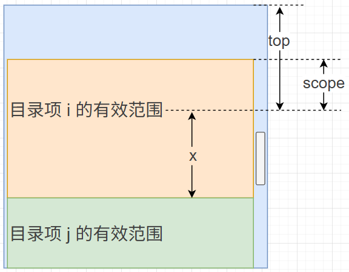

# L28：博客文章详情页开发（四）——目录大纲跟随高亮


本节视频主要实现了两个功能：

- 目录项的点击高亮效果；
- 目录大纲随鼠标滚轮动态高亮当前所在的目录位置。

第一个功能早在实现博文分页列表时就实现了（`HierarchyList/index.vue`）；后来还在第 `L24` 课渲染目录树时强化过递归操作，因此没有难度。

第二个功能的实现思路值得认真复盘。


## 1 目录大纲高亮显示

博文详情页的目录大纲通常是一个递归的树形结构，视频中通过在父组件的计算属性中重新生成带 `isSelected` 标记的节点树来实现。我的思路是直接新增一个 `props` 参数 `cirrId` 表示当前高亮节点的 `id`，从而可以在子组件内直接渲染高亮目录项，省事不少：

```vue
<template>
  <div class="blog-toc-container">
    <h2>目录</h2>
    <hierachy-list :data="tocTree" :currId="currId" @selected="handleClick"/>
  </div>
</template>
```

但由于本地实测时渲染目录树使用的节点属性是 `id`、`label`、`count` 和 `children`，和模拟接口返回的 `key` 值不一致，因此必须以递归方式重命名，也算因祸得福了：

```js
import { renameToc } from '@/utils';
computed: {
  tocTree() {
    return renameToc(this.toc);
  },
}

// renameToc.js
const validateArray = arr => Array.isArray(arr) && arr.length > 0;
export default function renameToc(arr, validArr = validateArray) {
  return arr.map(({
      name: label,
      anchor: id,
      children
    }) => ({
      id,
      label,
      children: validArr(children) ? [...renameToc(children)] : []
    }));
}
```


## 2 目录大纲的跟随高亮效果

**核心思路**：将目录大纲中的所有锚点元素作扁平化处理，统一转为一维数组：

```js
// computed:
bookMarks() {
  const navTitles = (trees, marks = []) => {
    for(const tree of trees) {
      const {id, children} = tree;
      const iDom = document.querySelector(`#${id}`);
      if(iDom) {
        marks.push(iDom);
      }
      if(children && Array.isArray(children) && children.length > 0) {
        navTitles(children, marks);
      }
    }
    return marks;
  };
  return navTitles(this.tocTree);
}
```

这些 `DOM` 元素对应滚轮行程上某个唯一的坐标点，因此不用考虑保留递归层级（长文浏览都是从上到下顺次排列的）。

然后根据各元素滚动时的 `top` 值动态计算 `currId` 绑定的值。

某个目录项的高亮区域是一个相对固定的区域，如图所示：



其中，目录项 `i` 只有在实时 `top` 值落在左开右闭区间 `(-X, scope]` 时才是高亮的；`top` 小于或等于 `-X` 后，下一项 `j` 的 `scope` 值会将目录项 `j` 高亮显示。因此核心切换逻辑为：

```js
checkActive() {
  for(const elem of this.bookMarks) {
    const { top } = elem.getBoundingClientRect();
    const id = elem.getAttribute('id');
    if(top > this.scope) {
      continue; // not reached, skip
    }
    // within scope
    this.currId = id;
  }
},
```

上述判定逻辑与滚动事件绑定时的写法也值得借鉴：

首先在详情页的最外层父组件注册 `scroll` 事件（记得同步注销），在其事件处理逻辑中触发事件总线的自定义事件（`myScroll`），至于传什么参数并不重要，实测中并未使用传入的参数：

```js
methods: {
  handleScroll() {
    console.log('滚动条变化了');
    eventBus.$emit('myScroll', this.$refs.blogBody1);
  },
},
mounted() {
  this.scrollDebounced = debounce(this.handleScroll, 50);
  this.$refs.blogBody1.addEventListener('scroll', this.scrollDebounced);
},
beforeDestroy() {
  this.$refs.blogBody1.removeEventListener('scroll', this.scrollDebounced);
},
```

然后在目录大纲组件上注册事件总线上的自定义事件 `myScroll`（记得同步注销）：

```js
mounted() {
  eventBus.$on('myScroll', this.checkActive);
},
destroyed() {
  eventBus.$off('myScroll', this.checkActive);
},
methods: {
  checkActive() {
    for(const elem of this.bookMarks) {
      const { top } = elem.getBoundingClientRect();
      const id = elem.getAttribute('id');
      if(top > this.scope) {
        // console.log('not reached, skip:', id);
        continue;
      }
      // within scope
      this.currId = id;
    }
  },
}
```

这里为了提高性能，用到了 `debounce` 防抖处理：

```js
export default function(fn, duration = 1000) {
  let timer = null;
  return (...args) => {
    clearTimeout(timer);
    timer = setTimeout(() => {
      fn(...args);
    }, duration);
  };
}
```

这样就实现了只在最后一次停顿后触发高亮判定。


## 3 关于带 hash 锚点的 URL 自动跳转失败的问题

根本原因在与浏览器跳转到指定位置时，页面组件还没有加载完毕。理想情况下需要在 `onload` 回调中重新手动跳转，实际通过 `setTimeout` 估计一个延迟时间实现。在文章详情页的根组件中添加如下逻辑：

```js
// BlogDetail/index.vue
methods: {
  correctHashedUrl() {
    const hash = location.hash;
    location.hash = '';
    setTimeout(function() {
      location.hash = hash;
    }, 3000); // 超过请求的最大延迟即可
  },
},
mounted() {
  this.correctHashedUrl();
},
```

