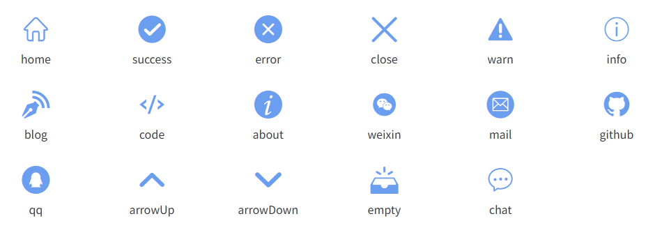
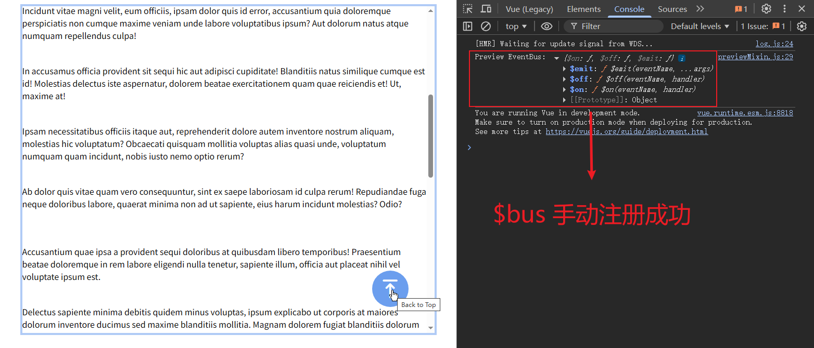

# L29：博客文章详情页开发（五）——触底加载与回顶部


## 1 触底加载效果

评论列表设计为增量加载，其本质是加载分页数据，特点是【只加载下一页】（如果有）的评论；如果没有下一页，则中止请求。

触底加载增量数据的原理图如下：


触底判定：`scrollHeight - (scrollTop + clientHeight)` 的绝对值在最大误差距离内（如 `100px`），即可判为【触底】。

具体实现方案：借用事件总线的 `mainScroll` 事件，可以在滚屏时，以防抖的方式触发各种回调逻辑，自然包括滚动条触底时的数据加载：

```js
// BlogComment.vue
created(){
  // window.getMoreData = this.getMoreData; // for debugging
  this.$bus.$on('mainScroll', this.handleMainScroll)
},
beforeDestroy(){
  this.$bus.$off('mainScroll', this.handleMainScroll)
},
methods: {
  async handleMainScroll(main){
    if(this.loading) {
      return;
    }
    const dist = Math.abs(main.scrollHeight - main.scrollTop - main.clientHeight);
    if(dist <= this.bottomMargin) {
      await this.getMoreData();
    }
  },
}
```

> [!important]
>
> **注意**
>
> 整个项目目前只有博客文章的根组件 `Blog/index.vue` 触发过 `mainScroll` 事件，并且做了防抖处理：
>
> ```js
> mounted(){
>   this.scrollDebounced = debounce(this.handleScroll, 50);
>   this.$refs.blogBody.addEventListener('scroll', this.scrollDebounced);
> },
> methods: {
>   handleScroll() {
>     this.$bus.$emit('mainScroll', this.$refs.blogBody);
>   },
> }
> ```
>
> 因此后续所有侦听 `mainScroll` 事件的组件都会 **以防抖的方式**，在滚屏时触发注册的响应逻辑。


## 2 快速回到页面顶部效果

实测时重新设计了 `ToTop` 组件，引入全新的图标并更新了自己的图标库（最后一个）：



该组件有两个主要功能：

- 滚动条从文章顶部滚动到一定距离后，自动显示该组件；
- 点击该组件，可快速回到当前页面的顶部。

上述功能都用到了事件总线注册、侦听、销毁自定义事件，其中有如下关键点：

- 注册（`mounted` 钩子）后一定记得对等注销（`beforeDestroy` 钩子）；
- 限定 `ToTop` 只能在博文列表页和详情页出现：需要在 `beforeDestroy` 上再触发一次 `mainScroll` 事件，携带参数为 `undefined`；同时所有观察者也要分别处理该情况，以及时中断后续流程。
- `mainScroll` 在 `ToTop` 的用途是检测组件的可见性；该事件在不同的组件有不同的用途（触底加载、目录高亮跟踪等）；
- 涉及 `scroll` 滚屏操作的地方务必考虑 **节流或防抖**，实测用的是 **防抖**；
- 由于点击 `ToTop` 无法沿用 `mainScroll` 逻辑，因此需要重新触发自定义事件（`backToTop`）；分别让列表和详情两个容器元素做观察者，侦听该事件并将 `dom.scrollTop` 的值设为指定的纵坐标（`0`）。

目前实现的事件总线功能：

|                        |                          mainScroll                          |                     backToTop                     |
| :--------------------: | :----------------------------------------------------------: | :-----------------------------------------------: |
|    评论列表触底加载    |       `BlogDetail` 防抖触发；`BlogComment` 侦听、销毁        |                        无                         |
|     `TOC` 高亮追踪     |         `BlogDetail` 防抖触发；`BlogToc` 侦听、销毁          |                        无                         |
| 在指定页面使用 `ToTop` | 在 `BlogDetail` 的 `beforeDestroy` 单独触发（参数为 `undefined`）；<br/>`ToTop` 侦听并单独处理、销毁 |                        无                         |
|      返回页面顶部      |                              无                              | `ToTop` 触发；`BlogList`、`BlogDetail` 侦听、销毁 |


## 3 实测备忘

返回顶部用到的 `DOM` 属性是 `dom.scrollTop`，实测时写成了 `scrollTo`。

设置 `ToTop` 定位时误用 `fixed`，让目录部分多出一截滚动条。改为 `absolute` 解决问题。

实现 `ToTop` 组件功能后，事件总线相关逻辑大量冗余，亟待重构（下节内容，详见分支 `L29_eventBus_mixin`）。

首次尝试补全 `ToTop` 预览组件 `preview.vue` 失败：启动 `vue serve path/to/preview.vue` 命令后，`Vue` 实例一直无法绑定 `$bus` 属性；后经 `DeepSeek` 提示，可以在 `beforeCreate` 钩子中为预览组件及其依赖子组件分别手动注册实例属性 `$bus`：

```js
// src/components/ToTop/previewMixin.js

import eventBus from "@/eventBus";
export default {
  // 在 beforeCreate 中挂载到所有子组件
  beforeCreate() {
    // 挂载到当前组件实例
    this.$bus = eventBus;

    // 确保所有子组件都能访问
    this.$options.components.ToTop.beforeCreate = function () {
      this.$bus = eventBus;
    };
    this.$options.components.LongPage.beforeCreate = function () {
      this.$bus = eventBus;
    };
  },
  mounted() {
    console.log("Preview EventBus:", this.$bus); // 现在应该能正常访问
  },
};
```

预览效果：


