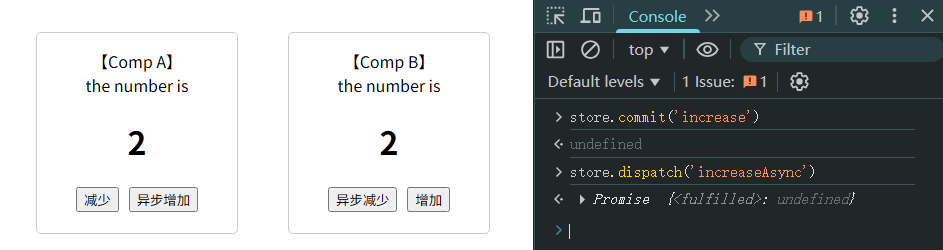
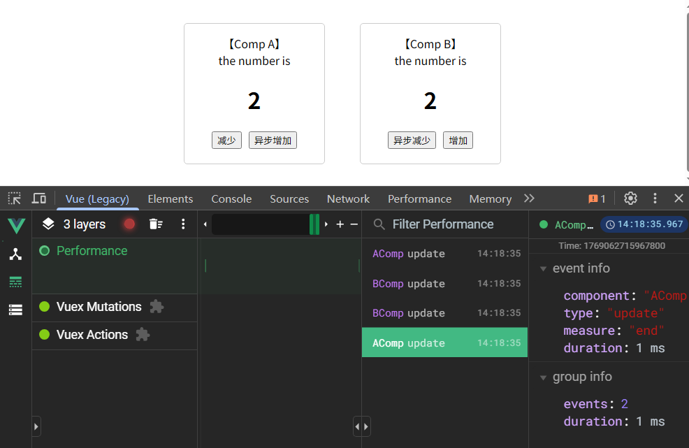

# L32：基于 Vuex 的数据共享机制


## 1 背景概述

`Vue` 的组件化开发为数据共享带来了全新的挑战，单一的父子组件通信机制难以满足实际开发需求：


**共享数据** 面临多个问题：

- 数据的唯一性难以保证：
  - 若不唯一，则浪费大量内存资源，降低运行效率；还可能加大后期运维难度；
- 某个组件改动数据后，如何让其他依赖该数据的组件知道数据变化了？
  - 【事件总线】貌似可以解决该问题，但需要在组件中 **手动维护监听**，极其不便；而且事件总线的目的在于**「通知」**，而非 **「共享数据」**。

传统方案是利用 **父子传参**：把所有的共享数据 **全量** 提升到根组件，然后通过 **props 属性** 层层下发；当某个组件需要修改数据时，又不断向上抛出事件（`$emit()`），直到根组件完成对数据的修改：


该方案的缺陷非常明显：数据的下发和上抛需要编写大量代码，中间组件即便不需要这些数据也要被迫上传下达这些信息。

为此，`Vue` 引入了一个 **独立数据仓库** 的概念：


有了数据仓库：

- 各组件可以独立地、按需获取共享数据；

- 仓库中的数据也可以自由更新；一旦更新，仓库就会 **自动通知** 用到该数据的其他组件更新。

这就是 `Vuex` 的诞生背景。


## 2 Vuex 仓库的用法

先安装 `Vuex`：

```bash
# 为了保证和课程一致，请安装 v3.6.2 版本
npm i vuex@3.6.2
```

然后以 `Vue` 插件的形式启用 `Vuex`，并创建一个名为 `store` 数据仓库实例（在大部分情况下，一个项目只需一个数据仓库）：

```js
// src/store/index.js:
import Vue from 'vue';
import Vuex from 'vuex';

Vue.use(Vuex); // 应用 Vuex 插件
const store = new Vuex.Store({
  // 仓库的配置
  state: {
    // 仓库的初始状态（数据）
    count: 0,
  },
});

export default store;
```

这样就能用 `store.state` 来访问仓库中的数据了。

与 `Vue Router` 类似，这个 `Vuex` 实例 `store` 还应该添加到 `Vue` 实例的配置中：

```js
// src/main.js:
import Vue from 'vue';
import App from './App.vue';
import store from './store';
new Vue({
  store, // 向 Vue 中注入数据仓库
  render: (h) => h(App),
}).$mount('#app');
```

之后，在 `Vue` 组件中，就能通过实例的 `$store` 属性访问到该仓库。

`Vuex` 会自动将配置的状态数据设置为 **响应式数据**，当数据变化时，依赖该数据的组件 **会自动渲染**。


## 3 数据的变更

尽管可以利用数据响应式的特点直接变更数据，但这样的做法在大型项目中也会遇到问题：

> 如果有一天，你发现某个共享数据是错误的，而有一百多个组件都有可能变更过这块数据，你该如何知道是哪一步数据变更出现了问题？

**为了能够更好地跟踪数据的变化**，`Vuex` 强烈建议使用 `mutation` 来更改数据：

```js
const store = new Vuex.Store({
  // 仓库的配置
  state: {
    // 仓库的初始状态（数据）
    count: 0,
  },
  mutations: {
    /**
     * 每个 mutation 是一个方法，它描述了数据在某种场景下的变化
     * increase mutation 描述了数据在增加时应该发生的变化
     * 参数 state 为当前的仓库数据
     */
    increase(state) {
      state.count++;
    },
    decrease(state) {
      state.count--;
    },
    /**
     * 求 n 次幂
     * 该 mutation 需要一个额外的参数来提供指数
     * 我们把让数据产生变化时的附加信息称之为 payload，即【负荷】、【负载】
     * payload 可以是任何类型，数字、字符串、对象均可
     * 在该 mutation 中，我们约定 payload 为一个数字，表示指数
     */
    power(state, payload) {
      state.count **= payload;
    },
  },
});
```

定义 `mutation` 后，就不应该直接去改动仓库的数据了，而是通过 `store.commit` 方法 **提交** 一个 `mutation` 变更。

具体做法是：

```js
store.commit('mutation 的名称'[, payload]);
```

现在，我们可以通过 `Vue Devtools` 观测到数据的变化了：


**特别注意： **

1. `mutation` 中不得出现异步操作

   > 在实际开发的规范中，甚至要求不得有副作用操作
   >
   > 副作用操作包括：
   >
   > - 异步
   > - 更改或读取外部环境的信息，例如 `localStorage`、`location`、`DOM` 等

2. 改变 `store` 中的状态数据的 **唯一途径**，就是显式地 **提交 (commit) mutation**：


## 4 异步处理

如果在 `Vuex` 中要进行异步操作，需要使用 `action`：

```js
const store = new Vuex.Store({
  state: {
    count: 0,
  },
  mutations: {
    increase(state) {
      state.count++;
    },
    decrease(state) {
      state.count--;
    },
    power(state, payload) {
      state.count **= payload;
    },
  },
  actions: {
    /**
     * ctx: 类似于store的对象
     * payload: 本次异步操作的额外信息
     */
    asyncPower(ctx, payload) {
      setTimeout(function () {
        ctx.commit('power', payload);
      }, 1000);
    },
  },
});
```


> [!important]
>
> ==**重要补充**==
>
> 根据 `Vuex` 官网提供的工作原理图，可以对 `Vuex` 涉及的相关术语、及其 **单项数据流** 的核心理念有更直观的认识：
>
> 
>
> ==**【一、流程解读】**==
>
> 这是一个严格的 **单向数据流**，确保了状态变化的可预测性——
>
> 1. **触发**：`Vue Components` 通过 `dispatch(<actionName>[, payload])` 方法触发一个 **Action** 操作。
> 2. **处理**：被触发的 **Action** 执行异步或业务逻辑（如调用 **Backend API** 后端接口）。
> 3. **提交变更**：**Action** 在逻辑完成后，通过 `commit(<mutationType>[, payload])` 方法提交一个 **Mutation**。
> 4. **变更状态**：**Mutation** 接收到 `commit` 提交请求，执行其 **同步函数**，直接修改 **State** 中的数据。
> 5. **响应渲染**：**State** 中的数据是响应式的，一旦被修改，所有依赖于该数据的 **Vue Components** 会自动、高效地重新计算和渲染（`Render`）。
> 6. **监测**：整个过程中，每一次 `commit` 都会被 **Devtools** 捕获，方便开发者进行状态快照和回滚调试。
>
> 
>
> ==【二、各要素单点分析】==
>
> 图中每一个部分和流程的角色与行为梳理如下：
>
> |        节点        |      标识      |                       角色                        | 行为                                                         |
> | :----------------: | :------------: | :-----------------------------------------------: | ------------------------------------------------------------ |
> | **Vue Components** |     绿色框     |       数据的 **消费者** 和交互的 **发起者**       | 从 `State` 中读取数据用于渲染。当需要改变数据时（如用户点击按钮），它不会直接修改 `State`，而是通过 `Dispatch` 方法触发一个 `Action`。 |
> |    **Actions**     |     黄色圆     |      **业务逻辑** 和 **异步操作** 的处理中心      | 接收来自组件的请求，可以在这里进行 `AJAX` 请求（调用 **Backend API**）、定时器、复杂的计算或判断等。它不直接修改状态，而是在异步操作完成后，通过 `Commit` 方法触发一个 `Mutation`。 |
> |   **Mutations**    |     红色圆     |          **状态变更** 的 **唯一执行者**           | 接收来自 `Actions` 的请求，其内部是一个 **同步函数**，负责直接修改 `State` 中的数据。每个 `Mutation` 都有一个字符串类型的【事件类型】，使得状态变化可被 **Devtools** 追踪。 |
> |     **State**      |     紫色圆     | **单一状态树**，是应用所有共享数据的 **唯一来源** | 存储响应式数据。当 `Mutations` 修改了它，所有依赖该状态的 `Vue Components` 都会自动得到通知并重新渲染（`Render`）。 |
> |  **Backend API**   | 灰色框（上方） |                    外部数据源                     | `Actions` 通过与之交互（如 `HTTP` 请求）来获取后端数据，为下一步提交 `Mutation` 做准备。 |
> |    **Devtools**    | 灰色框（右侧） |                   开发调试工具                    | 通过监听（`Mutate`）每一次 `Mutation` 的提交，可以记录状态的快照、实现【时间旅行】调试，极大地便利了开发。 |
>
> 
>
> ==**【三、核心理念剖析】**==
>
> 这种看似“繁琐”的操作流程，是为了解决组件间共享状态管理的复杂性：
>
> - **状态变更可追踪**：所有状态变化都必须通过 `Mutation`，使得变化来源清晰，且能被 `Devtools` 记录。
> - **分离关注点**：
>   - `Components` 只负责视图和触发事件。 
>   - `Actions` 负责处理业务和异步，让 `Mutations` 保持纯净。
>   - `Mutations` 只负责 **同步地修改** `State` 状态。
> - **强制单向数据流**：`State` :arrow_right: `View` :arrow_right: `Action` :arrow_right: `Mutation` :arrow_right: `State`，形成了一个清晰的循环，避免了数据随意修改带来的混乱。
> - **便于协作和调试**：由于流程固定且可追踪，团队协作和后期调试变得非常容易。
>
> 
>
> ==**【四、速记法】**==
>
> - `dispatch`：联想到【派遣、发出指令】，组件派遣一个任务给 `Action`。
> - `commit`：联想到【提交、确认】，`Action` 将改变提交给 `Mutation` 去最终执行。
> - 同步 vs 异步：
>   - `Mutation` = 同步（立即、直接修改数据）。
>   - `Action` = 可包含异步（请求 `API` 后再提交 `Mutation`）。
>
> 这张图是 `Vuex` 架构的精华。它揭示了 `Vuex` 单向数据流的实质：**Vue 组件通过派发 Action 来处理异步，Action 再提交 Mutation 来同步地改变状态，状态的变化最终驱动视图更新，而整个流程都是可监测的。** 理解了这个单向循环流程，就掌握了 `Vuex` 的核心。


## 5 项目实战

本节通过一个简易项目演示了在同步及异步场景下 `Vuex` 的具体写法。

用 `vue-cli` 脚手架创建最小化项目：

```bash
node -v # v14.21.3
npm config set strict-ssl false
vue create shared-data # 中途只选 Vue 2.x
npm config set strict-ssl true
cd shared-data
rm -recurse -Force .git # 删除默认的本地 Git 库
npm i vuex@3.6.2  # 确保版本一致
code . # 用 VSCode 打开项目，进一步精简初始版本
```

创建 `store` 模块时 `VSCode` 遇到一个编译异常：


这是因为 `Vue CLI v4.5.8` 可能对 `Vuex 3.x` 的类型支持不够好。解决方案是手动声明 `Vuex` 的类型：

```ts
// src/store/shims-vuex.d.ts
declare module 'vuex' {
  export * from 'vuex/types/index.d.ts'
}
```

运行空白项目的初始效果如下：


将 `store` 临时绑定到 `window` 以便手动调试：



由于实测时 `Vue Devtools` 插件对 `Vue 2.x` 的支持欠佳，仅能在无痕模式下部分开启：



具体代码详见 `15_Vue_intro/proj2_data_share/`。
