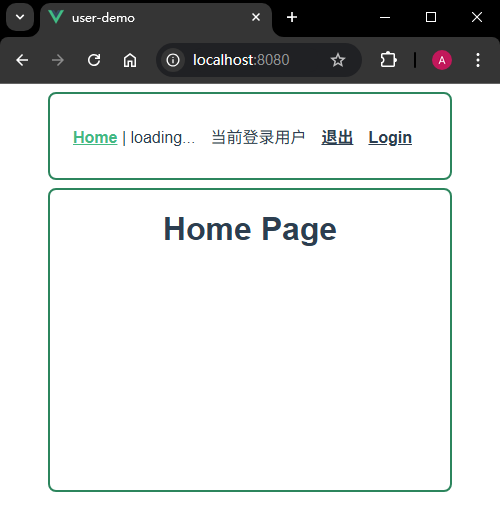
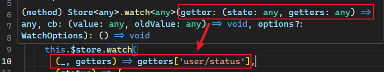
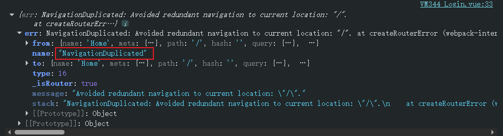

# L33：Vuex 在用户登录案例中的应用


> [!tip]
>
> **本节参考文档汇总**
>
> **Vue：**
>
> - [watch 的配置](https://v2.cn.vuejs.org/v2/api/#watch)
> - [Vue.prototype.$watch](https://v2.cn.vuejs.org/v2/api/#vm-watch)
>
> **Vuex：**
>
> - [mapState](https://v3.vuex.vuejs.org/zh/guide/state.html#mapstate-%E8%BE%85%E5%8A%A9%E5%87%BD%E6%95%B0)
> - [getters](https://v3.vuex.vuejs.org/zh/guide/getters.html)
> - [mapGetters](https://v3.vuex.vuejs.org/zh/guide/getters.html#mapgetters-%E8%BE%85%E5%8A%A9%E5%87%BD%E6%95%B0)
> - [modules](https://v3.vuex.vuejs.org/zh/guide/modules.html)
> - [watch](https://v3.vuex.vuejs.org/zh/api/#watch)
>
> **VueRouter：**
>
> - [exact-path](https://v3.router.vuejs.org/api/#exact-path)（`v3.5.0+`）
> - [导航守卫](https://v3.router.vuejs.org/zh/guide/advanced/navigation-guards.html#%E5%AF%BC%E8%88%AA%E5%AE%88%E5%8D%AB)


## 1 项目概况

本节通过实现一个简易的用户登录模块（登录、注销、鉴权……）来熟悉 `Vuex` 的各种用法。

完善后的项目初始效果如下（详见 `15_Vue_intro/proj3_user_demo`）：



项目依赖：

- `Vuex`：负责数据共享
- `VueRouter`：负责按需跳转

核心功能清单：

- 首页免登录校验：先判定【之前是否登录过】，判定期间显示 **loading**，判定结束后——
  - 若之前登过：则进入主页，并显示用户信息（可跳转到用户页）；
  - 之前未登过：则来到登录页；
- 新闻页：访问前若未登录，则提示先登录，随即跳到登录页；
- 登录页：
  - 若为中途拦截到登录页，则登录成功后回到之前拦截的页面（如新闻页），并且加载用户信息；
  - 若直接点开登录页，成功后则跳转到主页，否则停留在该页面；
- 登录成功后可以看到【管理员】链接，点击可打开该用户信息页；
- 不登录从地址栏直接访问 `/news` 或 `/user`，则自动校验是否已登录，未登录则重定向到登录页；登录成功后再回到目标页面。


## 2 相关知识点梳理

### 1 后端接口模拟

需模拟三个后端 `API` 接口（`src/api/user.js`）：

- `async login(loginId, loginPwd)`：登录接口
- `async logout()`：注销接口
- `async whoAmI()`：免登录校验接口

正式环境一般使用后台返回的登录凭证：`token` 或 `JWT` 形式。


### 2 创建共享数据仓库

即创建 `store` 模块。本示例围绕用户登录信息展开，因此可抽离出 `loginUser` 子模块 `module` 单独维护。

> [!note]
>
> ==【关于子模块中的 state 是否需要写为函数的回复】==
>
> 视频中的子模块和官方文档的写法不一致，官方文档为函数形式，视频为纯对象形式：
>
> ```js
> // Docs:
> const moduleA = {
>   state: () => ({ ... }),
>   mutations: { ... },
>   actions: { ... },
>   getters: { ... }
> }
> // Vedio:
> export default {
>   state: {
>     loading: false,
>     user: null
>   }
> }
> ```
>
> 渡一老师反馈：
>
> 在模块重用的时候会遇到这个问题，这种情况很少见，在课程项目中无影响。**保险起见确实应该书写为函数**，录播课后面忘了讲了，在直播课中会提到这些细枝末节的问题作为补充。


### 3 命名空间

为了避免 `mutations` 中的方法名（事件类型）相互污染，引出 **命名空间** 的概念：在模块中添加配置：

```js
// 子模块：loginUser.js
export default {
    namespaced: true,
    state: () => ({...}),
}

// store/index.js:
export default {
    modules: {
        user: loginUser
    }
}
```

这样，事件类型就变成：`user/setLoading`。

事件类型的概念可以类比事件注册中的【事件名】。


### 4 严格模式

严格模式必须在构造函数 `Vuex.Store(options)` 中声明，绕开 `mutation` 的一切状态值更新都会报错，**但状态值终究还是被更新了**。

> [!important]
>
> **DIY 补充**：开发时可以开启，生产部署时最好禁用。


### 5 关于 context 和 state

|      特性      | mutation                   | action                                               |
| :------------: | :------------------------- | :--------------------------------------------------- |
|    **参数**    | `(state, payload)`         | `(context, payload)`                                 |
| **state 访问** | 直接通过第一个参数         | 通过 `context.state`                                 |
|    **功能**    | 只能修改 `state`           | 可以包含异步操作、提交 `mutation`、分发其他 `action` |
|  **调用方式**  | `commit()`                 | `dispatch()`                                         |
|   **同步性**   | **必须是同步**             | 可以包含异步操作                                     |
|  **调试工具**  | 每个 `mutation` 都会被记录 | `action` 的异步回调不会被记录                        |

在子模块定义的每个 `action` 方法中的第一个参数 `context` 指的是 **当前的模块**，因此事件类型并不强制要求补全命名空间。

另外，`payload` 只能传一个，通常以参数对象的形式传入。


### 6 getters

`UserName` 组件的条件渲染分三种情况，需要 `state` 中的两个值共同判定：

- 加载中：`state.userLogin.loading = true`
- 已登录：`state.userLogin.loading = false` 且 `state.userLogin.user != null`
- 未登录：`state.userLogin.loading = false` 且 `state.userLogin.user == null`

由此引出 `getters` 的概念—— `store` 中的计算属性。

通过 `getters` 定义一个新的状态值 `status`，状态值可以是：`"loading"`、`"login"` 或者 `"unlogin"`。

用法：`this.$store.getters["loginUser/status"]`


### 7 mapState 等辅助工具函数

在改造登录页 `Login.vue` 时为了简化 `store.state.userLogin.loading` 的反复书写，在计算属性定义了 `loading` 属性，这个操作在 `Vuex` 有专门的工具函数代为处理：

```js
computed: {
    ...mapState({
        loading(state){
            return state.loginUser.loading;
        }
    })
},
```

不同的 `mapState` 的写法：

- 传对象：`mapState({loading(state){return state.loginUser.loading}})`
- 传命名空间+对象：`mapState("loginUser", { loading: "loading" })`
- 传命名空间+数组：`mapState("loginUser", ["loading", "user"])`

四个 `mapXXX` 函数的使用场景：

- `mapState`：注入 `computed`
- `mapGetters`：注入 `computed`
- `mapMutations`：注入 `methods`
- `mapActions`：注入 `methods`

此外，`mapGetters` 也可以返回一个函数：

```js
// 声明
getters: {
  // ...
  getTodoById: (state) => (id) => {
    return state.todos.find(todo => todo.id === id)
  }
}
// 调用
store.getters.getTodoById(2) // -> { id: 2, text: '...', done: false }
```


### 8 对多个兄弟元素使用 v-else-if

用户信息栏 `UserName.vue` 在处理条件渲染时，需要对平级的两个标签添加 `v-if-else` 指令，此处可以用 `<template>` 客串根元素：

```html
<template v-else-if="status === 'login'">
  <span>管理员</span>
  <a href="">退出</a>
</template>
```

显示用户名后需改为超链接，即用 router-link 改造。

禁用 `<a>` 标签的默认跳转：`@click.prevent="handler"`。


### 9 whoAmI 自动登录功能

关键：在 `main.js` 先触发一次，让 `store` 完成用户状态的初始化。


### 10 导航前置守卫 

原理图1：路由流程


原理图2：鉴权流程


DIY：对【加载中】的临时状态单独设置跳转页面有点罕见，至少在 `VueRouter` 看来这种方式不值得推荐（一旦 `loading` 切换失败，则有循环调用的风险）。

确定某个路由是否需要鉴权的最佳实践（`L20`）：

```js
// 设置元属性：
const router = new VueRouter({
  routes: [
    {
      path: '/foo',
      component: Foo,
      children: [
        {
          path: 'bar',
          component: Bar,
          // a meta field
          meta: { requiresAuth: true }
        }
      ]
    }
  ]
})
// 配置前置导航守卫
router.beforeEach((to, from, next) => {
  if (to.matched.some(record => record.meta.requiresAuth)) {
    // this route requires auth, check if logged in
    // if not, redirect to login page.
    if (!auth.loggedIn()) {
      next({
        path: '/login',
        query: { redirect: to.fullPath }
      })
    } else {
      next()
    }
  } else {
    next() // 确保一定要调用 next()
  }
})
```

注意：一个路由匹配到的所有路由记录会暴露为 `$route` 对象（以及在导航守卫中的路由对象）的 `$route.matched` 数组。


## 3 实战备忘

实测时，判定路由是否需要鉴权把 `requireAuth` 写成了 `requiredAuth`，造成堆栈溢出。

利用 `Prettier` 提供的类型提示可以快速查看 `$store.watch` 所需参数：



登录成功后回到首页，如果当前路由本来就是 `"/"`，则用 `this.$router.push("/")` 会报错：



实测时暂时用 `Promise.catch` 捕获异常，待处理：

```js
this.$router.push(path)
  .catch(err => console.log({err}));
```

`DeepSeek` 给出的方案是重写全局的 `push` 方法，忽略 `NavigationDuplicated` 异常：

```js
// 添加全局错误处理
const originalPush = VueRouter.prototype.push;
VueRouter.prototype.push = function push(location, onResolve, onReject) {
  if (onResolve || onReject) {
    return originalPush.call(this, location, onResolve, onReject);
  }
  return originalPush.call(this, location).catch(err => {
    if (err.name !== 'NavigationDuplicated') {
      throw err;
    }
  });
};
```

