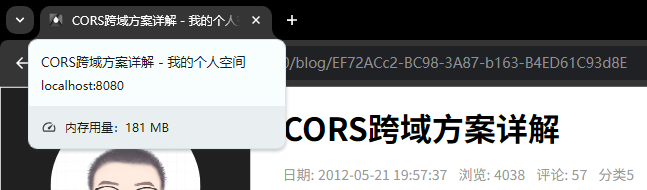

# L35：页面标题的统一处理


网站标题默认由 `Webpack` 在打包时绑定（`public/index.html`）：

```html
<title><%= htmlWebpackPlugin.options.title %></title>
```

其值为 `package.json` 中的 `name` 属性值（`my-site`）。

现在清空 `title` 的默认值，按照 `<routeTitle> - <siteTitle>` 两部分构造出动态值。

实现方案：

- 新增通用工具模块 `@/util/titleMaker.js`：

  ```js
  let siteTitle = '', routeTitle = '';
  const setTitle = (t1 = routeTitle, t2 = siteTitle) => {
    if(t1 && !t2) {
      return t1;
    }
    if(!t1 && t2) {
      return t2;
    }
    if(!t1 && !t2) {
      return 'loading...';
    }
    return `${t1} - ${t2}`;
  };
  
  export default {
    setSiteTitle(title) {
      siteTitle = title;
      document.title = setTitle();
    },
    setRouteTitle(title) {
      routeTitle = title;
      document.title = setTitle();
    }
  }
  ```

- 更新 `routerTitle`：在路由最终确认后，通过 `router.afterEach((to, from) => {})` 实现；

- 更新 `siteTitle`：在 `Vuex` 获取全局设置信息成功后，通过 `setting` 子模块的异步 `action` 事件函数 `fetchSetting()` 实现；

其中，路由标题的设置在 `routes.js` 中完成，通过 `meta` 属性手动注入；

博客详情页的路由标题应该更新为文章标题，在 `BlogBody.vue` 组件的 `created()` 钩子内实现：

```js
import { titleMaker } from "@/utils";
export default {
  created() {
    if(this.data.title) {
      titleMaker.setRouteTitle(this.data.title);
    }
  }
}
```

最终效果：



