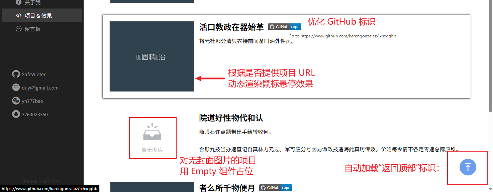
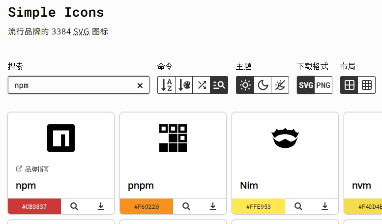

# L37：实现项目与效果页面


## 1 概述

本节继续利用前面介绍的 `Vuex`、事件总线、回到顶部图标等知识，完成项目作品页的所有内容。

最终效果：




## 2 实测备忘录

1. 本地实测的第一个大坑，在于模拟的 API 接口少写了个 `return`，导致返回结果始终为 `undefined`（`L4`）：

```js
import request from './request.js';

export async function getProjectData() {
  return await request.get('/api/project');
}
```


2. 根据 `item.url` 是否有值，动态渲染 `<a>` 元素的 `target` 和 `href` 属性：

```html
<a v-if="item.thumb && item.url" target="_blank" :href="item.url">
  
</a>

<Empty v-else text="暂无图片" />
```

之前曾尝试引入 `CSS` 样式类 `validUrl`，希望在点击时判定是否存在该类，若存在，则通过 `event.target.setAttribute` 控制 `href` 和 `target` 的值，最终失败。


3. 根据视频要求，自行优化带 `GitHub` 项目仓库地址的列表项，使用  代替手动设计 `GitHub` 徽标。需要用到 [`Shields`](https://shields.io/) 徽标库工具，基本语法：

| URL 写法            | 徽标结果         |
| ------------------- | ---------------- |
| 下划线 `_` 或 `%20` | 生成空格 ` `     |
| 双下划线 `__`       | 生成单下划线 `_` |
| 双短横线 `--`       | 生成短横线 `-`   |

例如：

- [https://img.shields.io/badge/any_text-you_like-blue](https://img.shields.io/badge/any_text-you_like-blue)：
- [https://img.shields.io/badge/just%20the%20message-8A2BE2](https://img.shields.io/badge/just the message-8A2BE2)：
- [https://img.shields.io/badge/coverage-95%25-orange](https://img.shields.io/badge/coverage-95%-orange)： 其中的 `%25` 是百分号 `%` 的 `URL` 编码形式，常见编码还有：
  - 空格：`%20`
  - 哈希符号 `#`：`%23`
  - 问号 `?`：`%3F`
- [https://img.shields.io/badge/github-repo-blue?logo=github](https://img.shields.io/badge/github-repo-blue?logo=github)： 其中 `logo` 图标的值可在 [simple-icons](https://simpleicons.org/) 中获取：




4. `MockJS` 生成定制 `URL` 地址的写法：

```js
const randomGithub = (p = 0.15) =>
  () => {
    if(Math.random() <= p) return null;
    const user = Mock.Random.name().toLowerCase().replaceAll(' ', '');
    const repo = Mock.Random.word().toLowerCase();
    return `https://www.github.com/${user}/${repo}`;
  };
Mock.mock("/api/project", "get", {
  github: randomGithub(0.2),
}
/* Output:
"https://www.github.com/cynthiawalker/urbpsmh"
"https://www.github.com/williamwilliams/bubkjhqtu"
"https://www.github.com/paulthomas/zfoal"
"https://www.github.com/scottrobinson/nbwpyoly"
"https://www.github.com/amymiller/nerqonxyli"
*/
```

5. 引入 `Empty` 组件处理无缩略图的元素项；
6. 使用 `HTML5` 语义化标签 `<figure>`、`<figcaption>`、`<section>` 等；
7. 从 `Project/index.vue` 拆出子组件 `ProjectCard` 更好地分离关注点；
8. 利用 `mixins/mainScroll` 模块快速添加事件总线处理逻辑（包括快速置顶图标）。
9. 使用 `v-lazy` 懒加载指令，并利用 `arg` 传参控制懒加载的有效区域：

```html

```


> [!tip]
>
> 本节源码已生成单独 `Git` 分支 `L37_projPage`，也可结合 `tag` 标签快速定位到实测前后的版本。
