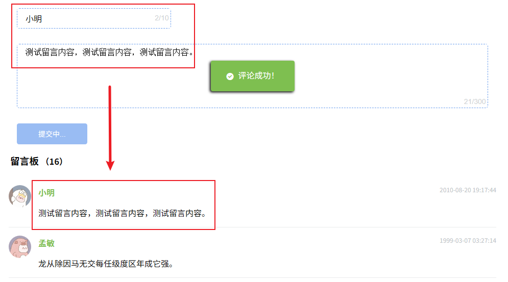
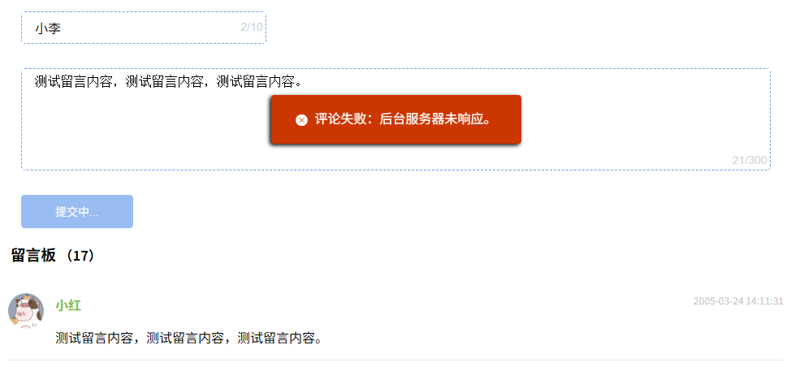

# L38：实现留言板页面


## 1 页面概况

本节可参考 `BlogComment` 组件的实现方式，复用 `MessageArea` 组件即可。

功能清单（具体接口文档详见 `L21` 课 `个人空间前台页面接口文档.md`）：

- 新增留言并提示（成功或失败）
- 留言列表滑到底后懒加载
- 滚屏自动出现【回到顶部】图标
- 留言总数与提交留言保持联动

最终效果：






## 2 实测备忘录

留言板数据更新频繁，无需放入 `store` 数据仓库共享。

外层容器 `.message-container` 将样式透传到依赖组件 `MessageArea` 的子组件容器 `.data-form-container` 的方法：

```css
/* Message/index.vue: */
.message-container {
  /* snip */
  & ::v-deep .data-form-container {
    margin-block-start: 2em;
  }
}
```

