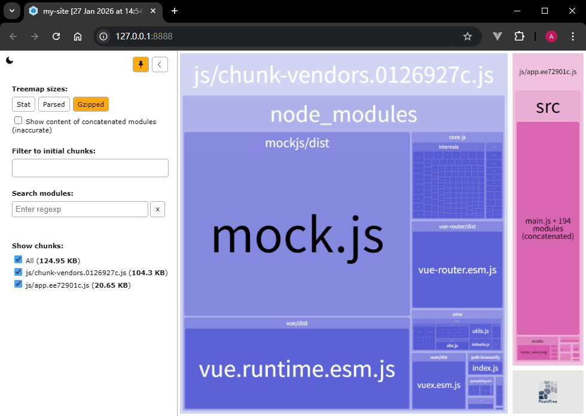
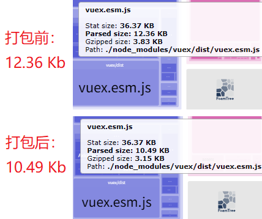
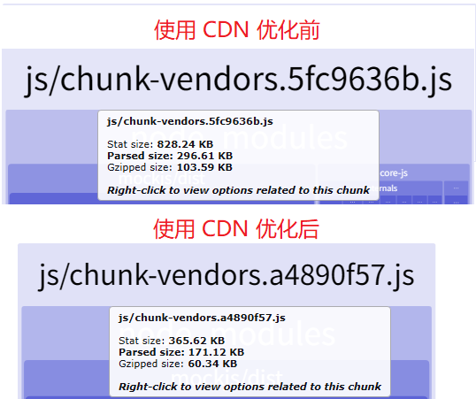
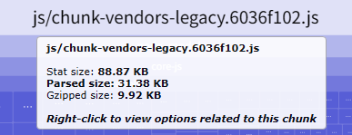
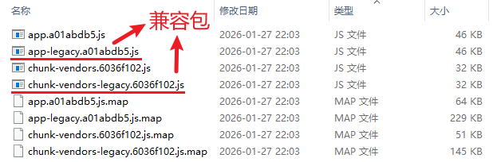
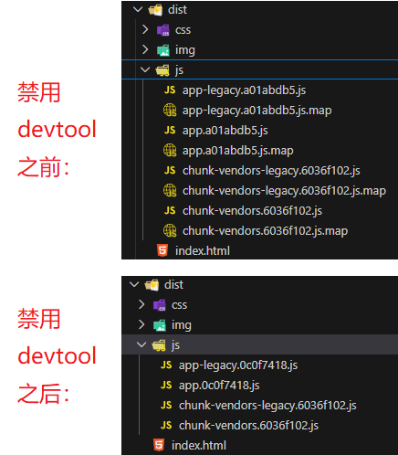
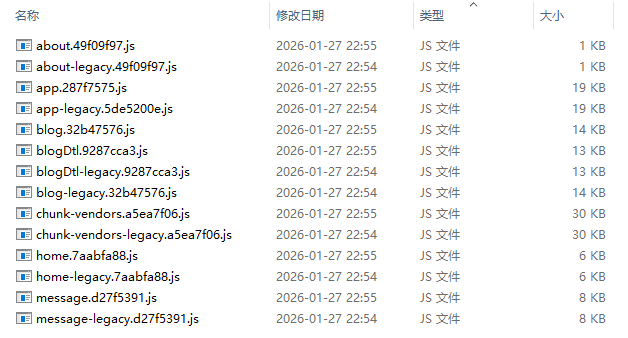
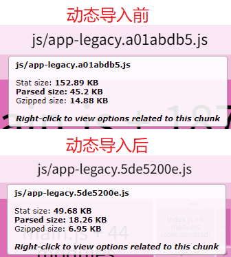

# L39：打包优化实战


项目优化的基本流程：

- 发现问题
- 分析问题
- 设计方案
- 尝试解决
- 测试反馈


## 1 分析打包结果

由于 `vue-cli` 是利用 `Webpack` 进行打包，我们只需引入一个 `Webpack` 插件 `webpack-bundle-analyzer` 即可分析打包结果。

安装依赖：

```bash
npm i -D webpack-bundle-analyzer
```

然后将插件配置到 `vue.config.js`：

```js
const { BundleAnalyzerPlugin } = require("webpack-bundle-analyzer");
// vue.config.js
module.exports = {
  // 通过 configureWebpack 选项，可对 Webpack 进行补充配置
  // 该配置最终会和 vue-cli 的默认配置进行合并（webpack-merge）
  configureWebpack: {
    plugins: [new BundleAnalyzerPlugin()]
  },
};
```

运行 `npm run build` 命令会自动打开一个统计页面 `http://127.0.0.1:8888/`，以面积图的形式展示当前项目的打包情况：



为了避免在开发环境中也启动 `webpack-bundle-analyzer`，可以使用以下代码：

```js
// webpack.config.js:
const { BundleAnalyzerPlugin } = require('webpack-bundle-analyzer');

const config = (process.env.NODE_ENV === 'development') ? {} : {
    plugins: [ new BundleAnalyzerPlugin() ],
  };

module.exports = config;

// vue.config.js:
module.exports = {
  /* -- snip -- */
  configureWebpack: require('./webpack.config'),
}
```

根据命令行提示，共发现三个问题：

- `asset` 体积过大：以下资产超过了推荐值（244 KB），可能对网页性能带来不良影响：
  - `img/default.969421d9.gif (308 KiB)`
  - `js/chunk-vendors.0126927c.js (298 KiB)`
- `entrypoint` 体积过大：以下整合了入口点的资产包超过了推荐值（244 KB），可能对网页性能带来不良影响：
  - `app (398 KiB)`
    - `css/chunk-vendors.a5ee18ea.css`
      `js/chunk-vendors.0126927c.js`
      `css/app.c052fb3d.css`
      `js/app.ee72901c.js`
- `webpack` 性能优化建议：可以通过 `import()` 或 `require.ensure` 懒加载应用的某些部分，限制 `bundle` 包的体积。


## 2 优化公共库打包体积

根据图示，`Mock.js` 在生产环境不会引入，问题不大；

`Vuex` 可以改为具名导出，后期利用 `TreeShaking` 技术按需加载：

```js
// @/store/index.js:
import Vue from 'vue';
import {Store, install} from 'vuex';

install(Vue);
const store = new Store({
  /* snip */
});
```

不过 `Vuex` 本身占用空间不大，优化效果也不太明显：



另一方面，`Vue` 和 `VueRouter` 在 `Vue 2.x` 版本中甚至无法使用 `TreeShaking` 技术，因此只能考虑用 `CDN` 优化。


### 2.1 使用 CDN

`CDN` 全称为 `Content Delivery Network`，称为 **内容分发网络**。

基本原理：架设多台服务器，这些服务器定期从源站（**Origin Server**）拿取资源存到本地，让不同地域的用户能够就近访问服务器（**CDN PoPs** [^1]）获得提供的资源：


我们可以把项目中的所有静态资源都放到 `CDN` 上（收费），也可以利用现成免费的 `CDN` 获取公共库资源（`Vue.js`、`React.js` 等）：


为此，需要先让 `Webpack` 不要打包公共库，添加 `externals` 配置对象（其中 `key` 表示要导入的 `Node.js` 模块，`value` 表示导入后的全局变量）：

```js
// webpack.config.js
/* snip */
const config = (process.env.NODE_ENV === 'development') ? {} : {
    plugins: [ new BundleAnalyzerPlugin() ],
    externals: {
      vue: 'Vue',
      vuex: 'Vuex',
      'vue-router': "VueRouter",
      axios: 'axios'
    }
  };
/* snip */
```

然后，在页面中手动加入 `CDN` 链接，这里使用 [bootcn](https://www.bootcdn.cn/)（仅在生产环境下使用）：

```html
<body>
  <div id="app"></div>
  <% if(NODE_ENV === "production") { %>
  <script src="https://cdn.bootcdn.net/ajax/libs/vue/2.6.11/vue.min.js"></script>
  <script src="https://cdn.bootcdn.net/ajax/libs/vuex/3.6.2/vuex.min.js"></script>
  <script src="https://cdn.bootcdn.net/ajax/libs/vue-router/3.4.9/vue-router.min.js"></script>
  <script src="https://cdn.bootcdn.net/ajax/libs/axios/0.21.0/axios.min.js"></script>
  <% } %>
  <!-- built files will be auto injected -->
</body>
```

对于 `Vuex` 和 `VueRouter`，使用这种传统方式引入会自动成为 `Vue` 的插件，因此需要去掉 `Vue.use(xxx)`。

我们可以使用下面的代码来进行兼容：

```js
// store.js
import Vue from "vue";
import Vuex from "vuex";  // or import { install } from 'vuex';

if(!window.Vuex){
  // 未使用传统的方式引入 Vuex
  Vue.use(Vuex);  // or install(Vue);
}

// router.js
import VueRouter from "vue-router";
import Vue from "vue";

if(!window.VueRouter){
  // 没有使用传统的方式引入VueRouter
  Vue.use(VueRouter);
}
```

引入 `CDN` 优化方案后，打包体积明显减小（降幅 `42.31%`）：



实测发现，`VSCode` 的 `Live Server` 插件在加载 `Avatar` 组件中的随机图片时有问题，在本地运行可以通过全局安装 `serve` 模块实现：

```bash
# path: PROJECT_ROOT
npm i -g serve
serve -s dist
```

> [!note]
>
> **关于视频中首页出现空白的原因**
>
> 根本原因：使用 `VSCode Live Server` 插件时，默认的访问地址为 `http://127.0.0.1:5500/index.html`，而路由配置中并没有关于 `/index.html` 的相关记录。
>
> 解决方案：
>
> 手动添加一个路由记录：
>
> ```js
> // @/router/routes.js
> export default [
>   {name: 'Portal', path: '/index.html', component: Home, meta: {title: '首页'}},
>   /* snip */
> ];
> ```


### 2.2 启用现代模式

为了兼容各种浏览器，`vue-cli` 在内部使用了 `@babel/present-env` 对代码进行降级，你可以通过 `.browserlistrc` 配置来设置需要兼容的目标浏览器。

这是一种比较 ***偷懒*** 的办法，因为对于那些使用现代浏览器的用户，它们也 **被迫使用了降级之后的代码**，而降低的代码中包含了大量的 `polyfill`，从而提升了包的体积。

因此，我们希望提供两种打包结果：

1. 降级后的包（大），提供给旧浏览器用户使用
2. 未降级的包（小），提供给现代浏览器用户使用

除了应用 `Webpack` 进行多次打包外，还可以利用 `vue-cli` 给我们提供的命令：

```shell
vue-cli-service build --modern
```

如果再注释掉 `main.js` 中的 `import '@/mock';` 排除 `MockJS` 的干扰，则打包体积就只剩 31 KB 了：



此时 `dist/js/` 文件夹下会出现两套打包文件（其间 `webpack-bundle-analyzer` 插件虽然会因为 `8888` 端口占用问题中断运行，但不影响浏览器查看）：



如果不想在打包时附带源码映射文件（`*.js.map`），可以在 `webpack.config.js` 禁用 `devtool` 配置：

```js
// webpack.config.js
const config = (process.env.NODE_ENV === 'development') ? {} : {
    /* snip */
    devtool: 'none'
  };
```

禁用 `devtool` 前后的实测效果对比：



> [!note]
>
> **index.html 对两套 JS 打包文件的引用方式**
>
> 打包后的 `index.html` 会自动配置两套 `JS` 的引用顺序：
>
> ```html
> <head>
>   <link href="/js/app.a01abdb5.js" rel="modulepreload" as="script">
>   <link href="/js/chunk-vendors.6036f102.js" rel="modulepreload" as="script">
> </head>
> <body>
>   <script type="module" src="/js/chunk-vendors.6036f102.js"></script>
>   <script type="module" src="/js/app.a01abdb5.js"></script>
>   <!-- snip -->
>   <script src="/js/chunk-vendors-legacy.6036f102.js" nomodule></script>
>   <script src="/js/app-legacy.a01abdb5.js" nomodule></script>
> </body>
> ```
>
> 对于支持现代浏览器的版本，先在 `head` 中通过 `modulepreload` 以 `ESM` 模块预加载的方式提前准备好；一旦支持 `ESM` 模块就会在下方 `L6-L7` 引入，而 `L9-L10` 的旧版 `JS` 自动忽略。反过来，如果在旧版浏览器环境，基于 `ESM` 的部分会自动忽略，直接加载带 `nomodule` 的两行 `script` 内容。


## 3 优化项目包体积

这里的 **项目包** 是指 `src` 目录中的打包结果。

### 3.1 页面分包

默认情况下，`vue-cli` 会利用 `Webpack` 将 `src` 目录中的所有代码打包成一个总的 `bundle` 文件，从而导致即便访问的 **只有一个页面**，也需要加载 **所有页面的** `JS` 代码。

为此，可以利用 `Webpack` 的 **动态导入（Dynamic Imports）** 特性（详见 [Webpack 官方文档](https://webpack.js.org/guides/code-splitting/#dynamic-imports)），实现将不同页面的代码打包到不同的 `bundle` 文件中：

```js
// @/router/routes.js:
export default [
  {
    name: "Home",
    path: "/",
    component: () => import(/* webpackChunkName: "home" */ "@/views/Home"),
  },
  {
    name: "About",
    path: "/about",
    component: () => import(/* webpackChunkName: "about" */"@/views/About"),
  }
];
```

这里的 `/* webpackChunkName: "home" */` 是手动指定打包后的 `bundle` 文件名，用于后期识别对应的模块。

实测时，还可以将动态引用部分抽提为独立的常量，这样只需要修改最上方的 `import` 部分即可，例如：

```js
// before
import Home from '@/views/Home';
export default [
  {name: "Portal", path: "/index.html", component: Home, meta: { title: "首页" }},
];

// current
export default [
  {
    name: "Portal",
    path: "/index.html",
    component: () => import(/* webpackChunkName: "home" */ "@/views/Home"),
    meta: { title: "首页" },
  },
]

// after
const Home = () => import(/* webpackChunkName: "home" */ "@/views/Home");
export default [
  {name: "Portal", path: "/index.html", component: Home, meta: { title: "首页" }},
];
```

注意：调用 `import()` 会返回一个 `Promise`，因此对旧版浏览器需要添加相应的兼容逻辑（`polyfill`）。

再次打包后 `dist/js/` 会生成不同的 `bundle` 文件：



以项目入口文件 `app-legacy.xxx.js` 为例，使用动态导入的前后体积变化也非常明显（降幅高达 `59.6%`，尽管总的打包体积有所上升）：



动态导入后，`index.html` 在依赖模块的处理上引入了一个新概念：`prefetch`（预获取）。`prefetch` 比之前的 `preload` 优先级低，预加载的分块会立即下载；预获取的分块则是在浏览器空闲时进行下载。二者的详细差异对比，详见 [Webpack 官方文档](https://webpack.js.org/guides/code-splitting/#prefetchingpreloading-modules)。

实测打包后的 `index.html` 引入情况（重点观察 `L11`、`L12`、`L13` 的区别）：

```html
<head>
  <link href="/css/about.fb15cc3f.css" rel="prefetch">
  <link href="/css/blog.13c69ea3.css" rel="prefetch">
  <link href="/css/blogDtl.9f0fe59f.css" rel="prefetch">
  <link href="/css/home.c1a0ea7a.css" rel="prefetch">
  <link href="/css/message.a011ebe5.css" rel="prefetch">
  <link href="/js/about.49f09f97.js" rel="prefetch">
  <link href="/js/blog.32b47576.js" rel="prefetch">
  <link href="/js/blogDtl.9287cca3.js" rel="prefetch">
  <link href="/js/home.7aabfa88.js" rel="prefetch">
  <link href="/js/message.d27f5391.js" rel="prefetch"><!-- 重点观察 -->
  <link href="/css/app.693d1132.css" rel="preload" as="style"><!-- 重点观察 -->
  <link href="/js/app.264f5674.js" rel="modulepreload" as="script"><!-- 重点观察 -->
  <link href="/js/chunk-vendors.a5ea7f06.js" rel="modulepreload" as="script">
  <link href="/css/app.693d1132.css" rel="stylesheet">
</head>
```


## 4 优化首屏响应

> [!note]
>
> 首页白屏受很多因素的影响。

`Vue` 页面需要通过 `JS` 构建，因此在 `JS` 下载到本地前，页面上什么也看不到。

一个非常简单且行之有效的处理手法，是在页面中先渲染一个小的【加载中】效果，等到 `JS` 下载到本地就绪后，会自动替换掉这个效果：

```html
<div id="app">
  <style>
    .loading-icon {
      position: fixed;
      top: 50%;
      left: 50%;
      width: 15%;
      height: 15%;
      animation: spin 2s linear infinite;
    }
    @keyframes spin {
      0% {transform: translate(-50%, -50%) rotate(0deg);}
      100% {transform: translate(-50%, -50%) rotate(360deg);}
    }
  </style>
  
</div>
```

由于课件提供的图片太大（`117 KB`），实测时从阿里图标库重新选了一个 `loading` 图标，通过 `CSS3` 动画实现了类似效果（同时更新图标的 `CDN` 地址）：


> [!tip]
>
> **常识：static 和 assets 静态资源的区别**
>
> `static` 中的资源是 **纯静态资源**：会原样复制到打包结果 `dist` 中；
>
> `assets` 中的资源又叫 **嵌入式静态资源**：当中的资源会参与打包过程，文件较大时会重命名，较小时可能直接转换成 `Base64` 编码格式。


> [!important]
>
> **重要提醒**
>
> 本节示例已另建 `Git` 分支 `L39_bundleOpt` 独立维护，并保留了打包优化前的原始起步版本（`Tag` 标签：`L39_bundleOpt_before`），方便后期继续验证测试。
>
> 字体图标 `CDN` 更新情况（离线备份字体文件详见 `L37_proj_page/iconfont_backup/` 文件夹）：
>
> - 更新前：`//at.alicdn.com/t/c/font_5112736_as9xsfpfolg.css`（不知何时过期）
> - 更新后：`//at.alicdn.com/t/c/font_5112736_tm3s4lhivjl.css`

---

[^1]: 即 `Points of Presence`，表示接入点、边缘节点。

