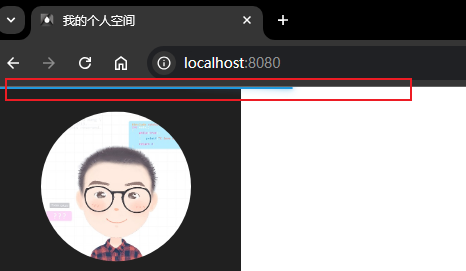
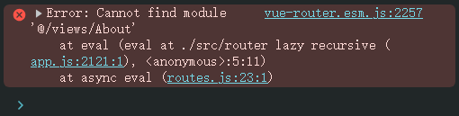

# L40：异步组件与页面伪进度条效果


> [!tip]
>
> `Vue 2.x` 异步组件官方文档：[https://v2.cn.vuejs.org/v2/guide/components-dynamic-async.html#异步组件](https://v2.cn.vuejs.org/v2/guide/components-dynamic-async.html#异步组件)


## 1 异步组件

在代码层面，`Vue` 组件本质上是一个 **配置对象**：

```js
const comp = {
  props: xxx,
  data: xxx,
  computed: xxx,
  methods: xxx
};
```

但有的时候，要得到某个组件配置对象需要一个异步的加载过程，比如：

- 需要使用 `Ajax` 获得某个数据之后才能加载该组件；
- 为了合理的分包，组件配置对象需要通过 `import(xxx)` 动态加载；

如果一个组件 **需要通过异步的方式得到组件配置对象**，该组件可以把它做成一个 **异步组件**：

```js
/**
 * 异步组件本质上是一个函数
 * 该函数调用后返回一个 Promise，Promise 成功的结果是一个组件配置对象
 */
const AsyncComponent = () => import("./MyComp");

var App = {
  components: {
    /**
     * 你可以把该函数当做一个组件使用（异步组件）
     * Vue 会调用该函数，并等待 Promise 完成，完成之前该组件位置什么也不渲染
     */
    AsyncComponent 
  }
}
```

> [!tip]
>
> 异步组件的函数不仅可以返回一个 `Promise`，还支持返回一个对象：
>
> ```js
> const AsyncComponent = () => ({
>   // 需要加载的组件 (应该是一个 Promise 对象)
>   component: import('./MyComponent.vue'),
>   // 异步组件加载时使用的组件
>   loading: LoadingComponent,
>   // 加载失败时使用的组件
>   error: ErrorComponent,
>   // 展示加载时组件的延时时间。默认值是 200 (毫秒)
>   delay: 200,
>   // 如果提供了超时时间且组件加载也超时了，
>   // 则使用加载失败时使用的组件。默认值是：Infinity
>   timeout: 3000
> });
> ```
>
> 详见：[返回对象格式的异步组件](https://v2.cn.vuejs.org/v2/guide/components-dynamic-async.html#处理加载状态)


## 2 应用

异步组件通常应用在路由懒加载中，以达到更好的分包。

为了改善用户体验，可以在组件配置对象加载完成前给用户显示一些提示信息：

```js
var routes = [
  { path: "/", component: async () => {
    console.log("组件开始加载"); 
    const HomeComp = await import("./Views/Home.vue");
    console.log("组件加载完毕");
    return HomeComp;
  } }
]
```

推荐使用 [NProgress](https://github.com/rstacruz/nprogress) 展现一个临时的加载进度条。

安装命令：

```bash
npm i nprogress
```

用法：手动导入 `CSS` 样式文件和 `JS` 模块：

```js
import 'nprogress/nprogress.css';
import {start, done, configure} from 'nprogress';
```

这里使用具名导入，以便后续打包优化。

核心逻辑：

```js
import {start, done, configure} from 'nprogress';

configure({
  trickleSpeed: 100,
  showSpinner: false
});

const delay = (duration = 3000) => new Promise(
  (res, _) => setTimeout(res, duration));

const makeAsyncComp = (asyncFactory, fakeDelay = delay) => async () => {
  start();
  const comp = await asyncFactory();
  if(process.env.NODE_ENV === 'development') {
    await fakeDelay();
  }
  done();
  return comp;
};
```

实测效果：



> [!tip]
>
> **注意**
>
> 不能让 `makeAsyncComp` 直接接收组件路径（如 `@/views/Home`），因为 `Webpack` 可能解析失败：
>
> ```js
> const makeAsyncComp1 = (path, fakeDelay = delay) => async () => {
>   start();
>   const comp = await import(/* webpackChunkName: "about" */ path);
>   if(process.env.NODE_ENV === 'development') {
>     await fakeDelay();
>   }
>   done();
>   return comp;
> };
> 
> export default [
>   /* snip */
>   {
>     name: "About",
>     path: "/about",
>     component: makeAsyncComp1('@/views/About'),
>     meta: { title: "关于我" },
>   },
>   /* snip */
> ]
> ```
>
> 实测报错：
>
> 
