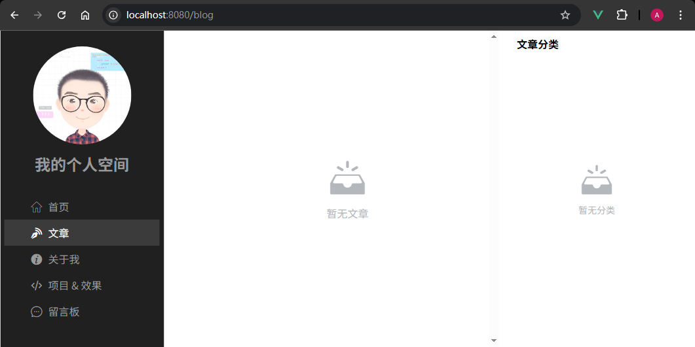

# L41：补充：无数据时的补白内容


本节是本套课程的补充内容，用于在文章数据或项目数据为空时，使用 `Empty` 组件补白。

核心逻辑：

`Empty` 组件的渲染条件：已加载完毕、且远程获取数据为空数组：

```js
/* <Empty v-if="noArticles" text="暂无文章"/> */
export default {
  name: 'BlogList',
  mixins: [fetchRemoteData({total: 0, rows:[]}), /* snip */],
  computed: {
    blogs() {
      return this.data.rows;
    },
    noArticles() {
      return !this.loading && this.blogs.length === 0;
    },
    /* snip */
  }
}
```

实测效果：




> 利用样式透传原理，实测时还顺带修复了左侧边栏没有滚动条的样式问题：
>
> ```css
> .app-container {
>   /* -- snip -- */
>   & ::v-deep .aside {
>     height: 100%;
>     overflow-y: auto;
>     background-color: @dark;
>   }
> }
> ```