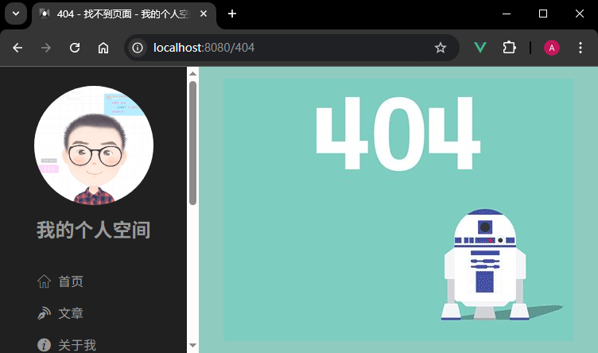

# L42：补充：404 页面


本节是本套课程的第二节补充内容，对于其他路由或文章内容获取失败时，正文区统一显示 404 页面。


核心逻辑：

```js
// @/router/routes.js:
import NotFound from "@/views/NotFound.vue";
export default [
    {path: '*', name: 'NotFound', component: NotFound}
]

// @/views/Blog/components/BlogDetail/index.vue:
async getRemoteData() {
  let content = await getBlog(this.id);
  if(!content) { // in case of null due to serve exception
    this.$router.push('/404');
    return;
  }
  return content;
},
```


实测效果：

模拟文章详情获取失败：



模拟访问其他未知路由：

