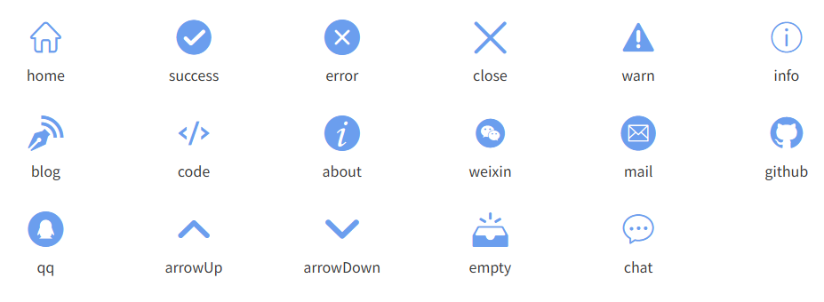
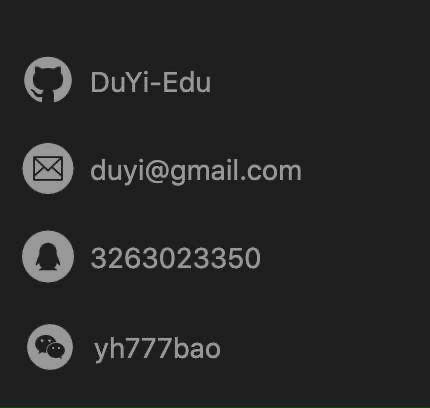
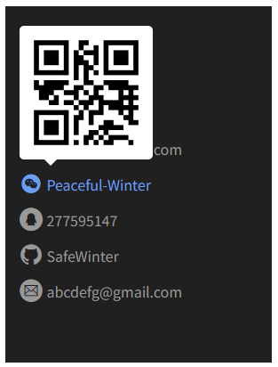
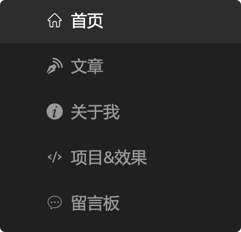
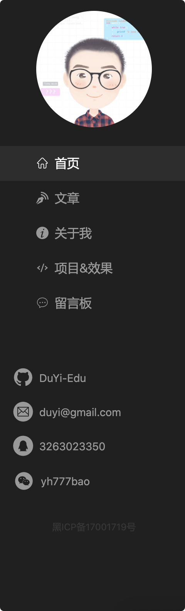
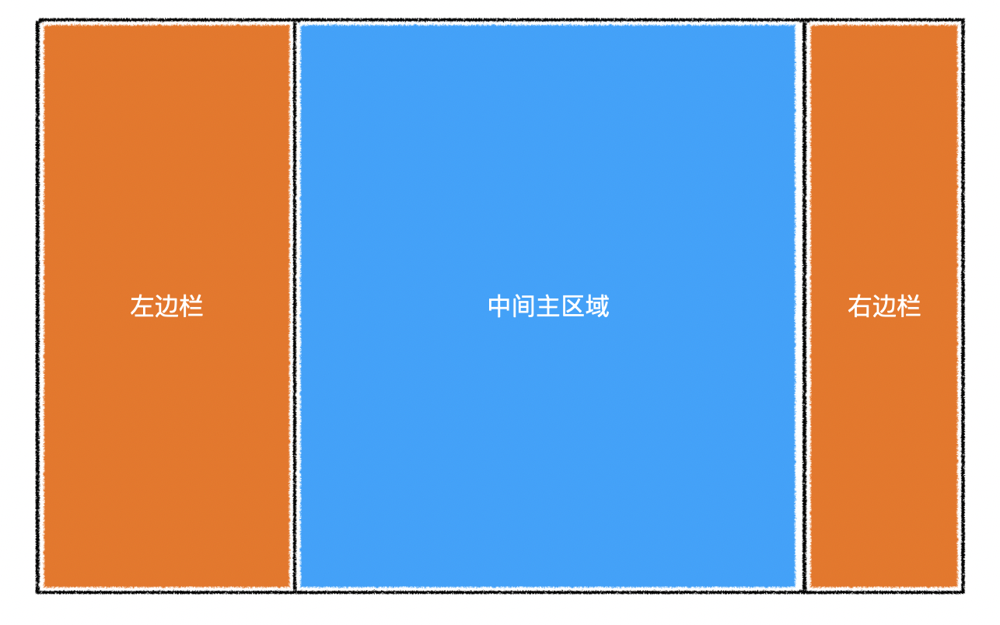

# Avatar


## 属性

| 属性名 | 含义               | 类型     | 必填 | 默认值 |
| ------ | ------------------ | -------- | ---- | ------ |
| `url`  | 头像图片路径       | `String` | 是   | 无     |
| `size` | 头像尺寸，宽高相等 | `Number` | 否   | `150`  |

# Icon


图标组件

使用的图标源来自于「[阿里巴巴矢量库](https://www.iconfont.cn/)」

## 属性

| 属性名 | 含义     | 类型     | 必填 | 默认值 |
| ------ | -------- | -------- | ---- | ------ |
| `type` | 图标类型 | `String` | 是   | 无     |

有效的图标类型（通过预览组件 `IconPreview` 渲染）：




# Pager


## 属性

| 属性名          | 含义       | 类型     | 必填 | 默认值 |
| --------------- | ---------- | -------- | ---- | ------ |
| `current`       | 当前页码   | `Number` | 否   | `1`    |
| `total`         | 总数据量   | `Number` | 否   | `0`    |
| `limit`         | 页容量     | `Number` | 否   | `10`   |
| `visibleNumber` | 可见页码数 | `Number` | 否   | `10`   |

## 事件

| 事件名       | 含义     | 事件参数 | 参数类型 |
| ------------ | -------- | -------- | -------- |
| `pageChange` | 页码变化 | 新的页码 | `Number` |


# Empty


该组件需要在外层容器中横向垂直居中

## 属性

| 属性名 | 含义       | 类型     | 必填 | 默认值   |
| ------ | ---------- | -------- | ---- | -------- |
| `text` | 显示的文字 | `String` | 否   | "无数据" |

# ImageLoader

该组件可以实现一个渐进式图片


## 属性

| 属性名        | 含义                                         | 类型     | 必填 | 默认值 |
| ------------- | -------------------------------------------- | -------- | ---- | ------ |
| `src`         | 原始图片的路径                               | `String` | 是   | 无     |
| `placeholder` | 原始图片加载完成前的占位图片                 | `String` | 是   | 无     |
| `duration`    | 原始图片加载完成后，切换到原始图经过的毫秒数 | `Number` | 否   | `500`  |

## 事件

| 事件名 | 含义                   | 事件参数 | 参数类型 |
| ------ | ---------------------- | -------- | -------- |
| `load` | 原始图片加载完成后触发 | 无       | 无       |

## 示例

```html
<ImageLoader 
  src="https://images.pexels.com/photos/33109/fall-autumn-red-season.jpg?fit=crop&crop=entropy&w=3456&h=2304"
  placeholder="https://images.pexels.com/photos/33109/fall-autumn-red-season.jpg?w=100"
/>
```


# Contact



该组件需要横向撑满容器，背景色透明。

DIY：该组件已改造为由若干个 `ContactItem` 组件构成。

> [!note]
>
> 1. 如何实现点击弹出 QQ 对话？[^1]
>
>    设置超链接为：`tencent://message/?Menu=yes&uin=要对话的QQ号&Service=300&sigT=45a1e5847943b64c6ff3990f8a9e644d2b31356cb0b4ac6b24663a3c8dd0f8aa12a595b1714f9d45` 
>
> 2. 如何实现点击弹出发送邮件？
>
>    设置超链接为：`mailto:邮件地址`

## ContactItem

## 属性

| 属性名   | 含义                              | 类型     | 必填 | 默认值 |
| -------- | --------------------------------- | -------- | ---- | ------ |
| `icon`   | 图标名称，如 `mail`、`github` 等  | `String` | 是   | 无     |
| `label`  | 该联系方式的文本内容              | `String` | 是   | 无     |
| `link`   | 该联系方式的超链接地址            | `String` | 否   | `""`   |
| `qrCode` | 该联系方式的二维码图片 `URL` 地址 | `String` | 否   | `""`   |

实测效果：



经调整，`ContactItem` 组件已放入 `Contact` 文件夹中，以进一步明确依赖关系。

# Menu



该组件需要横向撑满容器，背景色透明

每个菜单的信息如下：

> **首页**
>
> 链接地址：`/`
>
> 选中条件：路径等于 `/`
>
> **文章**
>
> 链接地址：`/blog`
>
> 选中条件：路径以 `/blog` 开头
>
> **关于我**
>
> 链接地址：`/about`
>
> 选中条件：路径等于 `/about`
>
> **项目&效果**
>
> 链接地址：`/project`
>
> 选中条件：路径等于 `/project`
>
> **留言板**
>
> 链接地址：`/message`
>
> 选中条件：路径等于 `/message`

# SiteAside



网站侧边栏。

宽度和高度撑满外层容器。


# Layout

使用示例：

```html
<Layout>
  <template #left>
  	<div>
      左边栏区域，宽度适应内容，溢出隐藏
    </div>
  </template>
  <div>
      主区域，宽度占满剩余空间，溢出隐藏
  </div>
  <template #right>
  	<div>
      右边栏区域，宽度适应内容，溢出隐藏
    </div>
  </template>
</Layout>
```



## 插槽

| 插槽名    | 含义       |
| --------- | ---------- |
| `default` | 中间主区域 |
| `left`    | 左边栏     |
| `right`   | 右边栏     |

左边栏固定宽度：

```css
.left {
    flex: 0 0 auto;
}
```

正文栏自动缩放：

```css
.main {
    flex: 1 1 auto;
}
```


# MessageArea

消息区域组件，可用于「评论区」和「留言板」


## 属性

| 属性名          | 含义               | 类型      | 必填 | 默认值  |
| --------------- | ------------------ | --------- | ---- | ------- |
| `title`         | 列表标题           | `String`  | 否   | `""`    |
| `subTitle`      | 列表副标题         | `String`  | 否   | `""`    |
| `list`          | 列表数据           | `Array`   | 否   | `[]`    |
| `isListLoading` | 列表是否正在加载中 | `Boolean` | 否   | `false` |

## 事件

| 事件名   | 含义               | 事件参数 | 参数类型 |
| -------- | ------------------ | -------- | -------- |
| `submit` | 用户点击提交时触发 | 数据对象 | `Object` |

`submit` 的事件参数格式为：

```js
{
  nickname: "昵称",
  content: "内容"
}
```


# ToTop

用于在博文列表页和详情页内容较长时，通过点击右下角的圆形标记快速返回页面顶部：


## 属性

| 属性名   | 含义                                   | 类型     | 必填 | 默认值        |
| -------- | -------------------------------------- | -------- | ---- | ------------- |
| `offset` | 滚动条滚动到显示该标记的最小页面偏移量 | `Number` | 否   | `500`（像素） |
| `size`   | 标记的尺寸大小                         | `Number` | 否   | `50`（像素）  |
| `title`  | 鼠标悬停时显示的提示内容               | `String` | 否   | `"回到顶部"`  |

## 用法

使用该组件时，必须实现两个处理逻辑：

- 在组件内部注册一个点击事件（`backToTop`），并通过【事件总线】触发一个返回顶部的自定义事件；该自定义事件须携带一个 `scrollTop` 值，用于设置目标组件滚轮的最终位置，只要该组件侦听了 `backToTop` 事件；
- 此外，还需要侦听【事件总线】上的滚轮滚动事件（`mainScroll`），用于检测该组件是否渲染到所有的目标观察者容器内（超过最小偏移量即显示）。

例如：

```vue
<template>
  <div class="box">
    <to-top :siez="size" :offset="offset"/>
  </div>
</template>
<script>
// 父组件：
import ToTop from '@/components/ToTop';
export default {
  components: {
    ToTop
  },
  data() {
    return {
      size: 70,
      offset: 200
    }
  },
}
    
// 子组件：
methods: {
  checkVisibility(dom) {
    this.visible = (!dom) ? false : (dom.scrollTop >= this.offset);
  },
  backToTop() {
    this.$bus.$emit('backToTop', 0);
  }
},
mounted() {
  this.$bus.$on('mainScroll', this.checkVisibility);
},
beforeDestroy() {
  this.$bus.$off('mainScroll', this.checkVisibility);
},    
</script>
```


---

[^1]: 实测时发现该方法已失效。


