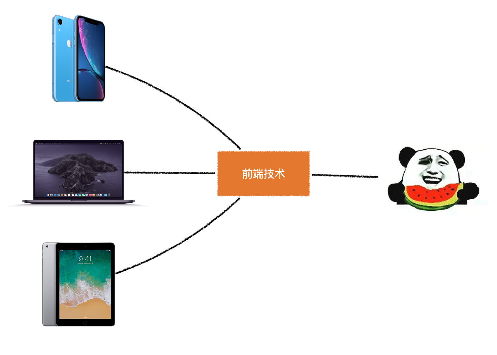

# L01：从 Vue 到前端

> 笔记格式：Markdown（纯文本）
>
> 打开软件：推荐 [Typora](https://www.typora.io/)

## 1 什么是 Vue

> 官方文档：
>
> - 最新版：[https://cn.vuejs.org/](https://cn.vuejs.org/)
> - `v2.x` 版：[https://v2.cn.vuejs.org/](https://v2.cn.vuejs.org/)

-----

前置知识：

- 学习 `Vue` 的完整路线：`HTML + CSS`、`JavaScript`、`CSS3`、`HTML5`、`第三方库`、`网络通信`、`ES6+`、`Webpack`、`模块化`、`包管理器`、`CSS 预编译器`；
- 仅体验 `Vue` 功能路线：`HTML + CSS`、`JavaScript`。

--------

**`Vue` 是前端的一种开发框架，它主要解决前端开发中的核心痛点——复杂的 DOM 操作**

------

`Vue` 拥有以下特点：

- 渐进式
- 组件化
- 响应式

------

`Vue` 的应用场景：

- **前台** 的部分页面
- **中后台** 的全部页面 [^1]

------

`Vue` 的版本：

- 目前的正式版本是`2.x`
- `3.x`版本即将上线，对`2.x`是兼容的，要完全体验到`3.x`的优势，还需要学习`TypeScript`

## 2 Vue 在前端的地位

前端是连接终端设备与人的技术：

**`Vue` 是这些实现技术的其中一种**。

------

除了 `Vue` 之外，还需要学习哪些前端知识？

`TypeScript`、`ThreeJS`、`WebGL`、`ECharts`、`NodeJS`、`Egg`、`Redis`、`Mongodb`、`Sequelize`、`Express`、`Koa`、`移动端` ......

## 3 学习准备

1. 安装 `VSCode`

   > 官网：[https://code.visualstudio.com/](https://code.visualstudio.com/)

2. 安装 `VSCode` 常用插件：

   - **Auto Rename Tag**：能够自动更改结束标签
   - **Live Server**：自动搭建本地服务器
   - **Prettier - Code formatter**：代码美化
   - **Vetur**：`Vue` 组件格式支持
   - **vscode-icons**：美化文件图标
   - **Code Runner**：用于快速查看 `JavaScript` 执行结果（DIY）

3. 加入组织（课程推广）

---

[^1]: 中台即用户在给定的管理平台看到的页面，例如淘宝卖家的后端管理系统。

