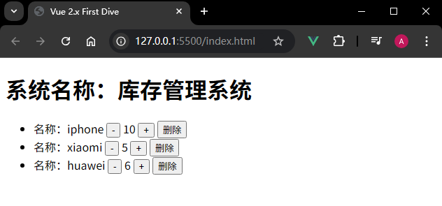
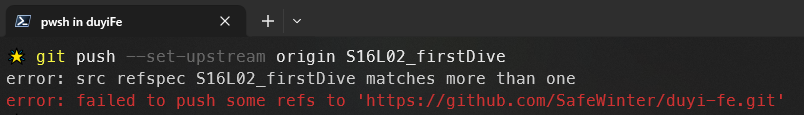
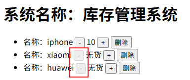

# L02：Vue 初体验


> [!tip]
>
> 主要体验特性：
>
> - `Vue` 响应式；
> - `mustache` 模板语法；
> - `v-for` 指令；
> - `v-on` 指令（`@click`）；
> - `methods` 实例方法；
> - `v-if` / `v-else` 指令；
>
> 本节配套练习文件详见 `16_Vue_scratch/my-first-vue/`。


## 1 起步

使用 `Vue` 的两种方式：

- 在页面中引入 `Vue` 的 `JavaScript` 库文件（类似 `jQuery`）；
- 使用 `Vue` 脚手架 ——
  - 官方脚手架：`vue-cli`（中小公司）；
  - 其他民间脚手架，如 `webpack-simple` 等（必会 `Webpack` 才行）；
  - 自行手动搭建脚手架（懂原理，大厂较多）。

低端开发早就饱和，高阶开发永远稀缺。


## 2 体验 Vue 开发


`Vue` 的 **响应式** 特性：数据变化后，页面会重新渲染（与 `CSS3`、移动端开发中的响应式概念不同）。

`MVVM`：**M** odel（模型）- **V** iew（视图）- **V** iew **M** odel（视图模型）的缩写。完全理解需要深入源码，并对比 `MVC` 模式相关概念（需掌握 `Node.js` 核心概念，后续有专门的 `MVVM` 原理分析课，本节不展开）。

> [!tip]
>
> **Vue 中的 MVVM 究竟是什么？**
>
> `DeepSeek` 回复（摘录）：
>
> 它是 `Vue.js` 框架实现的核心架构模式，它将应用程序分为三个核心部分：
>
> - **Model（模型）**：应用的数据层（`data`），包含业务逻辑和数据
> - **View（视图）**：用户界面（`DOM`），展示数据并与用户交互
> - **ViewModel（视图模型）**：即 `Vue` 实例，连接 `Model` 和 `View` 的桥梁
>
> 核心机制：数据绑定。
>
> 与 `MVC` 的区别：
>
> |          MVC          |         MVVM         |
> | :-------------------: | :------------------: |
> | `Controller` 控制流程 | `ViewModel` 自动同步 |
> |    手动更新 `DOM`     |    自动更新 `DOM`    |
> |    更适用于服务端     |     专为前端设计     |


## 3 实测备忘

### 3.1 充分利用 CDN

根据 [Vue 2 官网](https://v2.cn.vuejs.org/v2/guide/components-dynamic-async.html#在动态组件上使用-keep-alive) 提供的 [keep-alive 示例](https://codesandbox.io/s/github/vuejs/v2.vuejs.org/tree/master/src/v2/examples/vue-20-keep-alive-with-dynamic-components)，可以从 [unpkg.com](https://unpkg.com/) 提供的 `CDN` 上获取 `Vue 2.x` 的最终版：

```markdown
https://unpkg.com/vue@2
```

最终跳转的链接为：`https://unpkg.com/vue@2.7.16/dist/vue.js`。为了减小文件体积，将最后的文件名改为 `vue.min.js` 即可下载压缩版 `JS` 库文件（视频中的版本为 `v2.6.11`）。


实测效果图：




### 3.2 新建分支与标签同名冲突

实测时新建标签 `S16L02_firstDive` 并推送成功，再用该名称创建 `Git` 分支，推送到远程跟踪分支报错：



此时应写出分支的完整路径：

```bash
git push --set-upstream origin HEAD:refs/heads/S16L02_firstDive
```


### 3.3 代码优化

使用自定义 `filter` 简化模板：

```vue
<span>{{item.stock | fmtStock}}</span>
<script>
var vm = new Vue({
  filters: {
    fmtStock: v => v > 0 ? v : '无货'
  }
});
</script>
```

使用 `v-on` 指令绑定 `disabled` 属性：

```vue
<button :disabled="item.stock === 0" 
  @click="changeStock(item, item.stock - 1)">-</button>
```

使用 `Math.max()` 简化 `if` 逻辑：

```js
// before
changeStock(product, newStock) {
  if (newStock < 0) {
    newStock = 0;
  }
  product.stock = newStock;
}
// after
changeStock(product, newStock) {
  product.stock = Math.max(0, newStock);
}
```

最终效果（代码详见 `S16L02_firstDive` 分支，`SHA-ID`：`01053e23`）：


