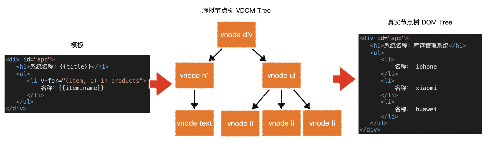
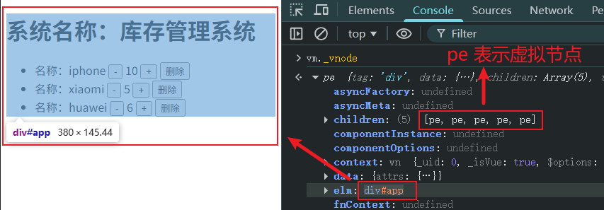
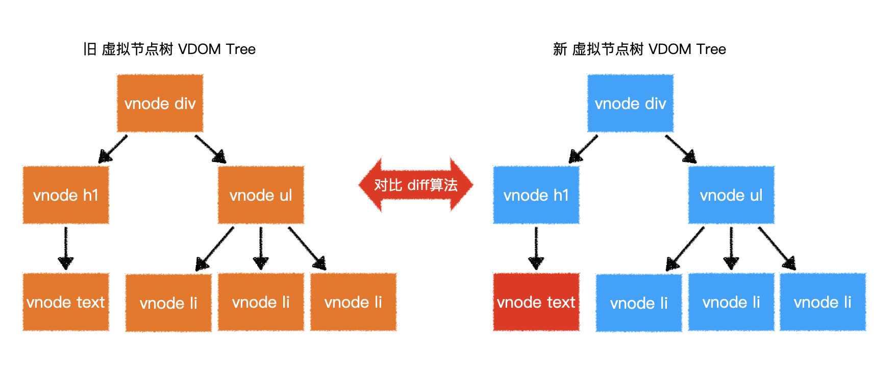
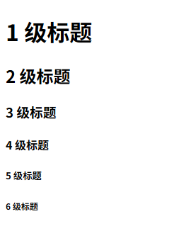

# L03：Vue 必会概念


## 1 ES6 知识补充

- 速写属性（语法糖）
- 速写方法（语法糖）
- 模板字符串

> [!tip]
>
> **使用技巧**
>
> 安装 `VSCode` 插件 `Code Runner` 后可通过组合键【<kbd>Ctrl</kbd> + <kbd>Alt</kbd> + <kbd>N</kbd>】快速执行当前 `JS` 文件。
>
> 在介绍 `VSCode` 插件 `Code Runner` 时谈到 `Node.js` 的地位——它是传统前端与现代前端的 **分水岭**：没有 `Node.js` 就没有 `Webpack`、更没有 `React`、`Vue` 等前端框架。


## 2 注入

配置对象中的部分内容会被提取到 `Vue` 实例中：

- `data`
- `methods`

该过程称之为 **注入**。

注入目的有两个：

- 完成数据响应式

- 绑定 `this`


> [!tip]
>
> 问：`Vue` 是怎么知道数据被更改了？
> 答：`Vue 2.x` 是通过 `Object.defineProperty()` 方法实现数据响应式，`Vue 3.x` 是通过 `Class Proxy` 实现的。后者效率更高，也修复了前者的固有缺陷：无法感知对象属性的新增和减少。
>
> 区分开发者水平高低的，永远是 **底层原理**、**源码分析**、**场景应用**，而非具体的配置写法。


## 3 虚拟 DOM 树

**为了提高渲染效率**，`Vue` 会把模板 **编译** 成为虚拟 `DOM` 树，然后再生成真实的 `DOM`：



> [!tip]
>
> **在浏览器控制台查看虚拟节点**
>
> 控制台直接打印 `vm._vnode` 即可：
>
> 
>
> 其中的 `pe` 为虚拟元素节点（**p** seudo **e** lement）的英文首字母组合，表示一个内置的构造函数。
>
> 另外，`Vue` 实例上提供的以 `$` 开头的属性是对外公开的 `API` 接口；而以 `_` 结尾的（如这里的 `_vnode` 则是仅供 `Vue` 内部使用，不推荐开发者直接使用的 `API` 接口（表示私有属性）。

当数据更改时，将 **重新编译成** 虚拟 `DOM` 树，然后对前后两棵树进行比对，仅将差异部分反映到真实 `DOM`，这样既可最小程度的改动真实 `DOM`，提升页面效率：



> [!tip]
>
> 验证虚拟节点树是否每次重新生成：
>
> ```js
> var v1 = vm._vnode
> vm.title = '123' // some updates
> var v2 = vm._vnode
> console.log(v1 === v2) // false
> console.log(v1.elm === v2.elm) // true
> ```

因此，对于 `Vue` 而言，提升效率重点着眼于两个方面：

- 减少新的虚拟 `DOM` 的生成（原话：减少虚拟 `DOM` 的产生）；
- 保证对比之后，只有必要的节点有变化（原话：减少真实 `DOM` 的改动）。

`Vue` 提供了多种方式生成虚拟 `DOM` 树：

1. 在挂载的元素内部直接书写，此时将使用元素的 `outerHTML` 作为模板；
2. 在 `template` 配置项中书写；
3. 在 `render` 配置项中用函数直接创建虚拟节点树，此时，完全脱离模板，将省略编译步骤。

这些步骤从上到下，优先级 **逐渐提升**。

**注意**：虚拟节点树 **必须是单根的**。

> [!tip]
>
> **实战**
>
> 用渲染函数动态生成 `h1` 到 `h6` 元素：
>
> ```js
> var vm = new Vue({
>   /* snip */
>   render(h){
>     const titles = [];
>     for(let i = 1; i <= 6; i++) {
>       titles.push(h(`h${i}`, `${i} 级标题`))
>     }
>     return h('div', titles);
>   }
> });
> ```
>
> 或者用 `ES6` 语法：
>
> ```js
> render(h) {
>   let titles = Array(6).fill().map(
>     (_, i) => h(`h${i + 1}`, `${i + 1} 级标题`));
>   // or
>   titles = Array.from({ length: 6 },
>     (_, i) => h(`h${i + 1}`, `${i + 1} 级标题`));
>   return h('div', titles);
> }
> ```
>
> 实测效果：
>
> 


## 4 挂载

将生成的真实 `DOM` 树，放置到某个元素位置，称之为 **挂载（mount）**。

挂载的方式：

1. 通过 `el: "<CSS selector>"` 进行配置；
2. 通过 `vm.$mount("<CSS selector>")` 进行配置。


## 5 完整流程


## 6 DIY 拓展

既然虚拟节点树 **必须是单根的**，`Vue 3` 的虚拟节点树也是单根吗？为什么 `Vue 2` 强制要求模板只能有一个根元素，而 `Vue 3` 不限制？

> `DeepSeek`：
>
> 答案是：**Vue 3 虚拟节点树不要求单根节点**。
>
> `Vue 2` 要求单根的原因：
>
> 1. **虚拟 DOM 的 diff 算法依赖**：`Vue 2` 的 `patch` 算法需要从单根节点开始遍历；
> 2. **组件实例管理**：每个 `Vue` 组件实例需要挂载到一个 `DOM` 元素上；
> 3. **生命周期管理**：单根便于组件的挂载 / 卸载管理；
> 4. **$el引用**：`this.$el` 需要指向一个确定的根 `DOM` 元素。
>
> `Vue 3` 取消限制的原因：
>
> 1. `Fragment`（片段）支持；
>
>    ```js
>    // Vue 3 内部会把多根模板转为 Fragment
>    const vnode = h(Fragment, [
>      h('header', '头部'),
>      h('main', '内容'),
>      h('footer', '底部')
>    ])
>    ```
>
> 2. 虚拟节点结构的改变；
>
>    ```js
>    // Vue 2 的 vnode
>    {
>      tag: 'div',
>      children: [...]
>    }
>    
>    // Vue 3 支持 Fragment
>    {
>      type: Symbol(Fragment),  // 特殊类型标识
>      children: [
>        { type: 'header', ... },
>        { type: 'main', ... },
>        { type: 'footer', ... }
>      ]
>    }
>    ```
>
> 3. 改进的 `patch` 算法；
>
>    ```js
>    // patch 过程能处理数组形式的 children
>    patch(container, [
>      vnode1,
>      vnode2,
>      vnode3
>    ], ...)
>    ```
>
> 4. `Teleport` 和 `Suspense` 需求。
>
>    ```vue
>    <template>
>      <Teleport to="body">
>        <Modal />
>      </Teleport>
>      <Content />
>    </template>
>    <!-- 这种情况自然需要多根 -->
>    ```
>
> 技术实现对比：
>
> | 特性         | Vue 2             | Vue 3                                      |
> | :----------- | :---------------- | :----------------------------------------- |
> | 模板根节点   | 必须单根          | 允许多根（`Fragment`）                     |
> | 虚拟节点类型 | 只能是元素或组件  | 新增 `Fragment`、`Suspense`、`Teleport` 等 |
> | `$el` 引用   | 指向根 `DOM` 元素 | 多根时返回 `null`，建议用 `ref`            |
> | `patch` 算法 | 从单根开始 `diff` | 支持多节点数组 `diff`                      |

