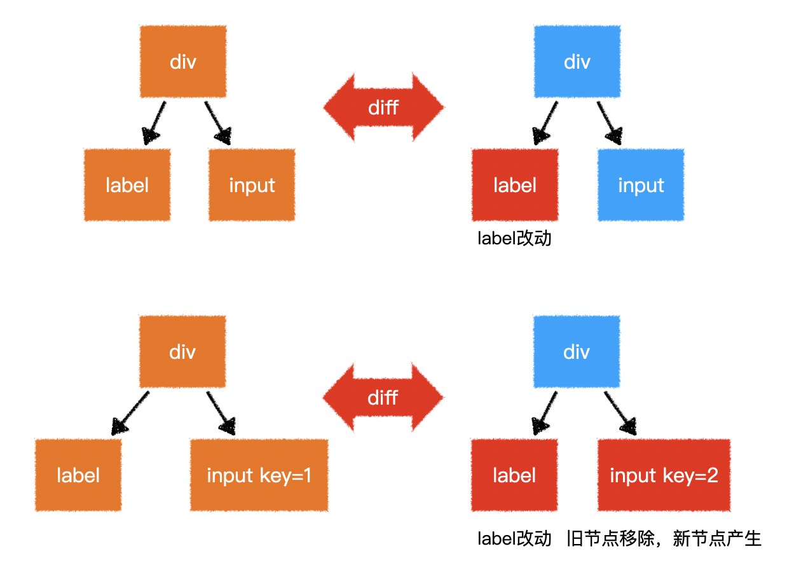
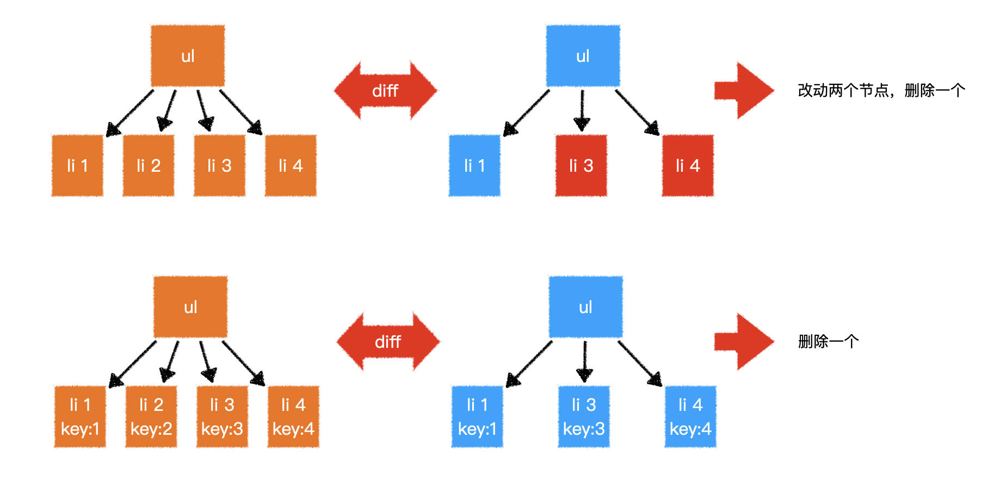

# L05：模板语法和计算属性

> [!tip]
>
> `Vue` 模板语法官方文档：
>
> - `v2.x`：https://v2.cn.vuejs.org/v2/guide/syntax.html
> - `v3.x`：https://cn.vuejs.org/guide/essentials/template-syntax.html#template-syntax


## 1 模板语法

### 1.1 内容插值

`Vue` 中的元素内容使用 `mustache` 模板引擎进行解析。

`mustache.js` 代码库：[https://github.com/janl/mustache.js](https://github.com/janl/mustache.js)

**P.S.**：这里尽管展开讲了很多 `mustache.js` 的逸闻趣事（大胡子说法的由来、`DvaJS`、`roadhog` 名称的由来等），但 `Vue` 的模板引擎并非基于 `mustache.js`（`mustache.js` 的用法示例详见本节 `mustache.html` 文件）。

> [!important]
>
> **勘误**
>
> 关于 `Vue` 的模板引擎，这里其实讲错了：根据 `Vue` 官方文档，`Vue` 只是借鉴了名为 `Mustache`（读作 `/ˈmʌstæʃ/`）的大胡子语法，实现了模板内容的文本插值：
>
> ```html
> <span>Message: {{ msg }}</span>
> ```
>
> `Mustache` 标签（即 `{{ msg }}`）将会被替代为对应的 `data` 对象上 `msg` 属性（`property`）的值。
>
> 双大括号只会将数据解释为 **普通文本**，而非按 `HTML` 解析（除非使用 `v-html` 指令）。
>
> 该语法也不能作用在 `HTML` 元素的 `attribute` 属性上，此时应该使用 `v-bind` 指令：
>
> ```html
> <div v-bind:id="dynamicId"></div>
> ```
>
> 大胡子语法中，除了实现简单的 `property` 插值，还支持所有合法的 `JS` 表达式：
>
> ```html
> {{ number + 1 }}
> 
> {{ ok ? 'YES' : 'NO' }}
> 
> {{ message.split('').reverse().join('') }}
> 
> <div v-bind:id="'list-' + id"></div>
> ```
>
> 但是每个插值绑定只能包含单个表达式，任何语句（如赋值）或流程控制（如 `if` 判定）都不会生效。


### 1.2 指令

指令会影响元素的渲染行为，指令始终以 `v-` 开头。

基础指令：

- `v-for`：循环渲染元素（参考 `index.html`）
- `v-html`：设置元素的 `innerHTML`，该指令会导致元素的模板内容失效（详见 `v-html.html`）
- `v-on`：注册事件（参考 `v-on.html`）
  - 该指令由于十分常用，因此提供了简写形式：`@`
  - 事件支持一些指令修饰符，如 `prevent`、`stop` 等
  - 事件参数会自动传递
- `v-bind`：绑定动态属性（参考 `v-bind.html`）
  - 该指令由于十分常用，因此提供了简写 `:`
- `v-show`：控制元素可见度（参考 `v-show.html`）
- `v-if`、`v-else-if`、`v-else`：控制元素生成（参考 `v-index.html`）
- `v-model`：双向数据绑定，常用于表单元素（参考 `v-model.html`）
  - 该指令是 `v-on` 和 `v-bind` 的复合版

> 进阶指令：
>
> - `v-slot`
> - `v-text`
> - `v-pre`
> - `v-cloak`
> - `v-once`
> - **自定义指令**（DIY：实战课中的 `v-loading`、`v-lazy`）


### 1.3 特殊属性

最重要的特殊属性：`key`

该属性可以干预 `diff` 算法，在同一层级，`key` 值相同的节点会进行比对，`key` 值不同的节点则不会：



在循环生成的节点中，`Vue` 强烈建议给予每个节点 **唯一** 且 **稳定** 的 `key` 值（参考 `v-for-key.html`）：



> 其他特殊属性：
>
> - `ref`
> - `is`
> - `slot`
> - `slot-scope`
> - `scope`


## 2 计算属性

本节示例详见 `计算属性.html`。

```js
computed: {
  // 仅访问器
  prop(){
    return ...
  }
  // 访问器 + 设置器
  fullProp: {
    get(){
      return ...
    },
    set(val){
      ...
    }
  }
}
```

计算属性（`computed`）和方法（`methods`）的区别：

- 计算属性 **可以赋值**，而方法不行；
- 计算属性会进行 **缓存**，如果依赖不变，则直接使用缓存结果，不会重新计算；
- 计算属性的适用场景：凡是根据已有数据计算得到新数据的 **无参函数**，都应该 **尽量写成计算属性**，而 **不是方法**