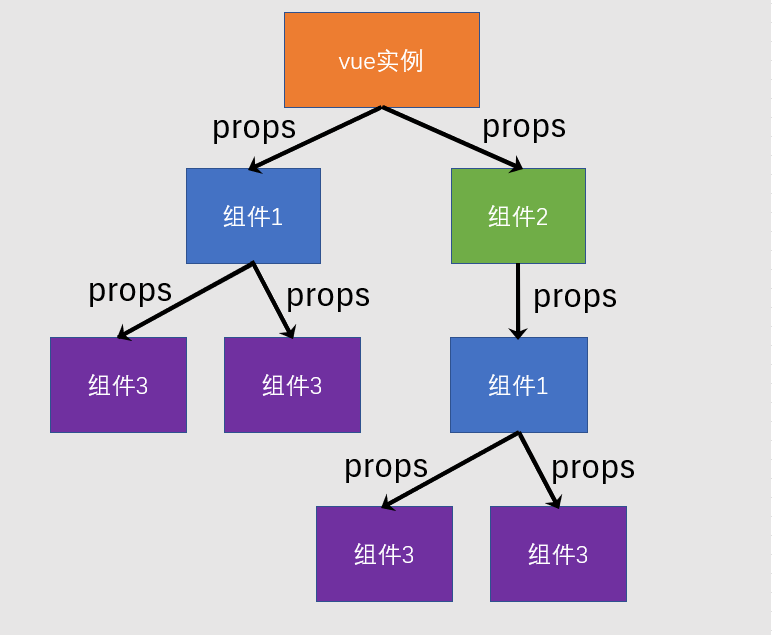

# L06：组件必会概念


## 1 知识补充

1. 箭头函数
   - 任何可以书写匿名函数的位置均可以书写箭头函数
   - 箭头函数将会绑定 `this` 为函数书写位置的 `this` 值

2. 模块化
   - 没有模块化的世界：全局变量污染、难以管理的依赖
   - 常见的模块化标准：`CommonJS`、`ES6 Module`、`AMD`、`CMD`、`UMD`


## 2 组件概念

一个完整的网页是复杂的，如果将其作为一个整体来进行开发，将会遇到下面的困难

- 代码凌乱臃肿
- 不易协作
- 难以复用

`Vue` 推荐使用一种更加精细的控制方案——组件化开发

所谓组件化，即把一个页面中区域功能细分，每一个区域成为一个组件，每个组件包含：

- 功能（`JS` 代码）
- 内容（模板代码）
- 样式（`CSS` 代码）

> [!important]
>
> 由于没有像 `Webpack` 这样的构建工具的支撑，`CSS` 代码暂时无法放到组件中。
>
> **注意**：`Webpack`、包管理器、模块化、`NodeJS` 的知识对于前端 **极其重要**，千万不可略过。


## 3 组件开发

### 3.1 创建组件

组件是根据一个普通的配置对象创建的，所以要开发一个组件，只需要写一个 **配置对象** 即可。

该配置对象和 `Vue` 实例的配置是 **几乎一样** 的：

```js
//组件配置对象
var myComp = {
  data(){
    return {
      // ...
    }
  },
  computed:{
    //...
  },
  methods:{
    //...
  },
  template: `....`
}
```

值得注意的是，组件配置对象和 `Vue` 实例有以下几点差异：

- 无 `el`；
- `data` **必须是一个函数**，该函数返回的对象作为数据；
- 由于没有 `el` 配置，组件的虚拟 `DOM` 树必须定义在 `template` 或 `render` 中。


### 3.2 注册组件

注册组件分为两种方式，一种是 **全局注册**，一种是 **局部注册**。

#### 3.2.1 全局注册

一旦全局注册了一个组件，整个应用中 **任何地方** 都可以使用该组件：


全局注册的方式是：

```js
// 参数1：组件名称，将来在模板中使用组件时，会使用该名称
// 参数2：组件配置对象
// 该代码运行后，即可在模板中使用组件
Vue.component('my-comp', myComp);
```

在模板中，可以使用组件了

```html
<my-comp />
<!-- 或 -->
<my-comp></my-comp>
```


> [!note]
>
> 在一些工程化的大型项目中，**很多组件都不需要全局使用**。
>
> 比如一个登录组件，只有在登录的相关页面中使用，如果全局注册，将导致构建工具无法优化打包（再次证明 `Webpack` 的极端重要性）。
>
> **因此，除非组件特别通用，否则不建议使用全局注册。**


#### 3.2.2 局部注册

局部注册就是哪里要用到组件，就在哪里注册：


局部注册的方式：在要使用组件的组件或实例中加入一个配置——

```js
// 这是另一个要使用 my-comp 的组件
var otherComp = {
  components:{
    // 属性名为组件名称，模板中将使用该名称
    // 属性值为组件配置对象
    "my-comp": myComp
  },
  template: `
    <div>
      <!-- 该组件的其他内容 -->
      <my-comp></my-comp>
    </div>
  `;
}
```


### 3.3 应用组件

在模板中使用组件特别简单，把组件名当作 `HTML` 元素名使用即可。

但要注意以下几点：

1. **组件必须有结束**

组件可以自结束，也可以用结束标记结束，但 **必须要有结束**。

下面的组件使用是错误的：

```html
<my-comp>
```

2. **组件的命名**

无论你使用哪种方式注册组件，组件的命名需要遵循规范。

组件可以使用 `kebab-case` 短横线命名法，也可以使用 `PascalCase` 大驼峰命名法。

下面两种命名均可：

```js
var otherComp = {
  components:{
    "my-comp": myComp,  // 方式1
    MyComp: myComp //方式2
  }
}
```

> [!tip]
>
> 实际上，使用小驼峰命名法 `camelCase` 也是可以识别的，只不过不符合官方要求的命名规范。

使用 `PascalCase` 方式命名还有一个额外的好处，即可以在模板中 **使用两种组件名**：

```js
var otherComp = {
  components:{
    MyComp: myComp
  }
}
```

模板中：

```html
<!-- 二者皆可 -->
<my-comp />
<MyComp />
```

因此，在使用组件时，为了方便，往往使用以下代码：

```js
var MyComp = {
  //组件配置
}

var OtherComp = {
  components: {
    MyComp // ES6 速写属性
  }
}
```

> [!note]
>
> **注意**
>
> `PascalCase` 命名不可以直接在 `HTML` 中使用，但可以在 `template` 配置中使用。
>
> 想想为什么？（因为 `HTML` 标签名和属性名是 **不区分大小写** 的）


## 4 组件树

一个组件创建好后，往往会在各种地方使用它。它可能多次出现在 `Vue` 实例中，也可能出现在其他组件中。

于是就形成了一个组件树：


## 5 向组件传递数据

大部分组件要完成自身的功能，都需要一些额外的信息。

比如一个头像组件，需要告诉它头像的地址，这就需要在使用组件时向组件传递数据。

传递数据的方式有很多种，最常见的一种是使用 **组件属性（component props）**

首先在组件中声明可以接收哪些属性：

```js
var MyComp = {
  props:["p1", "p2", "p3"],
  // 和 Vue 实例一样，使用组件时也会创建组件的实例
  // 而组件的属性会被提取到组件实例中，因此可以在模板中使用
  template: `
    <div>
      {{p1}}, {{p2}}, {{p3}}
    </div>
  `
}
```

在使用组件时，向其传递属性：

```js
var OtherComp = {
  components: {
    MyComp
  },
  data(){
    return {
      a:1
    }
  },
  template: `
    <my-comp :p1="a" :p2="2" p3="3"/>
  `
}
```

**注意：在组件中，属性是只读的，绝不可以更改，这叫做【单向数据流】**（原始课件图片有误，已根据视频重绘）：




## 6 工程结构

本节共包含两个示例源码包：

- `my-first-vue`：重构前的示例页；
- `my-first-proj`：按组件化思想重构后的示例页。

由于没讲子组件如何向父组件通信，这里暂时不使用 `props` 传参方式渲染产品列表。


### 关于 `Git` 分支与 `tag` 标签的说明：

本节练手 `Git` 分支名：`S16L06_compEssentials`。

`tag` 标签有三个：

- `S16L06_before`：对应课件提供的原始版本，问题较多；
- `S16L06_refactor`：基于本课讲解内容的 DIY 练手版，修复课件中的部分问题（`v-for` 没有 `key` 绑定、代码冗余等），并加入自定义 `filter` 和 `disabled` 绑定效果；
- `S16L06_after`：按 `props` 传参的方式实现的最终版（含子组件 `emit` 自定义事件）。