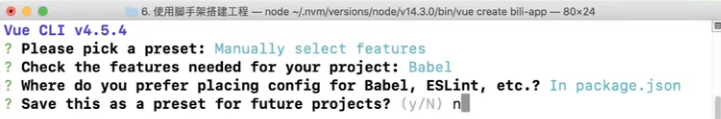
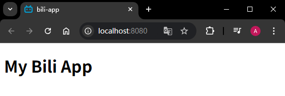

# L07：使用脚手架搭建工程


> [!tip]
>
> `vue-cli` 官方文档：[https://cli.vuejs.org/zh/](https://cli.vuejs.org/zh/)
>
> 视频中的工具版本汇总：
>
> - `node -v`：`v14.3.0`
> - `npm -v`：`6.14.5`
> - `vue --version`：`@vue/cli 4.3.1`
> - 运行 `vue create` 命令显示的 `Vue CLI` 版本：`Vue CLI v4.5.4`


## 1 vue-cli 的安装

`vue-cli` 是一个脚手架工具，它集成了诸多前端技术，包括但不仅限于：

- `Webpack`
- `Babel`
- `Eslint`
- `http-proxy-middleware`
- `Typescript`
- `CSS PreProsessor`
- `CSS Module`
- ....

这些工具，它们大部分都要依赖两个东西：

- `node` 环境：很多工具的运行环境；
- `npm`：包管理器，用于下载各种第三方库；

> [!tip]
>
> 目前，`npm` 已和 `node` 集成，当安装 `node` 后，会自动安装 `npm`。


### 1.1 安装 node

下载 `node`：[https://nodejs.org/zh-cn/](https://nodejs.org/zh-cn/)


### 1.2 验证安装

打开终端，查看 `node` 和 `npm` 版本，验证是否安装成功:

```shell
node -v
npm -v
```

> [!tip]
>
> 如果安装之前打开了终端，需要在安装后关闭终端，重新打开。


### 1.3 配置源地址

默认情况下，`npm` 安装包时会从国外的地址下载，速度很慢，容易导致安装失败，因此需要先配置 `npm` 的源地址。

使用下面的命令更改 `npm` 的源地址为 **淘宝源**（浏览器访问旧源会自动更新到最新的镜像源）：

```shell
# 视频中的淘宝源已过期
npm config set registry http://registry.npm.taobao.org/
# 应变更为以下最新的镜像源
npm config set registry https://registry.npmmirror.com/
```

更改好了之后，查看源地址是否正确的被更改（默认镜像源：`https://registry.npmjs.org/`）：

```shell
npm config get registry
# https://registry.npmmirror.com/
```


### 1.4 安装 vue-cli

使用下面的命令安装 `vue-cli` 工具：

```shell
npm install -g @vue/cli
```

安装好之后，检查 `vue-cli` 是否安装成功：

```shell
vue --version
```


## 2 vue-cli 的使用

### 2.1 在终端中进入某个目录

1. 选择一个目录，该目录将放置你的工程文件夹；
2. 在终端中进入该目录。


### 2.2 搭建工程

使用 `vue-cli` 提供的命令搭建工程：

```shell
# vue create 工程名
vue create bili-app
```

> [!note]
>
> **注意**
>
> 【工程名】只能出现 **英文、数字和短横线（也可以包含下划线）**。

`Vue CLI` 中的命令行界面选项：

- 手动选择 `feature` 特性
- 只勾选 `Babel`
- 所有配置都放到同一个文件中（`package.json`）
- 当前选择方案不作为下次默认方案

如图所示：




## 3 理解工程结构

最好对照上节课的 `my-first-proj` 目录结构理解当前工程结构：

- `node_modules`：第三方 `node` 包存放处（包括 `Vue`）
- `public`：放置页面模板 `index.html`（更换标签页的默认图标即可，其他不用动）
- `src`：源代码目录
  - `main.js`：启动文件
  - `App.vue`：`Vue.js` 的单组件文件，也是项目的根组件
- `.gitignore`：不进入 `Git` 版本管理的忽略文件清单
- `package.json`：当前工程的配置文件
  - `dependencies`：项目的直接依赖
  - `devDependencies`：项目的间接依赖
  - `scripts`：配置项目的脚本运行命令


## 4 实测备忘

本地工具版本：

```bash
> node -v
v14.21.3
> npm -v
6.14.18
> vue --version
@vue/cli 4.5.8
```

初始化 `bili-app` 命令：

```bash
> npm config set strict-ssl false
> vue create bili-app
# Mannually select features
# Babel
# In package.json
# n (not save as a preset)
> npm config set strict-ssl true
> cd bili-app
# 按视频删除无关内容，更换 favicon 图标
# 以开发模式启动项目
> npm run serve
```

运行结果：



具体源码详见 `16_Vue_scratch/bili-app/` 文件夹，对应分支 `S16L07_biliApp`。