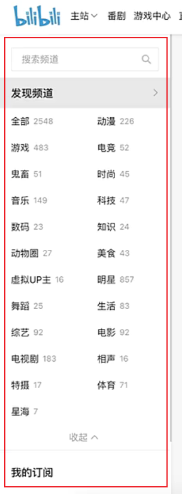
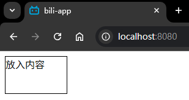

# L08：开发通用组件


## 1 需求描述

`bili-app` 项目用于模拟 B 站【频道】页中的左侧边栏效果：



本节先创建【发现频道】栏中的通用组件 `Item.vue`，其作用是提供这样一个容器：

- 既能存放列表标题区的网页内容；
- 又能存放标题下方列表项的内容；
- 还能在鼠标悬停时有激活效果（背景色变化）。


## 2 实战备忘

:one: 想让父组件限制子组件的尺寸，最好不要直接在子组件上设置样式，而是要在子组件上间接设置，例如让子组件的宽高均为 `100%`，分别占据父组件的整个宽高：

```css
/* parent comp */
.app-container {
  width:100px; 
  height:60px;
  border: 1px solid violet;
}

/* child comp */
.item-container {
  width: 100%;
  height: 100%;
  cursor: pointer;
}
```


:two: 为避免 `CSS` 样式冲突，需要在组件的 `style` 标签上添加 `scoped` 关键字：

```html
<style scoped>
/* -- snip -- */
</style>
```


:three: 限定 `props` 传入参数的类型、是否必填、以及默认值的设置方法：

```js
// src/components/Item.vue
export default {
  props: {
    isActive: {
      type: Boolean,
      // required: true,
      default: false,
    }
  }
}
```


:four: 样式类的绑定写法：

```vue
<div class="item-container" :class="{active: isActive}">
  <!-- snip -->
</div>
```


:five: 从父组件模板直接往引入的子组件标签中写入内容，这些内容是无法渲染的；除非在子组件中添加一个特殊的插槽标签（默认插槽）：`<slot></slot>`

```vue
<!-- Child -->
<template>
  <div class="item-container" :class="{active: isActive}">
    <slot name="default"></slot>
  </div>
</template>

<!-- Parent -->
<template>
  <div class="app-container">
    <Item :isActive="active" >
      <template #default>放入内容</template>
    </Item>
  </div>
</template>
```

实测效果：



更多用法详见 `Vue` 插槽的 [官方文档](https://v2.cn.vuejs.org/v2/guide/components-slots.html)。