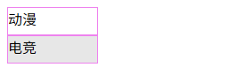

# L09：自定义事件


## 1 添加背景渐变效果

仔细观察发现侧边栏的元素在悬停或点击后，背景色是渐变而非突变的，因此需要添加背景渐变特效：

```css
/* Item.vue */
.item-container {
  transition: background-color .2s linear;

  --hover: #f4f4f4;
  --active: #e7e7e7;
}
.item-container:hover {
  background-color: var(--hover);
}
.active {
  background-color: var(--active);
}
```


## 2 父子组件通信

子组件不能直接修改父组件传来的属性值，以免破坏 `Vue` 的单项数据流机制：


但子组件可以用 `Vue` 的实例方法 `$emit(eventName, ... data)` 通知父组件变更状态：

```js
/*
<div class="item-container" @click="handleClick">
  <slot></slot>
</div>
*/
export default {
  name: 'Item',
  props: {
    isActive: {
      type: Boolean,
      // required: true,
      default: false
    }
  },
  methods: {
    handleClick(){
      this.$emit('activate');
    }
  },
};
```

父组件通过侦听自定义的 `activate` 事件并更新传入子组件的值：

```js
// <Item :isActive="active === '1'" @activate="handleActivate('1')" >
export default {
  name: 'App',
  data() {
    return {
      active: '',
    };
  },
  methods: {
    handleActivate(value) {
      this.active = value;
    }
  },
};
```

父子组件通信机制：


## 3 实测备忘

:one: 实测时尝试使用 `Vue` 封装的 `<transition>` 组件实现背景渐变，但并不适用于该场景下（作废）。

:two: 传入子组件的属性值 `isActive` 是一个布尔型，具体的比较条件可以灵活设置，实测时简化为和字符 `'1'`、`'2'` 对比，以便后续直接改造为 `v-for` 的形式。

本地实测效果（详见 `Git` 分支 `S16L09_customEvent`）：

