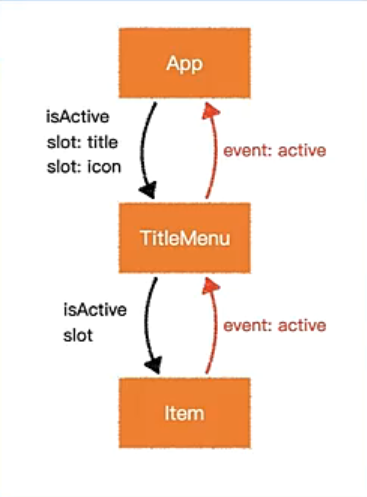
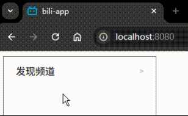

# L10：开发频道菜单


> [!tip]
>
> 开发的难度是和开发者的技术能力成正比的。

高级开发考虑更多的是代码的复用性。


## 1 新增频道标题组件

组件关系设计：



由于频道标题栏同样具有 `Item` 组件的鼠标悬停和选中效果，因此 `TitleItem` 可依赖 `Item` 组件：

```js
export default {
  name: "TitleMenu",
  components: {
    Item,
  },
}
```

同时，由于 `App` 和 `Item` 中间隔了一个 `TitleItem` 组件，按照单项数据流的设计，`Item` 所需属性和触发的自定义事件全部要在 `TitleItem` 中注册一遍：

```js
/*
<div class="title-menu">
  <Item :isActive="isActive" @activate="$emit('activate')">
    ...
  </Item>
</div>
*/
export default {
  name: "TitleMenu",
  props: {
    isActive: {
      type: Boolean,
      required: true,
    }
  },
}
```

另外，`TitleItem` 的宽度也不能设为固定值，应该根据父组件的尺寸动态决定；而高度根据经验变动较少，可以设为固定值。这里选择宽度全部充填：

```css
.title-menu {
  width: 100%;
  height: 46px;
  line-height: 46px;
}
```


## 2 具名插槽的使用

`TitleItem` 通过两个具名插槽，实现了对标题栏两个内容分区的独立配置：

```html
<!-- 在 TitleItem 内定义插槽 -->
<div class="title-menu">
  <Item ...>
    <div class="inner">
      <div class="title left">
        <slot name="title"></slot>
      </div>
      <div class="icon right">
        <slot name="icon"></slot>
      </div>
    </div>
  </Item>
</div>

<!-- 在 App 内使用插槽 -->
<TitleMenu>
  <template #title>发现频道</template>
  <template #icon>&gt;</template>
</TitleMenu>
```

> [!note]
>
> **插槽使用要领**
>
> - 插槽通过 `name` 属性命名；
> - 使用时则通过 `#<slot_name>` 或 `v-slot:<slot_name>` 引用；
> - 使用时插槽名称不能带引号（整体为 `v-slot` 指令的参数，而非参数值）。


## 2 实测备忘

:one: 左侧边栏有 `20px` 的左右内边距，如果从 `TitleMenu.vue` 容器设置，`Item` 的背景色就覆盖不了（背景色只对内容区生效）。此时可在 Item 的插槽内再套一个容器 `.inner`，让它也变为 `Item` 的内容区即可：

```css  
.inner {
  padding: 0 20px;
}
```


:two: 作中转的 `TitleMenu` 对转发的自定义事件可以不用单独创建 `method`：

```html
<div class="title-menu">
  <Item @activate="$emit('activate')">
    ...
  </Item>
</div>
```


实测效果（点击后检查选中状态，刷新页面还原）：



实测代码详见 `Git` 分支 `S16L10_titleMenu`。