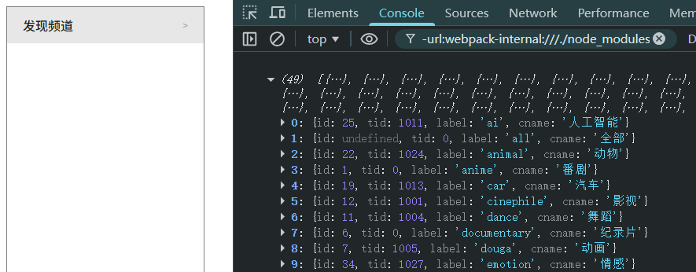

# L10：获取频道数据


## 1 关于 API 接口失效的问题与最新处理

原频道数据 `API` 接口早已失效：`https://api.bilibili.com/x/web-interface/web/channel/category/list`。

经实测，在 B 站登录后的个人中心页面找到了近似接口：


完整 `URL`：`https://api.bilibili.com/x/kv-frontend/namespace/data?appKey=333.1339&nscode=10&versionId=XXXXXX`

去掉最后的 `versionId` 即可得到所有分类数据，请求时也无需通过 `onProxyReq(proxyReq, req, res)` 单独设置请求头 `Origin` 和 `referer`。

核心配置：

```js
// vue.config.js
module.exports = {
  devServer: {
    proxy: {
      "/x": {
        target: 'https://api.bilibili.com',
        // onProxyReq(proxyReq, req, res) {
        //   proxyReq.setHeader('origin', 'https://www.bilibili.com');
        //   proxyReq.setHeader('referer', 'https://www.bilibili.com/v/channel');
        // }
      }
    }
  }
};

// src/services/channel.js
export default {
  async getChannels() {
    const resp = await fetch('/x/kv-frontend/namespace/data?appKey=333.1339&nscode=10');
    const { data } = await resp.json();
    const channelData = Object.entries(data.data)
      .map(([key, val]) => {
        const label = key.split('.').pop();
        const {channelId: id, tid, name: cname} = JSON.parse(val);
        return {id, tid, label, cname};
      });
    return channelData;
  }
}

// Testing: src/main.js
import api from './services/channel.js';
api.getChannels().then(data => console.log(data));
```

最终结果：




## 2 关于跨域问题

远程获取数据：


跨域问题：


在**开发环境中**解决跨域问题：


`vue.config.js` 其实是 `vue-cli` 的配置文件，其中约 `90%` 都是关于 `Webpack` 的配置。

> [!tip]
>
> **面试题**
>
> **问**：为什么 `Vue` 的配置文件必须使用 `CommonJS` 模块规范而不是 `ESM` 规范来导出？
>
> **答**：因为 `Webpack` 加载配置文件时处于 `node` 环境，而 `node` 的默认模块化标准是 `CommonJS`；但是在 `Webpack` 运行打包时处于 `Webpack` 环境，此时既支持 `CommonJS` 规范又支持 `ESM` 模块化规范。

配置开发服务器代理（课件摘录，仅供参考）：

```js
// vue.config.js
module.exports = {
  devServer: {
    proxy: {
      // 配置代理
      "/x": {
        // 凡是以 /x 开头的请求，进行代理
        target: "https://api.bilibili.com",
        onProxyReq(proxyReq) {
          // add custom header to request
          proxyReq.setHeader("origin", "https://www.bilibili.com");
          proxyReq.setHeader("referer", "https://www.bilibili.com/v/channel");
          // or log the req
        },
      },
    },
  },
};
```

该配置在重启项目后生效。


实测代码详见 `Git` 分支 `S16L11_channelData`。
