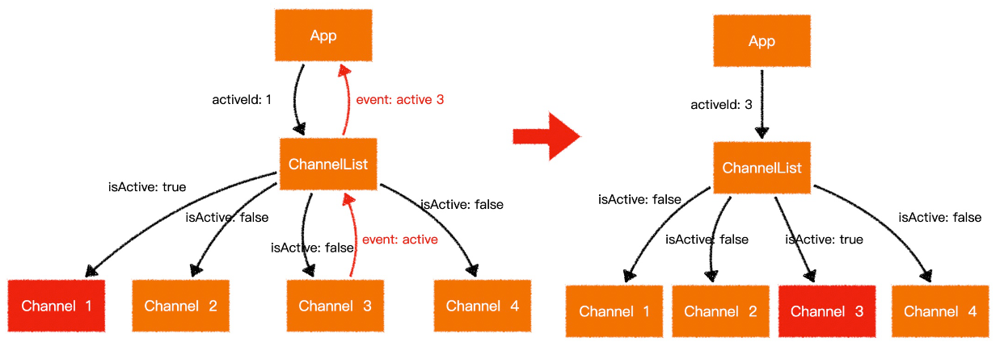
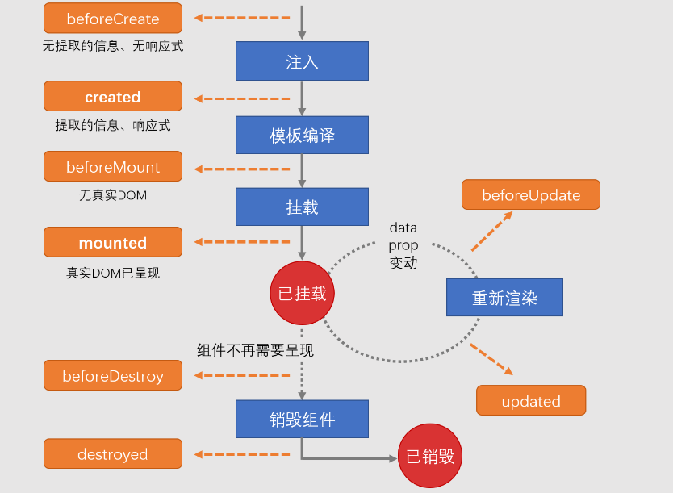
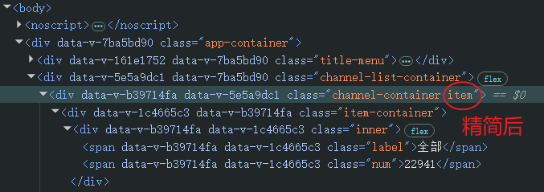
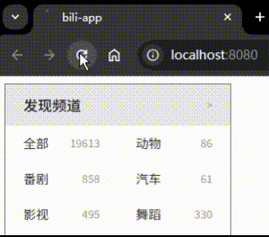
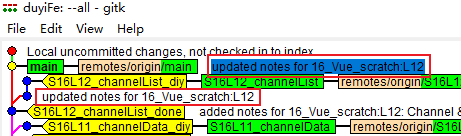

# L12：完成频道列表组件（二）


> [!tip]
>
> 欲速则不达。
>
> 学有余力者，可尝试把频道列表项和频道标题整合为一个组件。


本节实现频道列表项的批量渲染，涉及远程数据接口调用，以及组件生命周期钩子的选取。


## 1 关于默认值为对象时的处理

必须通过函数返回一个新对象，而不能直接写成对象常量，以免组件间共享同一个对象：

```js
export default {
  props: {
    data: {
      type: Object,
      default: () => ({})
    }
  }
}
```


## 2 组件生命周期

频道列表组件 `ChannelList` 的整体数据流设计：



异步数据加载及组件的二次渲染设计：


`Vue` 组件生命周期示意图（**重点**）：




## 3 实测备忘

:one: 实测时 `activeId` 拼成 `avtiveId`，导致控制台频繁报错。

:two: 由于新的 `API` 接口没有 `channel_count` 属性值，需在获取时临时生成随机数，再手动求和补录一项【全部】。

:three: 对 `Channel` 及 `ChannelList` 组件使用 `Flexbox` 布局，为了让包含数字的弹性元素尽量靠右，其 `flex` 的值不能是 `auto`，本例中只能是 `0`（`L14`）：

```css
.inner {
  padding: 0 20px;
  display: flex;
  gap: 0.2em;
}
.label {
  color: var(--titleColor);
  font-size: .875em;
  flex: 1;
}
.num {
  color: var(--iconColor);
  font-size: .75em;
  flex: 0;
}
```


:four: 适当精简模板层级：可在 `Channel` 组件上直接使用 `v-for` 遍历频道元素。添加到子组件上的样式类最终会放到子组件的根元素上（仅适用于 `Vue 2.x`）：

```html
<!-- ChannelList.vue -->
<div class="channel-list-container">
  <Channel class="item" v-for="item in data" :key="item.id"
    :activeId="activeId" 
    :channel="item" 
    @activate="id => $emit('activate', id)"
  />
</div>
```

最终 `item` 放到了 `Channel` 组件的根元素上：




实测效果图：



实测代码详见 `Git` 标签 `S16L12_channelList_diy`。


> [!tip]
>
> **git cherry-pick 命令实战**
>
> 提交本节实测代码时，发现笔记中漏掉了最后一条备忘记录，但又不想退回 `main` 分支重新操作一遍；此时可以在当前分支直接提交一个版本，等切回主分支后，使用 `cherry-pick` 快速同步新增的笔记内容：
>
> ```bash
> > git logs -5
> * 530d09f (tag: S16L12_channelList_diy, origin/S16L12_channelList, S16L12_channelList) DIY: implemented Channel & ChannelList via new API
> * 8b0e066 updated notes for 16_Vue_scratch:L12
> * fff1116 (HEAD -> main, tag: S16L12_channelList_done, origin/main, origin/HEAD) added notes for 16_Vue_scratch:L12: Channel & ChannelList components
> | * 471bdaa (tag: S16L11_channelData_diy, origin/S16L11_channelData, S16L11_channelData) DIY: fetch channel data from latest API
> |/
> * df18ede (tag: S16L11_channelData_done) added notes for 16_Vue_scratch:L11: fetch channel data
> # 记录要同步的 SHA-ID：8b0e066
> > git cherry-pick 8b0e066
> [main 6f40bd5] updated notes for 16_Vue_scratch:L12
>  Date: Fri Jan 30 23:53:20 2026 +0800
>  2 files changed, 21 insertions(+), 2 deletions(-)
>  create mode 100644 16_Vue_scratch/assets/12.5.png
>  # 同步到远程仓库
> > git push
> # 再次确认
> > gitk --all
> ```
>
> 实测截图（红框完全相同，同步成功）：
>
> 
