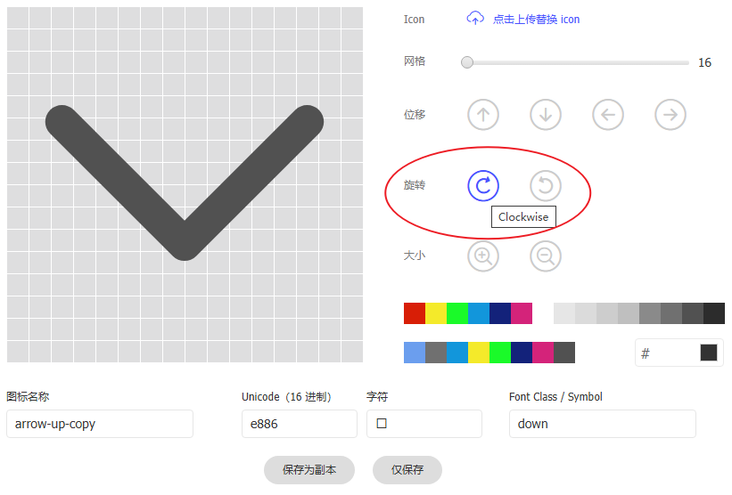
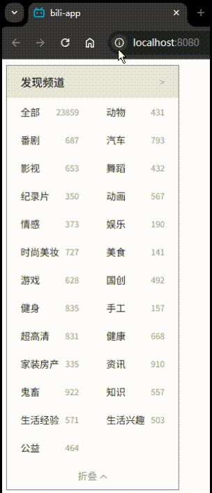

# L13：频道列表组件开发（三）——动态列数、单位行高及折叠条效果


本节对已经实现的 `ChannelList` 和 `Channel` 组件进行了一些优化扩展，自己又在此基础上进行了功能完善。


## 1 DIY：数据源的改造

由于新的数据接口提取的 `id` 值和中文名存在空值，且数据量太大，无法满足设置动态列宽的需求，于是进行改造。改造后的数据源默认只提供 25 个有效分类（含手动汇总项）：

```js
// src/services/channel.js
const randomCount = (start = 5, end = 1000) => 
  Math.floor(Math.random() * (end - start) + start);

const extractData = ({data}, size = 25, rand = randomCount) => {
  const channels = Object.entries(data)
    .map(([_, val], id) => {
      if(id === 0) { // 去掉第一项【人工智能】
        return null;
      }
      const {name: cname} = JSON.parse(val);
      if(id === 0 || !cname || cname === '全部') {
        // 去掉名称为【全部】或为空的所有元素项
        return null;
      }
      return {id, cname, count: rand()};
    })
    .filter(e => e !== null);
    
  // add 1st el representing all
  channels.unshift({
    id: 1, 
    cname: '全部',
    count: channels.reduce((sum, e) => sum + e.count, 0), 
  });
  return channels.slice(0, size);
};

export default {
  async getChannels() {
    const resp = await fetch('/x/kv-frontend/namespace/data?appKey=XXX&nscode=XXX');
    const { data } = await resp.json();
    return extractData(data);
  }
}
```


## 2 DIY：关于快速生成成对的图标

折叠工具条需要上下箭头图标，视频从阿里图标库直接检索，其实这类成对出现的图标通过编辑转向就能快速得到另一个：




## 3 利用样式绑定实现多列设置

让 `ChannelList` 接收参数 `cols`，同时利用形如 `:style="cssObj"` 的样式绑定，实现列宽的自动计算：

```js
// before
/*<Channel v-for="..." class="item" /> */
.item { width: 50%; }

// after
/*<Channel v-for="..." :style="dynmWidth" /> */
props: {cols: {type: Number, default: 2},}
computed: {
  dynmWidth() {
    const width = `${Math.round(1e5 / this.cols) / 1e3}%`;
    return { width };
  },
}
```


## 4 DIY：将折叠工具条重构为 ChannelList 的子组件

仔细观察发现，折叠条的状态（`this.collapsed`）除了切换工具条的文字和图标，还对列表区的高度有影响。因此，该状态只能作为 `props` 属性传入，不能作为子组件的内部状态：

```html
<div class="channel-list-container">
  <section class="list-container" :style="dynmHeight">
    ...
  </section>
  <CollapseBar 
    :collapsed="collapsed"
    @change="collapsed = !collapsed"
  />
</div>
<script>
export default {
  computed: {
    dynmHeight() {
      const rows = this.collapsed ? this.minRows
        : Math.ceil(this.data.length / this.cols);
      return {height: `${this.rowHeight * rows}px`};
    },
  },
}
</script>
```


## 5 DIY：行高的统一配置

由于 `ChannelList` 和 `Channel` 多次出现 `height` 和 `line-height` 的硬编码（`40px`），于是将行高和工具条高度分别作为 `ChannelList` 的 `props` 属性传入，实现了组件与固定行高的解耦：

```js
export default {
  props: {
    rowHeight: { // 列表元素高度
      type: Number,
      default: 40,  // px
    },
    barHeight: {  // 折叠条高度
      type: Number,
      default: 40,  // px
    },
  }
}
```


## 6 DIY：将折叠状态下的展示行数重构为组件属性

动态计算 `ChannelList` 列表区的总高度时，折叠状态下能看到的行数也是硬编码（3 行），实测时改为组件 `props` 属性 `minRows`。


## 7 其他杂项优化

禁止鼠标选中列表区和工具条上的文本：`user-select: none;`

添加 `CollapseBar` 悬停样式（背景和字体颜色加深）

精确控制 `transition` 渐变属性：`transition: height 0.3s ease-out;`

绑定图标类的新写法：

```html
<i :class="`bili b-${iconCls}`"></i>
```

统一组件标签的写法：`Pascal` 或 `Kebab`，不要混用。


## 8 实测效果



实测代码详见 `Git` 分支：`S16L13_colsCollapse`。