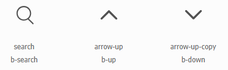
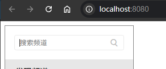

# L14：搜索框组件的实现


本节主要实现侧边栏上方的搜索框组件，并对上节频道列表组件进行代码优化。


## 1 优化频道列表组件

添加下边框：`border-bottom: 1px solid #e7e7e7;`

折叠工具条的文字：【折叠】改为【收起】（实测时已修复）

频道列表在展开状态下，高度不能设为 `auto`：自动高度要等内部元素渲染结束才能确定，此时过渡特效已经完成。因此必须手动计算出一个固定高度。


### 提取字体图标组件 Icon.vue

 :one: 字体图标 `CDN` 的维护

从 `ChannelList` 提取独立的字体图标组件 `Icon.vue`，可以对字体图标 `CDN` 统一管理：



- 添加搜索图标后的 `CDN`：`//at.alicdn.com/t/c/font_5120779_lsieqh95kg.css`
- 添加前的 `CDN`：`//at.alicdn.com/t/c/font_5120779_ks8qkejugrm.css`

旧版字体备份文件详见：`16_Vue_scratch\L14_search_bar\font_backup\`


:two: 利用 `props` 属性引入定制样式（:star: :star: :star: :star: :star:）

如果要在某个组件内对引入的字体图标组件的样式进行深度定制，最好不要在当前组件的 `style` 标签上直接修改 `Icon` 特有的样式类（如 `.iconfont`）。

最佳实践应该是：通过 `props` 属性，将父组件定义的样式类的类名传入 `Icon`，以便后期运维：

```js
/* <i :class="[`bili b-${type}`, extraCls]"></i> */
export default {
  props: {
    extraCls: {
      type: String,
      default: ""
    }
  }
}
```


## 2 开发搜索框组件

搜索框内的文本框要用相对宽高，不能硬编码；搜索标记使用 `Icon` 组件并设置绝对定位。

设置图标颜色时应该利用 `props` 给 `Icon` 传入一个定制的样式类类名（视频中忘了）。

搜索框的根元素应该用 `form` 元素，实现回车键自动提交表单（用 `@submit.prevent="submitHandler"` 阻止默认的提交行为）。


## 3 实测备忘

搜索栏的边框样式应该加在文本框上，而不是 `form` 容器上。

文本框的焦点到左右两边的距离设置：

```css
.keyword {
  text-indent: 1ch;
  padding-inline-end: 45px;
}
```


实测效果：



具体代码详见 `Git` 分支 `S16L14_searchBar`。