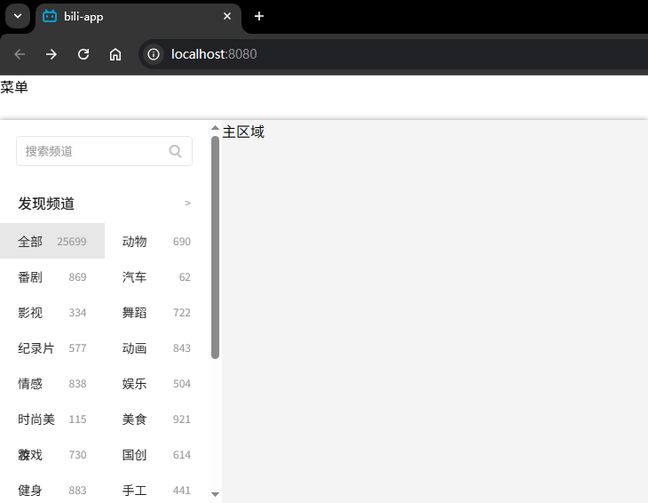

# L15：侧边栏也页面组件


本节整合了前面实现的侧边栏组件，并引入页面布局组件 `Layout`，将侧边栏和正文区、顶部导航等区域进行整合，站在更宏观的角度看待组件和页面的关系。


> [!tip]
>
> 一切封装都是为了代码的复用。


## 1 侧边栏组件的封装

新增 `BiliAside` 组件整合之前实现的搜索框组件 `ChannelSearch` 和频道列表组件 `ChannelList`。原视频中的 `Aside` 容易和 `HTML` 原生标签 `aside` 混淆，实测时改为 `BiliAside`。

迁移 `Vue` 组件中的内容时，引入子组件或 `JS` 模块用到的相对路径容易出错，应统一改为 `@/components/...`，其中 `@` 是 `Webpack` 定义的路径别名，代表 `src` 目录。

对于超过 `BiliAside` 高度的部分，设置滚动条：

```css
.bili-aside-container {
  width: 250px;
  height: 500px;
  overflow-y: auto;
}
```


## 2 更宏观视角下的页面整合

新增 `src/pages/` 文件夹存放页面（本质也是组件，只是更宏观）。

刚才整合的 `BiliAside` 组件应该放到 `pages` 中的频道页，即 `pages/Channel.vue` 页面组件中。该组件依赖一个专门处理页面布局的组件 `components/Layout.vue`，`BiliAside` 则位于 `Layout` 组件的具名插槽内 `v-slot:left` 中。

`BiliAside` 作为插槽内容放入 `Layout` 后，之前从 `App` 复制的固定宽高都要变为相对值，具体尺寸由父组件 `Layout` 决定。

未知的 `HTML` 标签（如笔误），在浏览器中的默认按行盒（`inline box`）渲染，类似 `span`。


## 3 实测备忘

实测时使用 `Flexbox` 布局实现【圣杯布局】：

```css
/* @/components/Layout.vue */
/* flex: <flex-grow> <flex-shrink> <flex-basis>; */
.body {
  display: flex;
}
.left {
  flex: 0 0 auto;
  width: 250px;
}
.main {
  flex: 1 1 auto;
  background: #f4f4f4;
}
.right {
  flex: 0 0 auto;
}
```


具名插槽可以通过 `$slots.<name>` 判定是否渲染（`L7`、`L10`、`L13`）：

```vue
<template>
  <div class="layout-container">
    <header class="head">
      <slot name="head"></slot>
    </header>
    <section class="body">
      <aside class="left" v-if="$slots.left">
        <slot name="left"></slot>
      </aside>
      <main class="main" v-if="$slots.main">
        <slot name="main"></slot>
      </main>
      <aside class="right" v-if="$slots.right">
        <slot name="right"></slot>
      </aside>
    </section>
  </div>
</template>
```


实测效果：



具体实测代码详见 `Git` 分支 `S16L15_layoutComp`。

